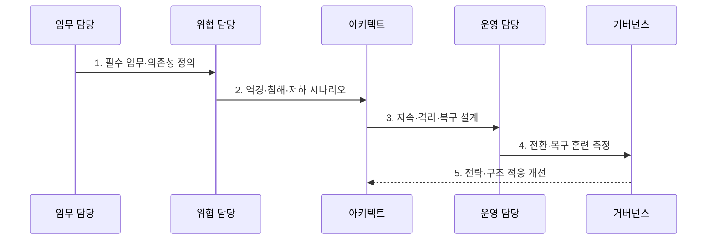

---
sidebar:
  order: 119
  label: "119. 사이버 레질리언스 (Cyber Resilience)"
  badge:
    text: "기출 · 70%"
    variant: note
title: "사이버 레질리언스 (Cyber Resilience)"
date: "2026-07-30T19:00:00+09:00"
tags:
  - "notes-security"
weight: 119
extra:
  question_no: "119"
  source_status: "기출"
  source_history: "137회"
  priority: 70
  priority_note: "137회 기출이며 예방·대응·복구 통합 설계성이 큼"
---

## 미리 알고가기

- **미국 국립표준기술연구소(National Institute of Standards and Technology, NIST)**: 미국의 사이버 회복탄력성 공학 지침을 개발하는 기관이다.
- **사이버 회복탄력성(Cyber Resiliency)**: 역경·공격·침해를 예상하고 견디며 복구하고 적응하는 시스템 능력이다.
- **복구 시간 목표(Recovery Time Objective, RTO)**: 중단된 업무·시스템을 복구해야 하는 목표 시간이다.
- **복구 시점 목표(Recovery Point Objective, RPO)**: 복구할 때 허용할 수 있는 데이터 손실의 기준 시점이다.
- **안전한 저하(Graceful Degradation)**: 비필수 기능을 줄이면서 핵심 기능을 허용 수준으로 유지하는 방식이다.
- **폭발 반경(Blast Radius)**: 한 번의 침해·실패가 영향을 미치는 시스템·업무 범위이다.
- **NIST SP 800-160 Vol.2 Rev.1**: 생명주기 시스템 보안공학으로 사이버 회복탄력성을 설계하는 지침이다.

## Ⅰ. 개요

- 정의/개념: 역경을 **예상·견딤·복구·적응**하는 능력
- 배경/필요성: 침해 중에도 **필수 임무·신뢰성 유지**

### 쉽게 이해하기 (학습용)

- 공격 중에도 핵심 기능과 성능을 유지하는 능력임

## Ⅱ. 특징

- 필수 임무·허용 성능의 **우선 정의**
- 격리·다양성·중복의 **폭발 반경 제한**
- 훈련·복구 경험의 **적응적 개선**

### 쉽게 이해하기 (학습용)

- 전체 기능이 멈추는 대신 꼭 필요한 기능만 안전하게 남기는 설계도 레질리언스임

## Ⅲ. 구조 및 구성요소

| 구성요소 | 책임 |
|:---|:---|
| 필수 임무·의존성 | 유지할 기능·자원·허용 수준 |
| 격리·다양성·안전한 저하 | 피해 범위·단일 실패 제한 |
| 신뢰 복구 기반 | 격리 백업·대체 환경 보호 |
| 관측·지휘·소통 | 상태·전환·책임 통합 |
| 훈련·측정·적응 | 지속·복구·학습 능력 검증 |

### 쉽게 이해하기 (학습용)

- 공격 전 준비부터 공격 중 버티기, 복구와 재설계까지 하나의 생명주기로 관리함

## Ⅳ. 흐름도

**동작 원리**

- **1. 필수 임무·의존성 정의**: 기능·자원·허용 수준 식별
- **2. 역경·침해·저하 시나리오**: 공격·실패·성능 저하 정의
- **3. 지속·격리·복구 설계**: 중복·분할·신뢰 복구 결정
- **4. 전환·복구 훈련 측정**: RTO·RPO·임무 수준 측정
- **5. 전략·구조 적응 개선**: 교훈·위협 변화 반영

### 쉽게 이해하기 (학습용)

- 서버 수를 늘리기 전에 어떤 기능을 어느 수준으로 남겨야 하는지 정해야 함

## Ⅴ. 종류 및 비교

| 사이버 위험 대응 | 사이버보안 | 사이버 회복탄력성 |
|:---|:---|:---|
| 적용 기준 | 예방·탐지·대응 통제를 설계할 때 | 침해를 가정한 지속·복구 능력이 필요할 때 |
| 핵심 특징 | 침해 가능성과 직접 피해를 낮춤 | 침해 중 필수 임무를 유지·복구함 |
| 한계 | 예방 실패 시 임무 전체가 중단됨 | 복잡한 대체 구조가 새 취약점을 만듦 |

### 쉽게 이해하기 (학습용)

- 보안은 공격 성공 가능성을 낮추고 레질리언스는 성공한 공격의 임무 영향을 제한함

## Ⅵ. 실무 고려사항 및 대책

| 고려사항 | 대책 | 효과 |
|:---|:---|:---|
| 회복탄력성 공학 | **NIST 800-160 V2R1 적용** | 예상·견딤·복구·적응 |
| 업무연속성 관리 | **ISO 22301:2019 연계** | 임무·복구 목표 정렬 |
| 사이버 위험 생명주기 | **NIST CSF 2.0 연계** | 보호·대응·복구 통합 |

### 쉽게 이해하기 (학습용)

- 백업을 운영 계정과 네트워크에서 격리하고 랜섬웨어 흔적이 없는 복구 지점에서 핵심 서비스를 목표 시간 안에 재가동할 수 있는지 반복 시험한다.

## Ⅶ. 결론

- **필수 임무·폭발 반경·복구 신뢰**로 회복 전략을 결정한다.

### 쉽게 이해하기 (학습용)

- 뚫리지 않겠다는 약속보다 뚫렸을 때 무엇을 지키고 어떻게 회복할지 증명하는 능력임
