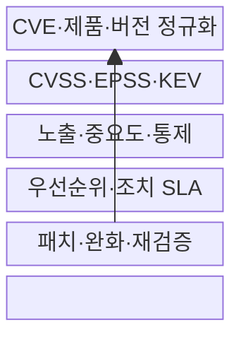
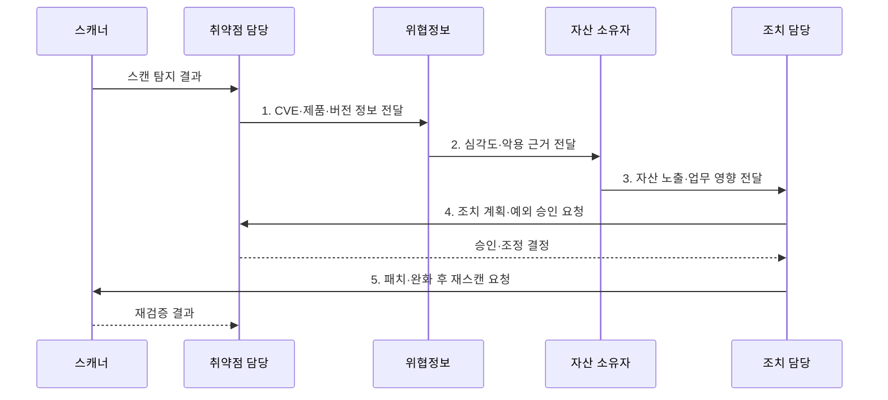

---
sidebar:
  order: 120
  label: "120. 취약점 우선순위 관리 — EPSS·CVSS (Vulnerability Prioritization EPSS CVSS)"
  badge:
    text: "미출제 · 70%"
    variant: note
title: "취약점 우선순위 관리 — EPSS·CVSS (Vulnerability Prioritization EPSS CVSS)"
date: "2026-07-31T11:23:10+09:00"
tags:
  - "notes-security"
weight: 120
extra:
  question_no: "120"
  source_status: "미출제"
  source_history: ""
  priority: 70
  priority_note: "EPSS·CVSS·자산맥락 결합은 강한 운영 설계 주제임"
---

## Ⅰ. 개요

핵심 용어

- **취약점 우선순위 관리**: 심각도·악용 가능성·실제 악용·자산 영향을 결합해 패치·완화 순서를 정하는 활동이다.

- 정의/개념: **취약점 우선순위화**는 CVSS 심각도·EPSS 악용 확률·KEV 실제 악용 정보와 자산 중요도·노출도를 결합해 패치·완화 순서를 정하는 위험관리 활동
- 배경/필요성: CVSS 심각도만으로는 실제 악용성과 자산 영향 기반 **패치 순위 산정 곤란**

#### 한줄 요약

- 우리 자산의 실제 악용 위험과 피해를 결합해 정함

## Ⅱ. 특징

핵심 용어

- **CVSS·EPSS·KEV**: 기술적 심각도, 향후 악용 확률, 실제 악용 확인을 각각 제공하는 판단 근거이다.

- CVSS v4.0의 **기술 심각도·환경 지표**
- EPSS v4·CISA KEV의 **악용 가능성·근거**
- 노출·중요도·통제의 **조직 자산 맥락**

#### 한줄 요약

- EPSS가 높아도 우리 제품이 없으면 위험이 없고 낮아도 이미 악용됐다면 빨리 조치해야 함

## Ⅲ. 구조 및 구성요소

핵심 용어

- **CVE**: 공개 취약점에 고유 식별자를 부여하는 국제 프로그램이다.
- **CTI**: 위협 행위자·공격기법·악용 증거를 분석한 사이버 위협 정보이다.

| 구성요소 | 책임 |
|:---|:---|
| CVE·제품·버전 정규화 | 스캔 결과와 실제 **자산 연결** |
| CVSS·EPSS·KEV | 심각도·확률·**악용 근거** 결합 |
| 노출·중요도·통제 | 공격 경로와 **업무 영향** 반영 |
| 우선순위·조치 SLA | 위험별 **기한·책임** 결정 |
| 패치·완화·재검증 | 조치 효과와 **예외** 지속 추적 |

#### 한줄 요약

- 외부 점수와 실제 설치 자산을 정확히 연결해야 취약점 목록이 조치 대상으로 바뀜

## Ⅳ. 흐름도

핵심 용어

- **자산 맥락**: 취약 자산의 노출도·업무 중요도·보완통제를 반영한 조직별 판단 정보이다.

**동작 원리**

- **1. CVE·제품·버전 정보 전달**: 동일 취약점을 설치 자산과 연결
- **2. 심각도·악용 근거 전달**: CVSS·EPSS·KEV 근거 결합
- **3. 자산 노출·업무 영향 전달**: 조직 맥락으로 위험 보정
- **4. 조치 계획·예외 승인 요청**: 서비스 영향별 조치 승인
- **5. 패치·완화 후 재스캔 요청**: 잔존 노출과 조치 효과 검증

#### 한줄 요약

- 조치 후 스캔과 침해 흔적 확인까지 해야 패치가 실제 위험을 줄였는지 알 수 있음

## Ⅴ. 종류 및 비교

핵심 용어

- **CVSS**: 취약점의 기술적 특성과 심각도를 표준 점수·벡터로 표현하는 체계이다.
- **EPSS**: CVE가 향후 30일 내 실제 악용될 확률을 매일 예측하는 모델이다.
- **KEV**: 실제 악용 근거가 확인된 취약점을 수록한 CISA 목록이다.

| 우선순위 입력 | CVSS v4.0 | EPSS v4 | CISA KEV | 자산 맥락 |
|:---|:---|:---|:---|:---|
| 적용 기준 | **기술 영향** 비교 | **30일 악용** 예측 | 실제 악용 **긴급대응** | **업무 순위** 결정 |
| 핵심 특징 | **4개 지표군·벡터** | **확률·백분위** | 권위 있는 **악용 목록** | **노출·중요도·통제** |
| 한계 | 실제 악용 **미반영** | 조직 영향 **미반영** | 목록 밖 악용 **누락** | 자료 누락·**주관성** |

#### 한줄 요약

- 네 입력은 서로 다른 질문에 답하므로 하나를 다른 점수 대신 쓰면 판단이 왜곡됨

## Ⅵ. 실무 고려사항 및 대책

핵심 용어

- **CVSS v4.0**: Base·Threat·Environmental·Supplemental 지표군을 제공하는 CVSS 규격이다.
- **EPSS v4**: 악용 관측과 취약점 특성으로 30일 악용 확률을 산출하는 EPSS 예측모델이다.

| 문제 | 대책 | 효과 |
|:---|:---|:---|
| **기술 심각도** | **CVSS v4.0 벡터** 적용 | 점수 근거 **투명화** |
| **단기 악용 가능성** | **EPSS v4** 매일 갱신 | **공격 가능성** 반영 |
| 확인된 **실제 악용** | **CISA KEV** 긴급 순위 적용 | **침해 확산** 신속 차단 |

#### 한줄 요약

- 외부 노출 KEV는 긴급 조치하고 과거 침해 흔적도 찾는다.

## Ⅶ. 결론

핵심 용어

- **조치 순위**: 실제 악용·악용 가능성·자산 영향을 근거로 패치·완화·수용의 순서를 정한 결과이다.

- KEV는 **긴급 조치**, EPSS는 **단기 악용 순위**, CVSS·자산 맥락은 영향 보정

#### 한줄 요약

- 좋은 우선순위는 점수를 설명하는 데서 끝나지 않고 위험한 자산을 제때 고치게 함
