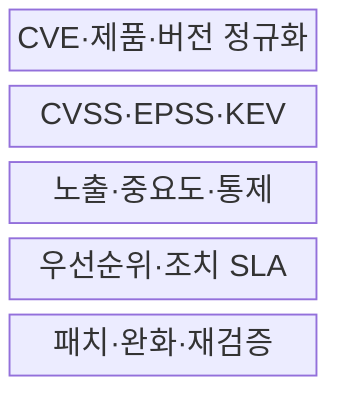
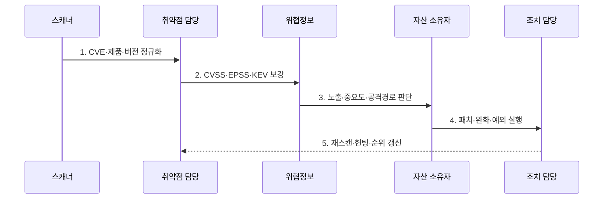

---
sidebar:
  order: 120
  label: "120. 취약점 우선순위 관리 — EPSS·CVSS (Vulnerability Prioritization EPSS CVSS)"
  badge:
    text: "미출제 · 70%"
    variant: note
title: "취약점 우선순위 관리 — EPSS·CVSS (Vulnerability Prioritization EPSS CVSS)"
date: "2026-07-25T01:00:00+09:00"
tags:
  - "notes-security"
weight: 120
extra:
  question_no: "120"
  source_status: "미출제"
  source_history: ""
  priority: 70
  priority_note: "EPSS·CVSS·자산맥락 결합은 강한 운영 설계 주제임"
---

## 미리 알고가기

- **공통 취약점 및 노출(Common Vulnerabilities and Exposures, CVE)**: 공개 취약점에 고유 식별자를 부여하는 국제 프로그램이다.
- **공통 취약점 등급 체계(Common Vulnerability Scoring System, CVSS)**: 취약점의 기술적 특성·심각도를 표준 점수와 벡터로 표현하는 FIRST 체계이다.
- **악용 예측 점수 체계(Exploit Prediction Scoring System, EPSS)**: CVE가 향후 30일 내 실제 악용될 확률을 매일 예측하는 FIRST 모델이다.
- **알려진 악용 취약점(Known Exploited Vulnerabilities, KEV)**: 실제 악용 근거가 확인된 취약점을 수록한 CISA 공식 목록이다.
- **사이버 위협 인텔리전스(Cyber Threat Intelligence, CTI)**: 위협 행위자·공격기법·악용 증거를 분석한 정보이다.
- **CVSS v4.0**: Base·Threat·Environmental·Supplemental 지표군을 제공하는 최신 CVSS 규격이다.
- **EPSS v4(v2025.03.14)**: 2025년 3월 17일부터 제공되는 현재 EPSS 예측모델이다.

## Ⅰ. 개요

- 정의: 심각도·악용·자산 영향의 **조치 순위 결정**
- 목적: 실제 침해 가능성에 **패치 자원 우선 배분**

### 쉽게 이해하기 (학습)

- 우리 자산의 실제 악용 위험과 피해를 결합해 정함

## Ⅱ. 특징

- CVSS v4.0의 **기술 심각도·환경 지표**
- EPSS v4·CISA KEV의 **악용 가능성·근거**
- 노출·중요도·통제의 **조직 자산 맥락**

### 쉽게 이해하기 (학습)

- EPSS가 높아도 우리 제품이 없으면 위험이 없고 낮아도 이미 악용됐다면 빨리 조치해야 함

## Ⅲ. 구조 및 구성요소

| 설계 요소 | 설명 |
|:---|:---|
| CVE·제품·버전 정규화 | 스캔 결과와 실제 자산 연결 |
| CVSS·EPSS·KEV | 심각도·확률·악용 근거 결합 |
| 노출·중요도·통제 | 공격 경로·업무 영향 반영 |
| 우선순위·조치 SLA | 위험별 기한·책임 결정 |
| 패치·완화·재검증 | 조치 효과·예외 지속 추적 |

### 쉽게 이해하기 (학습)

- 외부 점수와 실제 설치 자산을 정확히 연결해야 취약점 목록이 조치 대상으로 바뀜

## Ⅳ. 흐름도

| 절차 | 설명 |
|:---|:---|
| 1. CVE·제품·버전 정규화 | 탐지 결과·실제 설치 자산 대조 |
| 2. CVSS·EPSS·KEV 보강 | 심각도·확률·악용 근거 수집 |
| 3. 노출·중요도·공격경로 판단 | 자산 맥락·통제 효과 반영 |
| 4. 패치·완화·예외 실행 | SLA·책임·잔여위험 승인 |
| 5. 재스캔·헌팅·순위 갱신 | 조치 효과·침해 흔적 확인 |

### 쉽게 이해하기 (학습)

- 조치 후 스캔과 침해 흔적 확인까지 해야 패치가 실제 위험을 줄였는지 알 수 있음

## Ⅴ. 종류 및 비교

| 우선순위 입력 | CVSS v4.0 | EPSS v4 | CISA KEV | 자산 맥락 |
|:---|:---|:---|:---|:---|
| 적용 기준 | 기술 영향 비교 | 30일 악용 예측 | 실제 악용 긴급대응 | 업무 순위 결정 |
| 핵심 특징 | 4개 지표군·벡터 | 확률·백분위 | 권위 있는 악용 목록 | 노출·중요도·통제 |
| 한계 | 실제 악용 미반영 | 조직 영향 미반영 | 목록 밖 악용 누락 | 자료 누락·주관성 |

### 쉽게 이해하기 (학습)

- 네 입력은 서로 다른 질문에 답하므로 하나를 다른 점수 대신 쓰면 판단이 왜곡됨

## Ⅵ. 실무 고려사항 및 대책

| 고려사항 | 대책 | 효과 |
|:---|:---|:---|
| 기술 심각도 | **FIRST CVSS v4.0 벡터 적용** | 점수 근거 투명화 |
| 단기 악용 가능성 | **FIRST EPSS v4 매일 갱신** | 공격 가능성 반영 |
| 확인된 실제 악용 | **CISA KEV 긴급 순위 적용** | 침해 확산 신속 차단 |

### 쉽게 이해하기 (학습)

- 외부 노출 KEV는 긴급 조치하고 과거 침해 흔적도 찾는다.

## Ⅶ. 결론

- **CVSS·EPSS·KEV·자산 맥락**으로 패치 순위를 결정한다.

### 쉽게 이해하기 (학습)

- 좋은 우선순위는 점수를 설명하는 데서 끝나지 않고 위험한 자산을 제때 고치게 함
