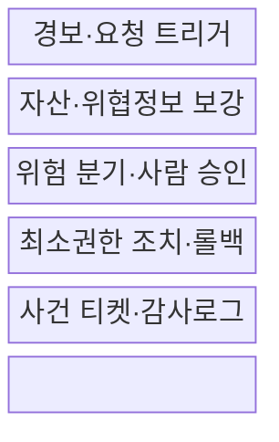
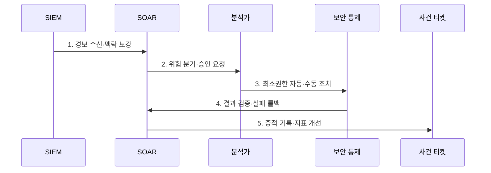

---
sidebar:
  order: 121
  label: "121. 보안 오케스트레이션 플레이북 (SOAR Playbook)"
  badge:
    text: "기출 · 70%"
    variant: note
title: "보안 오케스트레이션 플레이북 (SOAR Playbook)"
date: "2026-07-30T19:00:00+09:00"
tags:
  - "notes-security"
weight: 121
extra:
  question_no: "121"
  source_status: "기출"
  source_history: "138회"
  priority: 70
  priority_note: "138회 기출이며 자동대응 분기·승인 설계가 독립적임"
---

## 미리 알고가기

- **보안 오케스트레이션·자동화·대응(Security Orchestration, Automation and Response, SOAR)**: 보안 도구를 연결해 분석·대응 절차를 자동화하는 체계이다.
- **보안정보·이벤트 관리(Security Information and Event Management, SIEM)**: 보안 이벤트를 수집·분석해 경보를 만드는 체계이다.
- **엔드포인트 탐지·대응(Endpoint Detection and Response, EDR)**: 단말 위협을 탐지하고 격리·조사하는 체계이다.
- **플레이북(Playbook)**: 경보 보강·판단·승인·조치·복구 순서를 정의한 실행 절차이다.
- **사람 참여(Human-in-the-Loop)**: 업무 영향이 큰 자동 조치를 담당자가 확인·승인하는 방식이다.
- **OASIS CACAO Security Playbooks v2.0**: 보안 플레이북의 구조·분류·워크플로 공유 스키마를 규정한다.
- **OASIS OpenC2 Language Specification v1.0**: 보안 기능을 수행하는 장치에 표준 명령을 전달하는 언어 규격이다.

## Ⅰ. 개요

- 정의/개념: 도구 연계로 **분석·승인·대응을 실행**하는 절차
- 배경/필요성: 수동 반복·도구 전환의 **대응 지연·편차 감소**

### 쉽게 이해하기 (학습용)

- 분석가의 반복 조회·차단 업무를 조건과 승인, 되돌리기 기능이 있는 흐름으로 바꿈

## Ⅱ. 특징

- API·표준 명령 기반 **도구 오케스트레이션**
- 위험별 자동·승인·수동의 **경로 분기**
- 롤백·권한·감사로그의 **자동화 통제**

### 쉽게 이해하기 (학습용)

- 경보 위험에 따라 자동·승인·수동 대응을 나누고 실패 시 되돌림

## Ⅲ. 구조 및 구성요소

| 구성요소 | 책임 |
|:---|:---|
| 경보·요청 트리거 | 실행 조건·중복·범위 결정 |
| 자산·위협정보 보강 | 사용자·평판·업무 맥락 결합 |
| 위험 분기·사람 승인 | 자동·승인·수동 경로 선택 |
| 최소권한 조치·롤백 | 차단·격리·복구 수행 |
| 사건 티켓·감사로그 | 결정·API 결과·담당자 기록 |

### 쉽게 이해하기 (학습용)

- 자동화의 핵심은 버튼을 빨리 누르는 것이 아니라 잘못 누르면 되돌리고 이유를 남기는 것임

## Ⅳ. 흐름도

**동작 원리**

- **1. 경보 수신·맥락 보강**: 자산·사용자·위협정보 결합
- **2. 위험 분기·승인 요청**: 영향별 자동화 수준 결정
- **3. 최소권한 자동·수동 조치**: EDR·방화벽·계정 통제
- **4. 결과 검증·실패 롤백**: 조치 효과·업무 복구 확인
- **5. 증적 기록·지표 개선**: 오탐·시간·실패율 환류

### 쉽게 이해하기 (학습용)

- 처음부터 자동 차단하지 않고 관찰과 승인 단계를 거쳐 안전성이 확인된 범위만 확대함

## Ⅴ. 종류 및 비교

| 플레이북 실행 방식 | 완전 자동 | 승인 기반 | 수동 지원 |
|:---|:---|:---|:---|
| 적용 기준 | 반복적이고 되돌릴 수 있는 저위험 조치 | 업무 영향이 크지만 신속성이 필요할 때 | 판단이 복잡하거나 자동화가 미성숙할 때 |
| 핵심 특징 | 조건 충족 시 즉시 조치 | 사람이 확인한 뒤 조치 | 정보 보강만 하고 사람이 실행 |
| 한계 | 오탐이 대규모 차단으로 확산 | 승인 지연으로 대응이 늦어짐 | 처리 편차와 분석가 부담 증가 |

> 요약: 대상 위험도와 자동화 성숙도에 따라 선택함

### 쉽게 이해하기 (학습용)

- 확실하고 안전한 일만 자동화하고 업무 중단 위험이 큰 조치는 사람이 마지막으로 확인함

## Ⅵ. 실무 고려사항 및 대책

| 고려사항 | 대책 | 효과 |
|:---|:---|:---|
| 플레이북 상호운용 | **OASIS CACAO v2.0 적용** | 구조화·공유 가능 |
| 보안 조치 명령 | **OASIS OpenC2 v1.0 적용** | 도구 명령 표준화 |
| 사고대응 생명주기 | **NIST SP 800-61 Rev.3 연계** | CSF 2.0 대응 통합 |

### 쉽게 이해하기 (학습용)

- 플레이북은 단말의 악성 행위와 업무 중요도를 확인하고 승인 조건을 충족하면 최소 권한 API로 격리하며 실행 결과와 롤백 정보를 기록한다.

## Ⅶ. 결론

- **경보 신뢰도·업무 영향·권한·롤백**으로 자동화 수준을 결정한다.

### 쉽게 이해하기 (학습용)

- 빠른 자동화보다 잘못된 조치를 멈추고 되돌릴 수 있는 자동화가 중요함
