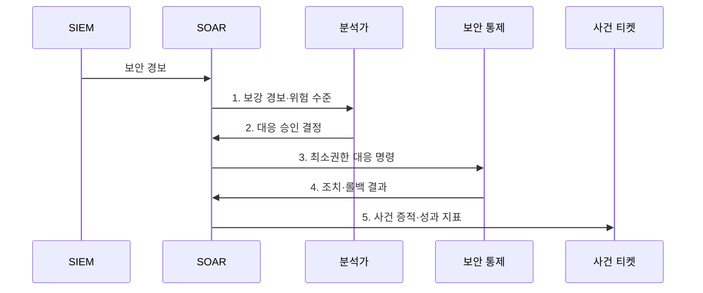

---
sidebar:
  order: 121
  label: "121. 보안 오케스트레이션 플레이북 (SOAR Playbook)"
  badge:
    text: "기출 · 70%"
    variant: note
title: "보안 오케스트레이션 플레이북 (SOAR Playbook)"
date: "2026-08-02T23:51:00+09:00"
tags:
  - "notes-security"
weight: 121
extra:
  question_no: "121"
  source_status: "기출"
  source_history: "138회"
  priority: 70
  priority_note: "138회 기출이며 자동대응 분기·승인 설계가 독립적임"
---

## Ⅰ. 개요

핵심 용어

- **보안 오케스트레이션 플레이북(SOAR Playbook)**: 경보 유형별 보강·판단·승인·조치·복구 순서와 분기 조건을 정의해 보안 도구에서 실행하는 자동화 절차이다.
- **SOAR**: 보안 도구를 연결해 플레이북에 따른 분석·대응 절차를 실행하고 이력을 관리하는 플랫폼이다.

- 정의/개념: 보안 도구를 연계해 경보별 분석·승인·조치·복구를 실행하는 **플레이북 기반 자동화 사고대응 절차**
- 배경/필요성: 수동 반복과 도구 전환으로 **대응 지연·처리 편차 발생**

### 쉽게 이해하기 (학습용)

- 분석가의 반복 조회·차단 업무를 조건과 승인, 되돌리기 기능이 있는 흐름으로 바꿈

## Ⅱ. 특징

핵심 용어

- **사람 참여**: 업무 영향이 큰 자동 조치를 담당자가 확인·승인하는 방식이다.
- **롤백**: 자동 조치 실패나 오탐 발생 시 이전 상태로 되돌리는 기능이다.

- API·표준 명령 기반 **도구 오케스트레이션**
- 위험별 자동·승인·수동의 **경로 분기**
- 롤백·권한·감사로그의 **자동화 통제**

### 쉽게 이해하기 (학습용)

- 경보 위험에 따라 자동·승인·수동 대응을 나누고 실패 시 되돌림

## Ⅲ. 구조 및 구성요소

핵심 용어

- **오케스트레이션**: 서로 다른 보안 도구의 조회·판단·조치를 하나의 흐름으로 연결하는 기능이다.

| 구성요소 | 책임 |
|:---|:---|
| 경보·요청 트리거 | **실행 조건·중복·범위** 결정 |
| 자산·위협정보 보강 | 사용자·평판·**업무 맥락** 결합 |
| 위험 분기·사람 승인 | **자동·승인·수동 경로** 선택 |
| 최소권한 조치·롤백 | **차단·격리·복구** 수행 |
| 사건 티켓·감사로그 | **결정·API 결과·담당자** 기록 |

### 쉽게 이해하기 (학습용)

- 자동화의 핵심은 버튼을 빨리 누르는 것이 아니라 잘못 누르면 되돌리고 이유를 남기는 것임

## Ⅳ. 흐름도

핵심 용어

- **SIEM·EDR**: 보안 이벤트를 경보로 만드는 체계와 단말 위협을 탐지·격리하는 체계이다.

**동작 원리**

1. **보강 경보·위험 수준**: 자산·사용자·위협정보와 업무 영향 제공
2. **대응 승인 결정**: 위험에 따른 자동·승인·수동 경로 결과 전달
3. **최소권한 대응 명령**: EDR·방화벽·계정에 제한된 차단·격리 지시
4. **조치·롤백 결과**: 대응 효과·실패 원인·업무 복구 상태 제공
5. **사건 증적·성과 지표**: 결정 근거·오탐·시간·실패율 기록

### 쉽게 이해하기 (학습용)

- 처음부터 자동 차단하지 않고 관찰과 승인 단계를 거쳐 안전성이 확인된 범위만 확대함

## Ⅴ. 종류 및 비교

핵심 용어

- **자동·승인·수동 대응**: 위험도와 되돌림 가능성에 따라 사람 개입 수준을 구분한 실행 방식이다.

| 플레이북 실행 방식 | 완전 자동 | 승인 기반 | 수동 지원 |
|:---|:---|:---|:---|
| 적용 기준 | 반복적이고 **되돌릴 수 있는 저위험 조치** | 업무 영향이 크고 **신속성 필요** | 판단이 복잡하거나 **자동화 미성숙** |
| 핵심 특징 | 조건 충족 시 **즉시 조치** | 사람의 **확인 후 조치** | 정보 보강 후 **사람이 실행** |
| 한계 | 오탐의 **대규모 차단 확산** | 승인에 따른 **대응 지연** | 처리 편차와 **분석가 부담** |

> 요약: 대상 위험도와 자동화 성숙도에 따라 선택함

### 쉽게 이해하기 (학습용)

- 확실하고 안전한 일만 자동화하고 업무 중단 위험이 큰 조치는 사람이 마지막으로 확인함

## Ⅵ. 실무 고려사항 및 대책

핵심 용어

- **OASIS CACAO**: 보안 플레이북의 구조·분류·워크플로 공유 스키마를 규정한다.
- **OASIS OpenC2**: 보안 기능을 수행하는 장치에 표준 명령을 전달하는 언어 규격이다.

| 문제 | 대책 | 효과 |
|:---|:---|:---|
| 플레이북 구조가 제품마다 다르면 공유·재사용 곤란 | **OASIS CACAO v2.0** 적용 | 절차의 **구조화·상호운용** 확보 |
| 보안 조치 명령이 도구별로 달라 연계 오류 | **OASIS OpenC2 v1.0** 적용 | 대응 명령의 **표준화** 확보 |
| 자동화가 사고대응 생명주기와 분리되면 통제 누락 | **NIST SP 800-61 Rev.3** 연계 | CSF 2.0 기반 **사고대응 통합** |

### 쉽게 이해하기 (학습용)

- 플레이북은 단말의 악성 행위와 업무 중요도를 확인하고 승인 조건을 충족하면 최소 권한 API로 격리하며 실행 결과와 롤백 정보를 기록한다.

## Ⅶ. 결론

핵심 용어

- **안전한 자동화**: 신뢰도·업무 영향·승인·롤백을 함께 통제하는 자동화 원칙이다.

- 신뢰도 높고 롤백 가능한 저위험 조치는 **자동**, 업무 영향이 크면 **승인·수동** 선택

### 쉽게 이해하기 (학습용)

- 빠른 자동화보다 잘못된 조치를 멈추고 되돌릴 수 있는 자동화가 중요함
