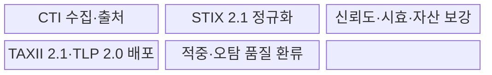
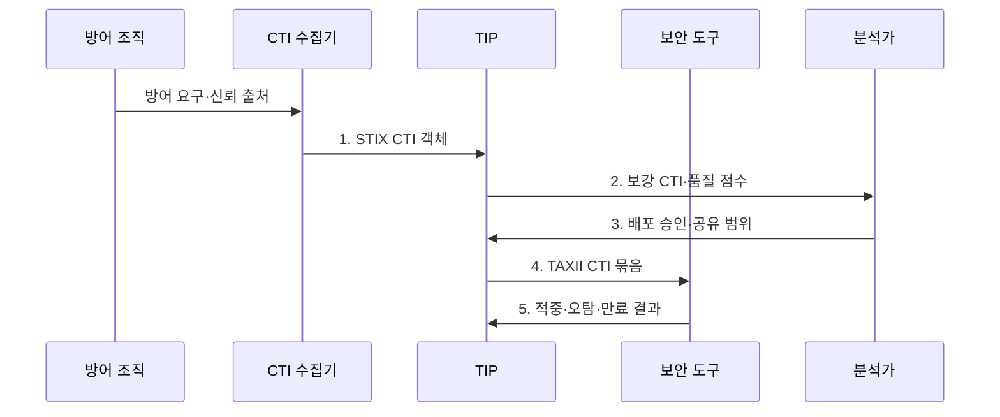

---
sidebar:
  order: 122
  label: "122. 인텔리전스 기반 CTI 자동화 (CTI Automation)"
  badge:
    text: "기출 · 70%"
    variant: note
title: "인텔리전스 기반 CTI 자동화 (CTI Automation)"
date: "2026-08-02T23:52:00+09:00"
tags:
  - "notes-security"
weight: 122
extra:
  question_no: "122"
  source_status: "기출"
  source_history: "138회"
  priority: 70
  priority_note: "138회 기출이며 CTI 수집·분석·대응 자동화가 핵심임"
---

## Ⅰ. 개요

핵심 용어

- **CTI 자동화(CTI Automation)**: 위협 정보의 수집·정규화·중복 제거·신뢰도 평가·배포를 기계적으로 연결하되 품질과 공유 정책을 함께 통제하는 운영 방식이다.

- 정의/개념: CTI의 수집·정규화·평가·배포를 자동화하는 **위협정보 운영 체계**
- 배경/필요성: 검증 없는 피드 자동 배포로 **중복·만료 지표의 오차단 발생**

#### 한줄 요약

- 외부 공격 정보를 우리 자산과 대조해 믿을 만하고 아직 유효한 정보만 탐지·차단에 전달함

## Ⅱ. 특징

핵심 용어

- **IoC·TTP**: 침해 흔적을 식별하는 관측값과 공격자가 목표 달성에 사용하는 행동 방식이다.
- **TLP**: CTI의 수신자와 재공유 범위를 표시하는 규칙이다.

- STIX 객체·관계 기반 **위협정보 구조화**
- TAXII 교환·TLP 표시 기반 **제한적 공유**
- 출처·신뢰도·시효·자산 기반 **품질 통제**

#### 한줄 요약

- 형식만 맞추지 않고 출처·유효기간·내부 자산 관련성을 함께 검증함

## Ⅲ. 구조 및 구성요소

핵심 용어

- **TIP**: 여러 위협 피드를 정규화·평가·배포하는 위협 인텔리전스 플랫폼이다.

| 구성요소 | 책임 |
|:---|:---|
| CTI 수집·출처 | **OSINT·상용·공유 피드** 수집 |
| STIX 2.1 정규화 | **객체·관계·시간 형식** 통일 |
| 신뢰도·시효·자산 보강 | **출처 점수·만료·영향** 결합 |
| TAXII 2.1·TLP 2.0 배포 | **API 교환·공유 범위** 통제 |
| 적중·오탐 품질 환류 | 탐지 결과로 **품질 점수** 갱신 |

#### 한줄 요약

- IP 하나도 출처와 관측 시점, 공격 관계, 내부 사용 여부를 확인한 뒤 배포함

## Ⅳ. 흐름도

핵심 용어

- **품질 점수**: 출처 신뢰도·시효·자산 관련성·적중 결과를 결합한 배포 판단값이다.

**동작 원리**

1. **STIX CTI 객체**: 수집 정보를 객체·관계·출처·시간 형식으로 제공
2. **보강 CTI·품질 점수**: 중복 제거와 출처·시효·자산 관련성 평가값 제공
3. **배포 승인·공유 범위**: 자동 배포 여부와 TLP 수신자 범위 결정
4. **TAXII CTI 묶음**: 승인된 지표·관계를 보안 도구에 API로 전달
5. **적중·오탐·만료 결과**: 탐지 성과와 지표 유효성을 품질 점수에 환류

#### 한줄 요약

- 방어 목적을 먼저 정하고 검증된 지표만 제한적으로 배포한 뒤 결과로 신뢰도를 다시 조정함

## Ⅴ. 종류 및 비교

핵심 용어

- **STIX·TAXII**: 위협 객체·관계를 표현하는 표준과 CTI를 API로 교환하는 프로토콜이다.

| CTI 자동화 요소 | STIX 2.1 | TAXII 2.1 | TIP |
|:---|:---|:---|:---|
| 적용 기준 | 위협 **의미·관계 표현** | 조직·도구 간 **CTI 교환** | 다중 피드 **운영·품질관리** |
| 핵심 특징 | **객체·관계 기반 모델** | **HTTPS API 기반 전송** | **수집·평가·배포 통합** |
| 한계 | 모델링 **복잡도·품질 편차** | **인증·권한 설정 오류** | 저품질 피드의 **자동 확산** |

> 요약: STIX는 표현, TAXII는 교환, TIP은 운영을 담당함

#### 한줄 요약

- 같은 형식과 전송 규칙을 써도 내용이 오래되거나 틀리면 TIP의 품질 통제가 필요함

## Ⅵ. 실무 고려사항 및 대책

핵심 용어

- **OASIS STIX 2.1·TAXII 2.1**: CTI의 구조화 표현과 HTTPS 기반 교환을 위한 표준이다.
- **FIRST TLP 2.0**: `TLP:CLEAR`부터 `TLP:RED`까지 정보 공유 범위를 표시하는 규칙이다.

| 문제 | 대책 | 효과 |
|:---|:---|:---|
| 객체 의미·관계가 다르면 도구별 탐지 해석 불일치 | **OASIS STIX 2.1** 적용 | CTI의 **구조화·상호운용** 확보 |
| 교환 API가 다르면 자동 수집·배포 연계 실패 | **OASIS TAXII 2.1** 적용 | CTI **API 배포 표준화** |
| 공유 범위가 없으면 민감 CTI의 재공유·공개 | **FIRST TLP 2.0** 표시 | 수신자별 **재공유·공개 오용** 방지 |

#### 한줄 요약

- 수신 CTI를 STIX 객체로 검증하고 TAXII로 배포하되 TLP 표시에 따라 수신자와 재공유 범위를 제한한다.

## Ⅶ. 결론

핵심 용어

- **시효 관리**: 오래되거나 관련 없는 위협정보가 차단 정책으로 확산되지 않게 만료를 통제하는 활동이다.

- 출처·시효·자산 관련성이 기준을 충족하면 **자동 배포**, 불충족하면 **보류·폐기**

#### 한줄 요약

- 자동화 속도보다 오래되거나 관련 없는 위협 정보가 차단 정책으로 확산되지 않게 하는 것이 중요함
