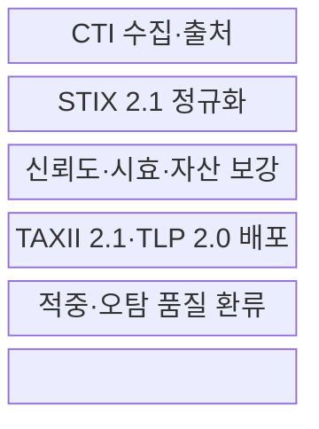
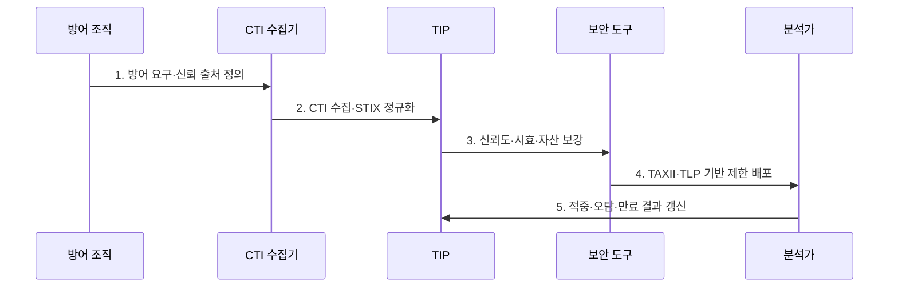

---
sidebar:
  order: 122
  label: "122. 인텔리전스 기반 CTI 자동화 (CTI Automation)"
  badge:
    text: "기출 · 70%"
    variant: note
title: "인텔리전스 기반 CTI 자동화 (CTI Automation)"
date: "2026-07-30T19:00:00+09:00"
tags:
  - "notes-security"
weight: 122
extra:
  question_no: "122"
  source_status: "기출"
  source_history: "138회"
  priority: 70
  priority_note: "138회 기출이며 CTI 수집·분석·대응 자동화가 핵심임"
---

## 미리 알고가기

- **사이버위협 인텔리전스(Cyber Threat Intelligence, CTI)**: 공격 주체·행위·의도·영향을 분석해 방어 의사결정에 쓰는 지식이다.
- **침해지표(Indicator of Compromise, IoC)**: 악성 IP·도메인·파일 해시처럼 침해 흔적을 식별하는 관측값이다.
- **전술·기법·절차(Tactics, Techniques, and Procedures, TTP)**: 공격자가 목표 달성에 사용하는 행동 방식과 절차이다.
- **위협 인텔리전스 플랫폼(Threat Intelligence Platform, TIP)**: 여러 위협 피드를 정규화·평가·배포하는 플랫폼이다.
- **OASIS STIX 2.1**: 위협 객체와 객체 간 관계를 기계가 처리할 수 있게 표현하는 표준이다.
- **OASIS TAXII 2.1**: CTI를 HTTPS 기반 API로 교환하는 애플리케이션 계층 프로토콜이다.
- **FIRST TLP 2.0**: `TLP:CLEAR`부터 `TLP:RED`까지 정보 공유 범위를 표시하는 규칙이다.
- **MITRE ATT&CK**: 공격자의 전술·기법을 체계화해 탐지·헌팅과 연결하는 지식기반이다.

## Ⅰ. 개요

- 정의/개념: CTI의 **수집·정규화·평가·배포를 자동화**하는 체계
- 배경/필요성: 피드 중복·만료·오차단을 줄여 **대응 품질 향상**

### 쉽게 이해하기 (학습용)

- 외부 공격 정보를 우리 자산과 대조해 믿을 만하고 아직 유효한 정보만 탐지·차단에 전달함

## Ⅱ. 특징

- STIX 객체·관계 기반 **위협정보 구조화**
- TAXII 교환·TLP 표시 기반 **제한적 공유**
- 출처·신뢰도·시효·자산 기반 **품질 통제**

### 쉽게 이해하기 (학습용)

- 형식만 맞추지 않고 출처·유효기간·내부 자산 관련성을 함께 검증함

## Ⅲ. 구조 및 구성요소

| 구성요소 | 책임 |
|:---|:---|
| CTI 수집·출처 | OSINT·상용·공유 피드 수집 |
| STIX 2.1 정규화 | 객체·관계·시간 형식 통일 |
| 신뢰도·시효·자산 보강 | 출처 점수·만료·영향 결합 |
| TAXII 2.1·TLP 2.0 배포 | API 교환·공유 범위 통제 |
| 적중·오탐 품질 환류 | 탐지 결과로 점수 갱신 |

### 쉽게 이해하기 (학습용)

- IP 하나도 출처와 관측 시점, 공격 관계, 내부 사용 여부를 확인한 뒤 배포함

## Ⅳ. 흐름도

**동작 원리**

- **1. 방어 요구·신뢰 출처 정의**: 자산·공격 유형·수집 조건 설정
- **2. CTI 수집·STIX 정규화**: 객체·관계·출처 형식 통일
- **3. 신뢰도·시효·자산 보강**: 중복 제거·점수·영향 계산
- **4. TAXII·TLP 기반 제한 배포**: 대상 도구와 공유 범위 통제
- **5. 적중·오탐·만료 결과 갱신**: 탐지 성과와 품질 점수 환류

### 쉽게 이해하기 (학습용)

- 방어 목적을 먼저 정하고 검증된 지표만 제한적으로 배포한 뒤 결과로 신뢰도를 다시 조정함

## Ⅴ. 종류 및 비교

| CTI 자동화 요소 | STIX 2.1 | TAXII 2.1 | TIP |
|:---|:---|:---|:---|
| 적용 기준 | 위협 의미·관계 표현 | 조직·도구 간 CTI 교환 | 다중 피드 운영·품질관리 |
| 핵심 특징 | 객체·관계 기반 표준 모델 | HTTPS API 기반 전송 | 수집·평가·배포 통합 |
| 한계 | 모델링 복잡도와 품질 편차 | 인증·권한 설정 오류 위험 | 저품질 피드 자동 확산 위험 |

> 요약: STIX는 표현, TAXII는 교환, TIP은 운영을 담당함

### 쉽게 이해하기 (학습용)

- 같은 형식과 전송 규칙을 써도 내용이 오래되거나 틀리면 TIP의 품질 통제가 필요함

## Ⅵ. 실무 고려사항 및 대책

| 고려사항 | 대책 | 효과 |
|:---|:---|:---|
| CTI 의미·관계 표현 | **OASIS STIX 2.1 적용** | 구조화·상호운용 확보 |
| CTI 자동 교환 | **OASIS TAXII 2.1 적용** | API 배포 표준화 |
| 정보 공유 범위 | **FIRST TLP 2.0 표시** | 재공유·공개 오용 방지 |

### 쉽게 이해하기 (학습용)

- 수신 CTI를 STIX 객체로 검증하고 TAXII로 배포하되 TLP 표시에 따라 수신자와 재공유 범위를 제한한다.

## Ⅶ. 결론

- **출처·신뢰도·시효·자산 관련성**으로 CTI 배포를 결정한다.

### 쉽게 이해하기 (학습용)

- 자동화 속도보다 오래되거나 관련 없는 위협 정보가 차단 정책으로 확산되지 않게 하는 것이 중요함
