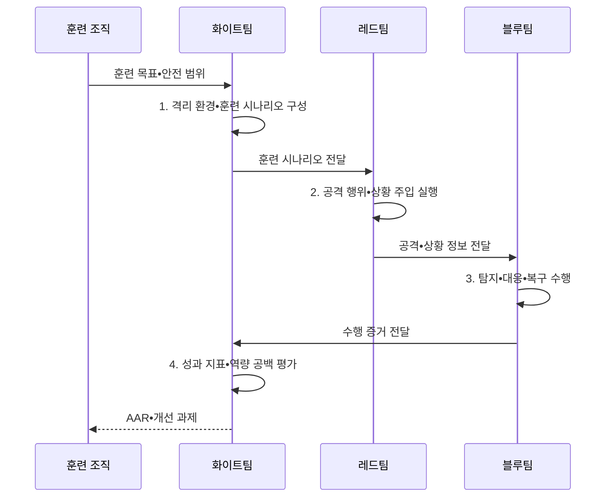

---
sidebar:
  order: 123
  label: "123. 사이버 레인지 (Cyber Range, 가상 실전 훈련장)"
  badge:
    text: "미출제 • 50%"
    variant: note
title: "사이버 레인지 (Cyber Range, 가상 실전 훈련장)"
date: "2026-08-04T14:21:49+09:00"
tags:
  - "notes-security"
weight: 123
extra:
  question_no: "123"
  source_status: "미출제"
  source_history: ""
  priority: 50
  priority_note: "재현 환경•상황주입•평가를 갖춘 독립 훈련체계임"
---

## Ⅰ. 개요

핵심 용어

- **사이버 레인지(Cyber Range)**: 실제 시스템•업무 상황을 모사한 격리 환경에서 공격•방어•복구를 반복하고 수행 결과를 측정하는 훈련 체계이다.

- 정의/개념: 실제 시스템을 모사한 격리 환경에서 반복 수행하는 **재현형 공방 훈련 체계**
- 배경/필요성: 실운영 환경의 공격 훈련은 **서비스 중단•데이터 훼손 위험**

#### 한줄 요약

- 실제 서비스와 유사한 격리 훈련장에서 같은 공격과 대응을 반복해 개선 정도를 측정함

## Ⅱ. 특징

핵심 용어

- **디지털 트윈**: 실제 시스템의 구조•상태•동작을 디지털 환경에 대응시킨 모형이다.
- **IaC(Infrastructure as Code)**: 인프라 설정을 코드로 정의해 반복 배포하는 방식이다.
- **IT(Information Technology)**: 업무 정보를 처리•저장•전송하는 기술 환경이다.
- **OT(Operational Technology)**: 산업 설비와 공정을 감시•제어하는 기술 환경이다.

- IT•OT•클라우드의 **현실적 환경 모사**
- IaC•스냅샷 기반 **동일 조건 재현**
- 상황 주입•텔레메트리 기반 **정량 평가**

#### 한줄 요약

- 서버뿐 아니라 역할•업무 상황•공격 흔적•평가 기준까지 함께 재현함

## Ⅲ. 구조 및 구성요소

핵심 용어

- **레드팀**: 훈련에서 공격자 역할을 수행하는 팀이다.
- **블루팀**: 훈련에서 탐지•대응•복구를 수행하는 팀이다.
- **화이트팀**: 훈련의 안전•상황•평가를 통제하는 팀이다.

| 구성요소 | 책임 |
|:---|:---|
| 훈련 거버넌스•목표 | **역량•성공 기준•안전 규칙** 정의 |
| 격리 환경•디지털 트윈 | **IT•OT•클라우드 대상** 모사 |
| 위협 시나리오•상황 주입 | **공격•업무 사건** 순차 제공 |
| 레드•블루•화이트팀 | **공격•방어•통제 역할** 분담 |
| 텔레메트리•평가체계 | **로그•판단•조치 성과** 측정 |

#### 한줄 요약

- 화이트팀이 안전 경계와 상황을 통제하고 공방 결과를 동일한 기준으로 평가함

## Ⅳ. 흐름도

핵심 용어

- **AAR(After Action Review)**: 훈련 결과와 판단 과정을 분석해 개선 과제를 정하는 사후검토이다.

**동작 원리**

1. **격리 환경•훈련 시나리오 구성**: IaC 배포•유출입 차단•상황 순서 설계
2. **공격 행위•상황 주입 실행**: 위협 행위와 업무 사건을 순서대로 실행
3. **탐지•대응•복구 수행**: 판단•도구 조치•복구 시간을 기록
4. **성과 지표•역량 공백 평가**: 목표 대비 탐지•격리•복구 성과와 누락 역량 확인

#### 한줄 요약

- 무엇을 측정할지 먼저 정하고 안전하게 실행한 뒤 결과를 실제 대응 절차에 반영함

## Ⅴ. 종류 및 비교

핵심 용어

- **도상 훈련**: 토론으로 계획•역할•연락망을 점검하는 방식이다.
- **CTF(Capture The Flag)**: 제한된 환경에서 보안 문제를 해결하는 기술 훈련이다.
- **사이버 레인지 훈련**: 운영 모사 환경에서 팀 단위 공방을 수행하는 방식이다.

| 훈련 방식 | 도상 훈련 | CTF | 사이버 레인지 |
|:---|:---|:---|:---|
| 적용 기준 | **계획•연락망 확인** | 개인 **기술 집중 훈련** | 팀 **대응•복구 검증** |
| 핵심 특징 | **토론 기반 역할 점검** | 제한 환경의 **문제 해결** | **운영 모사 공방** 수행 |
| 한계 | **실제 조작 검증** 부족 | 전체 **대응 맥락** 부족 | 구축비•**격리 실패 위험** |

> 요약: 절차 확인, 기술 연습, 팀 실전 검증으로 구분함

#### 한줄 요약

- 도상 훈련은 말로, CTF는 문제 풀이로, 사이버 레인지는 팀 단위 실행으로 역량을 확인함

## Ⅵ. 실무 고려사항 및 대책

핵심 용어

- **NIST(National Institute of Standards and Technology)**: 미국 국립표준기술연구소이다.
- **SP(Special Publication)**: NIST가 발행하는 특별간행물이다.
- **NIST SP 800-84**: IT 훈련 프로그램의 설계•수행•평가 지침이다.
- **ISO(International Organization for Standardization)**: 국제표준화기구이다.
- **ISO 22398**: 조직 훈련의 계획•수행•평가•개선 지침이다.
- **NICE(National Initiative for Cybersecurity Education)**: 국가 사이버보안 교육 이니셔티브이다.
- **NICE 프레임워크**: 사이버보안 업무를 역할•과업•지식•기술로 기술한 체계이다.

| 문제 | 대책 | 효과 |
|:---|:---|:---|
| 측정 목표가 없으면 훈련 성공 여부를 객관적으로 판정 불가 | **NIST SP 800-84** 적용 | 목표•수행•평가의 **일관성** 확보 |
| 훈련 계획과 개선 과제가 분리되면 같은 실패 반복 | **ISO 22398:2013** 연계 | 훈련 프로젝트의 **계획•개선 체계화** |
| 오래된 역할 정의로 현재 직무•과업 역량 누락 | **NICE 구성요소 v2.2.0** 매핑 | 최신 **역할•과업•지식•기술** 추적 |

#### 한줄 요약

- 랜섬웨어 시나리오를 합성 데이터와 격리망에서 수행하고 탐지•격리•복구 시간과 판단 근거를 AAR로 검토한다.

## Ⅶ. 결론

핵심 용어

- **재현 가능성**: 같은 공격과 조건을 다시 실행해 팀 대응의 개선 여부를 비교할 수 있는 속성이다.

- 절차•연락망 확인은 **도상 훈련**, 개인 기술은 **CTF**, 팀 대응•복구는 **사이버 레인지** 선택

#### 한줄 요약

- 환경 규모보다 같은 공격을 다시 실행해 팀 대응이 실제로 나아졌는지 확인할 수 있어야 함
