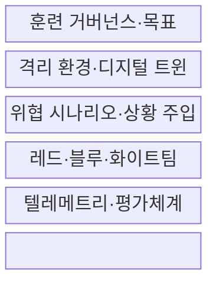
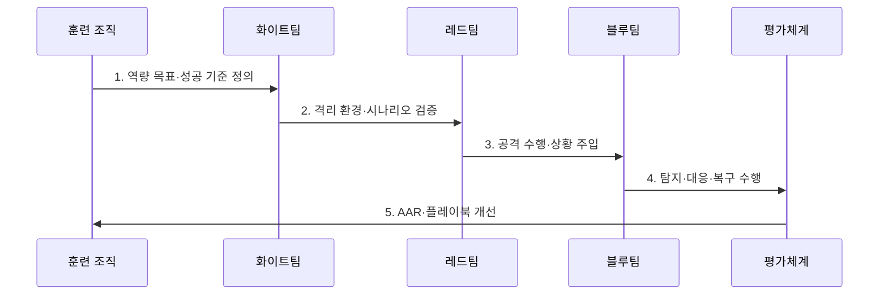

---
sidebar:
  order: 123
  label: "123. 사이버 레인지 (Cyber Range, 가상 실전 훈련장)"
  badge:
    text: "미출제 · 50%"
    variant: note
title: "사이버 레인지 (Cyber Range, 가상 실전 훈련장)"
date: "2026-07-30T19:00:00+09:00"
tags:
  - "notes-security"
weight: 123
extra:
  question_no: "123"
  source_status: "미출제"
  source_history: ""
  priority: 50
  priority_note: "재현 환경·상황주입·평가를 갖춘 독립 훈련체계임"
---

## 미리 알고가기

- **사이버 레인지(Cyber Range)**: 현실적인 시스템을 격리해 공격·방어·복구를 반복 훈련하는 환경이다.
- **디지털 트윈(Digital Twin)**: 실제 시스템의 구조·상태·동작을 디지털 환경에 대응시킨 모형이다.
- **코드형 인프라(Infrastructure as Code, IaC)**: 인프라 설정을 코드로 정의해 반복 배포·초기화하는 방식이다.
- **레드팀(Red Team)**: 공격자 관점에서 취약점과 탐지 공백을 검증하는 역할이다.
- **블루팀(Blue Team)**: 공격을 탐지·분석·격리하고 서비스를 복구하는 역할이다.
- **퍼플팀(Purple Team)**: 공격 행위와 방어 증거를 함께 검토해 탐지 공백을 개선하는 협업 방식이다.
- **화이트팀(White Team)**: 훈련 규칙·안전 경계·상황 주입·평가를 통제하는 역할이다.
- **사후검토(After Action Review, AAR)**: 훈련 결과와 판단 과정을 분석해 개선 과제를 정하는 검토이다.
- **NIST SP 800-84**: IT 계획·역량의 시험·교육·훈련 프로그램 설계와 평가 지침이다.
- **ISO 22398:2013**: 조직의 훈련 프로젝트를 계획·수행·개선하는 국제표준 지침이다.

## Ⅰ. 개요

- 정의/개념: 격리 환경에서 수행하는 **재현 가능한 공방 훈련**
- 배경/필요성: 운영 피해 없이 **탐지·대응·복구 역량 검증**

### 쉽게 이해하기 (학습용)

- 실제 서비스와 유사한 격리 훈련장에서 같은 공격과 대응을 반복해 개선 정도를 측정함

## Ⅱ. 특징

- IT·OT·클라우드의 **현실적 환경 모사**
- IaC·스냅샷 기반 **동일 조건 재현**
- 상황 주입·텔레메트리 기반 **정량 평가**

### 쉽게 이해하기 (학습용)

- 서버뿐 아니라 역할·업무 상황·공격 흔적·평가 기준까지 함께 재현함

## Ⅲ. 구조 및 구성요소

| 구성요소 | 책임 |
|:---|:---|
| 훈련 거버넌스·목표 | 역량·성공 기준·안전 규칙 |
| 격리 환경·디지털 트윈 | IT·OT·클라우드 대상 모사 |
| 위협 시나리오·상황 주입 | 공격·업무 사건 순차 제공 |
| 레드·블루·화이트팀 | 공격·방어·통제 역할 분담 |
| 텔레메트리·평가체계 | 로그·판단·조치 성과 측정 |

### 쉽게 이해하기 (학습용)

- 화이트팀이 안전 경계와 상황을 통제하고 공방 결과를 동일한 기준으로 평가함

## Ⅳ. 흐름도

**동작 원리**

- **1. 역량 목표·성공 기준 정의**: 역할·지표·안전 범위 설정
- **2. 격리 환경·시나리오 검증**: IaC 배포·유출입 차단 확인
- **3. 공격 수행·상황 주입**: 위협 행위와 업무 사건 제공
- **4. 탐지·대응·복구 수행**: 팀 판단·도구 조치 기록
- **5. AAR·플레이북 개선**: 원인·공백·개선 과제 환류

### 쉽게 이해하기 (학습용)

- 무엇을 측정할지 먼저 정하고 안전하게 실행한 뒤 결과를 실제 대응 절차에 반영함

## Ⅴ. 종류 및 비교

| 훈련 방식 | 도상 훈련 | CTF | 사이버 레인지 |
|:---|:---|:---|:---|
| 적용 기준 | 계획·연락망 확인 | 개인 기술 집중 훈련 | 팀 대응·복구 검증 |
| 핵심 특징 | 토론 기반 역할 점검 | 제한 환경 문제 해결 | 운영 모사 공방 수행 |
| 한계 | 실제 조작 검증 부족 | 전체 대응 맥락 부족 | 구축비·격리 실패 위험 |

> 요약: 절차 확인, 기술 연습, 팀 실전 검증으로 구분함

### 쉽게 이해하기 (학습용)

- 도상 훈련은 말로, CTF는 문제 풀이로, 사이버 레인지는 팀 단위 실행으로 역량을 확인함

## Ⅵ. 실무 고려사항 및 대책

| 고려사항 | 대책 | 효과 |
|:---|:---|:---|
| 훈련 설계·평가 | **NIST SP 800-84 적용** | 목표·수행·평가 일관성 |
| 훈련 프로젝트 운영 | **ISO 22398:2013 연계** | 계획·개선 체계화 |
| 역할별 역량 측정 | **NIST SP 800-181 Rev.1 매핑** | 직무·과업·기술 추적 |

### 쉽게 이해하기 (학습용)

- 랜섬웨어 시나리오를 합성 데이터와 격리망에서 수행하고 탐지·격리·복구 시간과 판단 근거를 AAR로 검토한다.

## Ⅶ. 결론

- **훈련 목표·재현성·격리·평가지표**로 레인지 설계를 결정한다.

### 쉽게 이해하기 (학습용)

- 환경 규모보다 같은 공격을 다시 실행해 팀 대응이 실제로 나아졌는지 확인할 수 있어야 함
