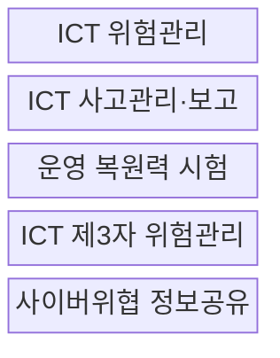
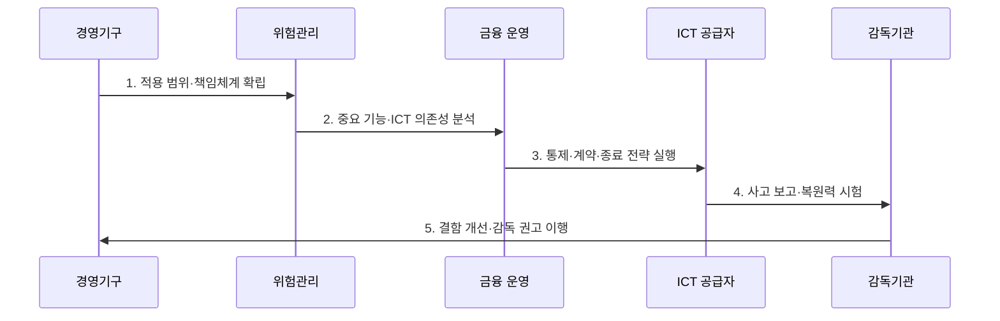

---
sidebar:
  order: 124
  label: "124. EU DORA (디지털 운영 복원력 법)"
  badge:
    text: "기출 · 70%"
    variant: note
title: "EU DORA (디지털 운영 복원력 법)"
date: "2026-07-27T23:59:59+09:00"
tags:
  - "notes-security"
weight: 124
extra:
  question_no: "124"
  source_status: "기출"
  source_history: "138회"
  priority: 70
  priority_note: "138회 최신 규정이며 운영복원력·제3자 위험이 중요함"
---

## 미리 알고가기

- **디지털 운영 복원력 법(Digital Operational Resilience Act, DORA)**: EU 금융 부문의 ICT 위험·사고·시험·제3자 관리를 통합한 법이다.
- **Regulation (EU) 2022/2554**: DORA의 정식 법령이며 2025년 1월 17일부터 적용된다.
- **금융기관(Financial Entity)**: DORA의 직접 적용을 받는 은행·보험·투자 등 금융 주체이다.
- **ICT 위험(ICT Risk)**: 정보통신기술 장애·오류·공격이 금융 서비스에 손실을 일으킬 가능성이다.
- **중대 ICT 사고(Major ICT-related Incident)**: 서비스·고객·거래에 중대한 영향을 주어 보고해야 하는 사고이다.
- **위협 기반 침투시험(Threat-Led Penetration Testing, TLPT)**: 실제 위협정보와 전술로 중요 기능의 방어·복구를 검증하는 고급 시험이다.
- **중요 ICT 제3자 제공자(Critical ICT Third-Party Provider, CTPP)**: EU 금융 안정성에 중요해 직접 감독받는 공급자이다.
- **주관 감독자(Lead Overseer)**: CTPP의 위험 평가·검사·권고 이행을 총괄하는 유럽 감독기관이다.
- **집중 위험(Concentration Risk)**: 다수 금융기관의 소수 공급자 의존으로 단일 장애가 확산할 위험이다.
- **종료 전략(Exit Strategy)**: 공급자 장애·계약 종료 시 중요 서비스를 이전·복구하는 계획이다.

## Ⅰ. 개요

- 정의: EU 금융 부문의 **디지털 운영 복원력 통합 규정**
- 목적: ICT 장애·공급자 집중의 **금융 연쇄 피해 억제**

### 쉽게 이해하기 (학습)

- 금융기관이 내부 시스템과 외부 ICT 공급자의 장애를 함께 견디고 복구하도록 정한 규칙임

## Ⅱ. 특징

- 경영기구 최종 책임의 **ICT 위험 거버넌스**
- 사고 보고·복원력 시험의 **EU 단일 체계**
- 계약 통제·CTPP 감독의 **제3자 위험관리**

### 쉽게 이해하기 (학습)

- 보안 통제뿐 아니라 장애 중 중요 금융 서비스가 계속되는지를 경영진이 책임짐

## Ⅲ. 구조 및 구성요소

| 설계 요소 | 설명 |
|:---|:---|
| ICT 위험관리 | 식별·보호·탐지·대응·복구 |
| ICT 사고관리·보고 | 분류·초기·중간·최종 보고 |
| 운영 복원력 시험 | 기본 시험·중요 기능 TLPT |
| ICT 제3자 위험관리 | 계약·집중·종료 전략 통제 |
| 사이버위협 정보공유 | 신뢰 공동체 내 자발적 공유 |

### 쉽게 이해하기 (학습)

- 내부 통제, 사고 보고, 시험, 공급자 관리, 위협정보 공유를 하나의 복원력 체계로 묶음

## Ⅳ. 흐름도

| 절차 | 설명 |
|:---|:---|
| 1. 적용 범위·책임체계 확립 | 법인·경영기구 책임 지정 |
| 2. 중요 기능·ICT 의존성 분석 | 자산·공급자·집중위험 식별 |
| 3. 통제·계약·종료 전략 실행 | 보안·복구·대체수단 확보 |
| 4. 사고 보고·복원력 시험 | 중대 사고 보고·TLPT 수행 |
| 5. 결함 개선·감독 권고 이행 | 시험·감독 결과 통제 환류 |

### 쉽게 이해하기 (학습)

- 중요 기능과 공급자 의존성을 먼저 파악하고 사고·시험·감독 결과를 경영진 통제에 되돌림

## Ⅴ. 종류 및 비교

| DORA 적용 주체 | 금융기관 | 일반 ICT 공급자 | CTPP |
|:---|:---|:---|:---|
| 적용 기준 | DORA 대상 금융업 수행 | 금융기관에 ICT 제공 | EU가 중요 공급자로 지정 |
| 핵심 특징 | 위험·사고·시험 의무 수행 | 계약·실사 통제 수용 | 계약 통제와 EU 직접 감독 |
| 한계 | 업무별 통제 분절 가능 | 대체·종료 수단 부족 | 집중 장애의 시장 확산 |

> 요약: 금융기관 직접 의무와 중요 공급자 감독을 결합함

### 쉽게 이해하기 (학습)

- 금융기관은 DORA 의무를 직접 이행하고 CTPP는 계약 통제에 더해 EU 감독도 받음

## Ⅵ. 실무 고려사항 및 대책

| 고려사항 | 대책 | 효과 |
|:---|:---|:---|
| 법적 적용 범위·시점 | **Regulation (EU) 2022/2554 적용** | 2025-01-17 의무 준수 |
| 중요 기능 고급 시험 | **DORA 제26조 TLPT 수행** | 실전 방어·복구 검증 |
| ICT 제3자 집중위험 | **DORA 제28~44조 통제** | 계약·감독·종료 확보 |

### 쉽게 이해하기 (학습)

- 중요 금융 기능은 실제 위협 기반 TLPT로 검증하고 공급자별 계약 목록·집중도·대체 가능성·종료 계획을 함께 관리한다.

## Ⅶ. 결론

- **기능 중요도·사고·시험·집중위험**으로 통제를 결정한다.

### 쉽게 이해하기 (학습)

- 내부 보안과 공급자 계약을 따로 보지 않고 금융 서비스의 지속성이라는 하나의 결과로 관리함
