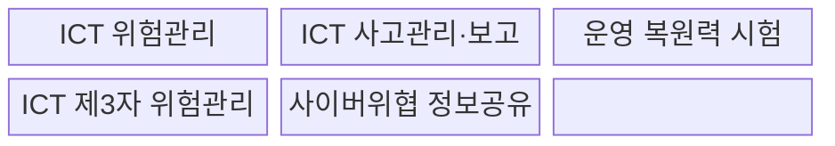
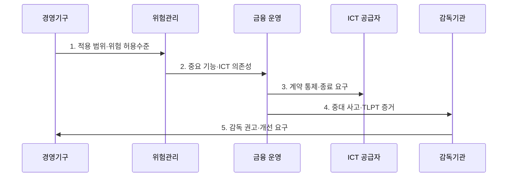

---
sidebar:
  order: 124
  label: "124. EU DORA (디지털 운영 복원력 법)"
  badge:
    text: "기출 · 70%"
    variant: note
title: "EU DORA (디지털 운영 복원력 법)"
date: "2026-07-31T02:14:22+09:00"
tags:
  - "notes-security"
weight: 124
extra:
  question_no: "124"
  source_status: "기출"
  source_history: "138회"
  priority: 70
  priority_note: "138회 최신 규정이며 운영복원력·제3자 위험이 중요함"
---

## Ⅰ. 개요

핵심 용어

- **DORA**: EU 금융 부문의 ICT 위험·사고·시험·제3자 관리를 통합한 디지털 운영 복원력 법이다.

- 정의/개념: EU 금융 부문의 ICT 위험·사고·시험·제3자를 통합 관리하는 **운영 복원력 규정**
- 배경/필요성: 분절된 금융 ICT 규제로는 공급자 집중 장애의 **연쇄 피해 통제 곤란**

### 쉽게 이해하기 (학습용)

- 금융기관이 내부 시스템과 외부 ICT 공급자의 장애를 함께 견디고 복구하도록 정한 규칙임

## Ⅱ. 특징

핵심 용어

- **ICT 위험**: 정보통신기술 장애·오류·공격이 금융 서비스에 손실을 일으킬 가능성이다.
- **중대 ICT 사고**: 서비스·고객·거래에 중대한 영향을 주어 보고해야 하는 사고이다.

- 경영기구 최종 책임의 **ICT 위험 거버넌스**
- 사고 보고·복원력 시험의 **EU 단일 체계**
- 계약 통제·CTPP 감독의 **제3자 위험관리**

### 쉽게 이해하기 (학습용)

- 보안 통제뿐 아니라 장애 중 중요 금융 서비스가 계속되는지를 경영진이 책임짐

## Ⅲ. 구조 및 구성요소

핵심 용어

- **TLPT**: 실제 위협정보와 전술로 중요 기능의 방어·복구를 검증하는 위협 기반 침투시험이다.
- **종료 전략**: 공급자 장애·계약 종료 시 중요 서비스를 이전·복구하는 계획이다.

| 구성요소 | 책임 |
|:---|:---|
| ICT 위험관리 | **식별·보호·탐지·대응·복구** |
| ICT 사고관리·보고 | **분류·초기·중간·최종 보고** |
| 운영 복원력 시험 | 기본 시험과 중요 기능 **TLPT** |
| ICT 제3자 위험관리 | **계약·집중·종료 전략** 통제 |
| 사이버위협 정보공유 | 신뢰 공동체 내 **자발적 공유** |

### 쉽게 이해하기 (학습용)

- 내부 통제, 사고 보고, 시험, 공급자 관리, 위협정보 공유를 하나의 복원력 체계로 묶음

## Ⅳ. 흐름도

핵심 용어

- **집중 위험**: 다수 금융기관의 소수 공급자 의존으로 단일 장애가 확산할 위험이다.

**동작 원리**

1. **적용 범위·위험 허용수준**: 법인·경영기구 책임과 허용 가능한 ICT 위험 제공
2. **중요 기능·ICT 의존성**: 자산·공급자·집중 위험의 분석 결과 전달
3. **계약 통제·종료 요구**: 보안·복구·감사권·대체수단 조건 제공
4. **중대 사고·TLPT 증거**: 사고 분류·보고와 중요 기능 시험 결과 제출
5. **감독 권고·개선 요구**: 시험·감독 결함과 이행 기한 제공

### 쉽게 이해하기 (학습용)

- 중요 기능과 공급자 의존성을 먼저 파악하고 사고·시험·감독 결과를 경영진 통제에 되돌림

## Ⅴ. 종류 및 비교

핵심 용어

- **CTPP**: EU 금융 안정성에 중요해 유럽 감독기관의 직접 감독을 받는 ICT 제3자 제공자이다.

| DORA 적용 주체 | 금융기관 | 일반 ICT 공급자 | CTPP |
|:---|:---|:---|:---|
| 적용 기준 | **DORA 대상 금융업** 수행 | 금융기관에 **ICT 제공** | EU의 **중요 공급자 지정** |
| 핵심 특징 | **위험·사고·시험 의무** 수행 | **계약·실사 통제** 수용 | 계약 통제와 **EU 직접 감독** |
| 한계 | 업무별 **통제 분절** 가능 | **대체·종료 수단** 부족 | 집중 장애의 **시장 확산** |

> 요약: 금융기관 직접 의무와 중요 공급자 감독을 결합함

### 쉽게 이해하기 (학습용)

- 금융기관은 DORA 의무를 직접 이행하고 CTPP는 계약 통제에 더해 EU 감독도 받음

## Ⅵ. 실무 고려사항 및 대책

핵심 용어

- **Regulation (EU) 2022/2554**: DORA의 정식 법령으로 2025년 1월 17일부터 적용된다.
- **주관 감독자**: CTPP의 위험 평가·검사·권고 이행을 총괄하는 유럽 감독기관이다.

| 문제 | 대책 | 효과 |
|:---|:---|:---|
| 적용 범위·시점을 놓치면 법정 의무 이행 지연 | **Regulation (EU) 2022/2554** 적용 | 2025-01-17부터 **법정 의무 준수** |
| 중요 기능의 실전 공격·복구 검증이 부족 | **DORA 제26조 TLPT** 수행 | 실운영 기반 **방어·복구 역량** 검증 |
| 소수 ICT 공급자 집중으로 장애가 금융권에 확산 | **DORA 제28~44조** 통제 | **계약·감독·종료 전략** 확보 |

### 쉽게 이해하기 (학습용)

- 중요 금융 기능은 실제 위협 기반 TLPT로 검증하고 공급자별 계약 목록·집중도·대체 가능성·종료 계획을 함께 관리한다.

## Ⅶ. 결론

핵심 용어

- **운영 복원력**: 내부 시스템과 외부 공급자의 장애 중에도 중요 금융 서비스를 지속·복구하는 능력이다.

- 금융기관은 **DORA 직접 의무**, CTPP는 EU 직접 감독, 일반 공급자는 계약 통제 적용

### 쉽게 이해하기 (학습용)

- 내부 보안과 공급자 계약을 따로 보지 않고 금융 서비스의 지속성이라는 하나의 결과로 관리함
