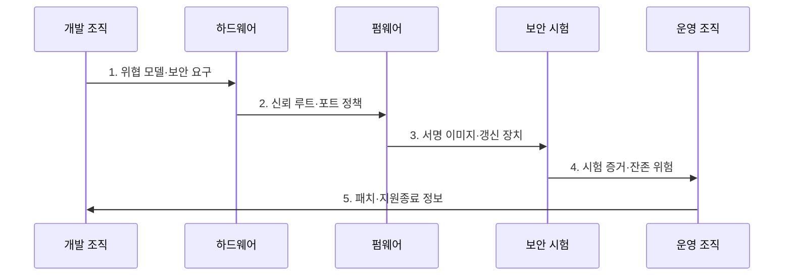

---
sidebar:
  order: 125
  label: "125. 임베디드 시스템 보안 취약점 (Embedded Security Vulnerabilities)"
  badge:
    text: "기출 · 70%"
    variant: note
title: 임베디드 시스템 보안 취약점 (Embedded Security Vulnerabilities)
date: "2026-08-02T23:55:00+09:00"
tags:
  - notes-security
weight: 125
extra:
  question_no: "125"
  source_status: "기출"
  source_history: "138회"
  priority: 70
  priority_note: "138회 기출이며 임베디드 공격면 우산으로 재사용됨"
---

## Ⅰ. 개요

핵심 용어

- **임베디드 시스템 보안 취약점(Embedded Security Vulnerabilities)**: 전용 장치의 하드웨어·펌웨어·통신·갱신·물리 경로에서 기밀성·무결성·가용성을 훼손할 수 있는 약점이다.
- **공격면**: 공격자가 접근하거나 입력할 수 있는 통신·포트·갱신·물리 경로의 전체 범위이다.

- 정의/개념: 전용 장치의 하드웨어·펌웨어·통신·물리 경로에 존재하는 **보안 취약점**
- 배경/필요성: 공용 비밀·미패치 결함은 동일 모델 전체로 **원격 공격 확산**

#### 한줄 요약

- 오래 쓰고 고치기 어려운 장치는 작은 설계 실수도 같은 모델 전체의 장기 위험이 됨

## Ⅱ. 특징

핵심 용어

- **하드코딩 자격증명**: 계정·암호·키를 펌웨어에 고정해 추출·재사용될 수 있는 결함이다.

- 자원 제약·장기 운영의 **보호 적용 한계**
- 원격·로컬·물리·공급망의 **다층 공격면**
- 공용 자격증명·미서명 갱신의 **장치군 확산**

#### 한줄 요약

- 네트워크뿐 아니라 디버그 포트, 펌웨어 파일, 칩 자체와 폐기 단계까지 보호해야 함

## Ⅲ. 구조 및 구성요소

핵심 용어

- **합동 테스트 액션 그룹(Joint Test Action Group, JTAG)·범용 비동기 송수신기(Universal Asynchronous Receiver-Transmitter, UART)**: 칩 디버깅과 직렬 진단에 쓰이며 노출 시 로컬 공격 경로가 되는 인터페이스이다.
- **신뢰 루트**: 부팅 검증·키 보호 등 장치 신뢰가 시작되는 최소 하드웨어·코드 기반이다.

| 구성요소 | 책임 |
|:---|:---|
| 원격 통신·입력 | **인증·암호화·파서 검증** |
| JTAG·UART 로컬 포트 | **잠금·승인 정비 접근** |
| 펌웨어·부팅·갱신 | **서명·버전·복구 검증** |
| 하드웨어·물리 접근 | **키 보호·결함 주입 방어** |
| 제조·운영·폐기 | **장치별 비밀·패치·삭제** |

#### 한줄 요약

- 통신 입력부터 부팅 신뢰, 물리 포트, 장치별 키와 업데이트까지 공격 경로별 통제가 필요함

## Ⅳ. 흐름도

핵심 용어

- **결함 주입**: 전압·클록·빛을 교란해 연산 오류를 만들고 보안 검사를 우회하는 공격이다.
- **JTAG·UART 포트**: 합동 테스트 액션 그룹(Joint Test Action Group, JTAG)과 범용 비동기 송수신기(Universal Asynchronous Receiver-Transmitter, UART)를 이용하는 디버그·진단 경로이다.

**동작 원리**

1. **위협 모델·보안 요구**: 원격·로컬·물리·공급망 경로와 영향 제공
2. **신뢰 루트·포트 정책**: 장치별 키와 JTAG·UART 잠금 조건 전달
3. **서명 이미지·갱신 장치**: 진위·버전·실패 복구를 보장하는 구현 제공
4. **시험 증거·잔존 위험**: 퍼징·포트·결함 주입 시험과 미해결 위험 제공
5. **패치·지원종료 정보**: 지원 기간·복구 절차·키 삭제 조건을 개발에 환류

#### 한줄 요약

- 출시 직전 검사보다 설계 때 공격면을 줄이고 업데이트 실패와 지원 종료까지 준비함

## Ⅴ. 종류 및 비교

핵심 용어

- **메모리 안전성**: 허용 범위 밖의 읽기·쓰기와 잘못된 객체 접근을 방지하는 속성이다.

| 임베디드 취약점 | 코드 결함 | 자격증명 결함 | 부팅·갱신 결함 |
|:---|:---|:---|:---|
| 적용 기준 | 파서·**저수준 코드 검증** | 제조·등록·**폐기 키 관리** | 시작·**원격 갱신 보호** |
| 핵심 특징 | **메모리·입력 오류**로 실행 | **공용·고정 비밀** 재사용 | **미검증 이미지** 설치 |
| 한계 | 권한 상승·**제어권 탈취** | 한 장치 분석의 **전체 확산** | 악성·구형 이미지의 **지속 실행** |

> 요약: 코드·비밀·신뢰 경로별로 통제함

#### 한줄 요약

- 실행 코드, 장치별 비밀, 시작·업데이트 경로는 서로 다른 시험과 보호가 필요함

## Ⅵ. 실무 고려사항 및 대책

핵심 용어

- **유럽전기통신표준협회 유럽표준(European Telecommunications Standards Institute European Standard, ETSI EN) 303 645**: 소비자 사물인터넷(Internet of Things, IoT) 제품의 기본 사이버보안 요구사항을 규정한다.
- **국제전기기술위원회(International Electrotechnical Commission, IEC) 62443-4-1**: 산업 제품의 보안 개발 생명주기 요구사항을 규정한다.
- **미국 국립표준기술연구소 내부보고서(National Institute of Standards and Technology Internal Report, NIST IR) 8259**: 사물인터넷 장치의 기능·제조 활동 보안 기준선을 다루는 지침이다.

| 문제 | 대책 | 효과 |
|:---|:---|:---|
| 소비자 IoT에 공용 암호·업데이트 부재로 대규모 악용 | **ETSI EN 303 645 V3.1.3** 적용 | 공용 암호와 **패치 위험** 감소 |
| 산업 제품의 보안 활동이 개발 단계별로 단절 | **IEC 62443-4-1:2018** 적용 | 설계부터 단종까지 **생명주기 통제** |
| 장치 기능·제조 활동 기준선이 없어 제품별 보호 편차 | **NIST IR 8259 Rev.1·8259A** 적용 | 식별·설정·보호·갱신의 **기준선 확보** |

#### 한줄 요약

- 양산 시 JTAG를 잠그고 장치별 비밀과 서명 갱신을 적용하며 승인된 정비 후 포트를 다시 잠근다.

## Ⅶ. 결론

핵심 용어

- **전 생명주기 보안**: 제조·운영·갱신·지원 종료·폐기까지 장치의 신뢰와 복구 가능성을 유지하는 원칙이다.

- 원격 입력은 **파서·인증**, **로컬 포트 잠금**, 부팅·갱신은 **서명·롤백 방지** 적용

#### 한줄 요약

- 제조부터 업데이트·지원 종료·폐기까지 장치의 신뢰와 복구 가능성을 이어가야 함
