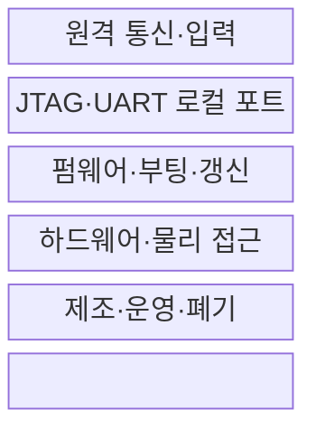
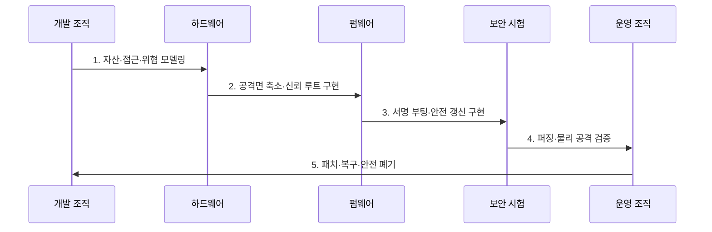

---
sidebar:
  order: 125
  label: "125. 임베디드 시스템 보안 취약점 (Embedded Security Vulnerabilities)"
  badge:
    text: "기출 · 70%"
    variant: note
title: 임베디드 시스템 보안 취약점 (Embedded Security Vulnerabilities)
date: "2026-07-30T19:00:00+09:00"
tags:
  - notes-security
weight: 125
extra:
  question_no: "125"
  source_status: "기출"
  source_history: "138회"
  priority: 70
  priority_note: "138회 기출이며 임베디드 공격면 우산으로 재사용됨"
---

## 미리 알고가기

- **임베디드 시스템(Embedded System)**: 특정 기능을 수행하도록 하드웨어와 펌웨어를 결합한 전용 시스템이다.
- **공격면(Attack Surface)**: 공격자가 접근하거나 입력할 수 있는 통신·포트·갱신·물리 경로의 전체 범위이다.
- **메모리 안전성(Memory Safety)**: 허용 범위 밖의 읽기·쓰기와 잘못된 객체 접근을 방지하는 속성이다.
- **하드코딩 자격증명(Hard-coded Credential)**: 계정·암호·키를 펌웨어에 고정해 추출·재사용될 수 있는 결함이다.
- **JTAG(IEEE 1149.1)**: 칩의 경계주사 시험과 디버깅을 위한 표준 하드웨어 인터페이스이다.
- **범용 비동기 송수신기(Universal Asynchronous Receiver-Transmitter, UART)**: 진단 메시지와 명령을 주고받는 직렬 통신 인터페이스이다.
- **결함 주입(Fault Injection)**: 전압·클록·빛을 교란해 연산 오류를 만들고 보안 검사를 우회하는 공격이다.
- **신뢰 루트(Root of Trust)**: 부팅 검증·키 보호 등 장치 신뢰가 시작되는 최소 하드웨어·코드 기반이다.
- **ETSI EN 303 645 V3.1.3**: 소비자 IoT 제품의 기본 사이버보안 요구사항을 규정한 유럽표준이다.
- **IEC 62443-4-1:2018**: 산업용 제어 제품의 보안 개발 생명주기 요구사항을 규정한 국제표준이다.

## Ⅰ. 개요

- 정의/개념: 장치의 **하드웨어·펌웨어·통신·물리 보안 결함**
- 배경/필요성: 공용 비밀·미패치 결함의 **장치군 확산 억제**

### 쉽게 이해하기 (학습용)

- 오래 쓰고 고치기 어려운 장치는 작은 설계 실수도 같은 모델 전체의 장기 위험이 됨

## Ⅱ. 특징

- 자원 제약·장기 운영의 **보호 적용 한계**
- 원격·로컬·물리·공급망의 **다층 공격면**
- 공용 자격증명·미서명 갱신의 **장치군 확산**

### 쉽게 이해하기 (학습용)

- 네트워크뿐 아니라 디버그 포트, 펌웨어 파일, 칩 자체와 폐기 단계까지 보호해야 함

## Ⅲ. 구조 및 구성요소

| 구성요소 | 책임 |
|:---|:---|
| 원격 통신·입력 | 인증·암호화·파서 검증 |
| JTAG·UART 로컬 포트 | 잠금·승인 정비 접근 |
| 펌웨어·부팅·갱신 | 서명·버전·복구 검증 |
| 하드웨어·물리 접근 | 키 보호·결함 주입 방어 |
| 제조·운영·폐기 | 장치별 비밀·패치·삭제 |

### 쉽게 이해하기 (학습용)

- 통신 입력부터 부팅 신뢰, 물리 포트, 장치별 키와 업데이트까지 공격 경로별 통제가 필요함

## Ⅳ. 흐름도

**동작 원리**

- **1. 자산·접근·위협 모델링**: 원격·로컬·물리 영향 분석
- **2. 공격면 축소·신뢰 루트 구현**: 불필요 서비스·포트·비밀 제거
- **3. 서명 부팅·안전 갱신 구현**: 진위·버전·실패 복구 보장
- **4. 퍼징·물리 공격 검증**: 파서·포트·결함 주입 시험
- **5. 패치·복구·안전 폐기**: 지원기간·키 폐기까지 운영

### 쉽게 이해하기 (학습용)

- 출시 직전 검사보다 설계 때 공격면을 줄이고 업데이트 실패와 지원 종료까지 준비함

## Ⅴ. 종류 및 비교

| 임베디드 취약점 | 코드 결함 | 자격증명 결함 | 부팅·갱신 결함 |
|:---|:---|:---|:---|
| 적용 기준 | 파서·저수준 코드 검증 | 제조·등록·폐기 키 관리 | 시작·원격 갱신 보호 |
| 핵심 특징 | 메모리·입력 오류로 실행 | 공용·고정 비밀 재사용 | 미검증 이미지 설치 |
| 한계 | 권한 상승·제어권 탈취 | 한 장치 분석이 전체 확산 | 악성·구형 이미지 지속 |

> 요약: 코드·비밀·신뢰 경로별로 통제함

### 쉽게 이해하기 (학습용)

- 실행 코드, 장치별 비밀, 시작·업데이트 경로는 서로 다른 시험과 보호가 필요함

## Ⅵ. 실무 고려사항 및 대책

| 고려사항 | 대책 | 효과 |
|:---|:---|:---|
| 소비자 IoT 기본 통제 | **ETSI EN 303 645 V3.1.3 적용** | 공용 암호·패치 위험 감소 |
| 산업 제품 개발 생명주기 | **IEC 62443-4-1:2018 적용** | 설계부터 단종까지 통제 |
| 장치 보안 기능 기준선 | **NIST IR 8259A 적용** | 식별·설정·보호·갱신 확보 |

### 쉽게 이해하기 (학습용)

- 양산 시 JTAG를 잠그고 장치별 비밀과 서명 갱신을 적용하며 승인된 정비 후 포트를 다시 잠근다.

## Ⅶ. 결론

- **접근면·수명·복구성·장치군 영향**으로 보호 수준을 결정한다.

### 쉽게 이해하기 (학습용)

- 제조부터 업데이트·지원 종료·폐기까지 장치의 신뢰와 복구 가능성을 이어가야 함
