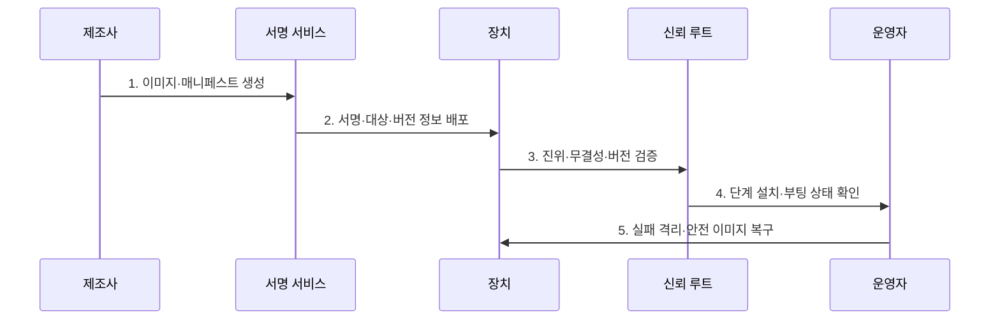

---
sidebar:
  order: 126
  label: "126. 펌웨어 보안 — 하드코딩 자격증명 (Firmware Security)"
  badge:
    text: "기출 · 70%"
    variant: note
title: 펌웨어 보안 — 하드코딩 자격증명 (Firmware Security)
date: "2026-07-30T19:00:00+09:00"
tags:
  - notes-security
weight: 126
extra:
  question_no: "126"
  source_status: "기출"
  source_history: "138회"
  priority: 70
  priority_note: "138회 기출이며 펌웨어 신뢰·업데이트 설계가 중요함"
---

## 미리 알고가기

- **펌웨어(Firmware)**: 하드웨어를 초기화·제어하는 장치 내 저수준 소프트웨어이다.
- **하드코딩 자격증명(Hard-coded Credential)**: 계정·암호·키를 코드에 고정해 추출·공유될 수 있는 결함이다.
- **신뢰 루트(Root of Trust, RoT)**: 신뢰 사슬을 시작하는 변조 방지 하드웨어·코드·키 기반이다.
- **보안 부팅(Secure Boot)**: 서명과 정책으로 부팅 구성요소의 진위·무결성을 검증하는 기능이다.
- **인증 업데이트(Authenticated Update)**: 승인된 주체가 서명한 정식 펌웨어만 설치하는 기능이다.
- **롤백 방지(Anti-rollback)**: 알려진 취약점이 있는 구형 정식 버전의 재설치를 차단하는 기능이다.
- **소프트웨어 자재명세서(Software Bill of Materials, SBOM)**: 펌웨어 구성요소와 버전·의존성을 기록한 명세서이다.
- **NIST SP 800-193**: 플랫폼 펌웨어의 보호·탐지·복구 복원력 지침이다.
- **IETF RFC 9019**: IoT 장치의 안전한 펌웨어 업데이트 참여자·절차·보안 구조를 정의한다.
- **IETF RFC 9124**: IoT 펌웨어 업데이트 매니페스트에 필요한 정보 모델을 정의한다.

## Ⅰ. 개요

- 정의/개념: 펌웨어의 **부팅·비밀·갱신·복구 신뢰 보호**
- 배경/필요성: 하위 변조·지속성의 **장치군 확산과 영구 장애 방지**

### 쉽게 이해하기 (학습용)

- 운영체제보다 먼저 실행되는 펌웨어가 바뀌면 위에서 동작하는 보안 기능도 믿기 어려움

## Ⅱ. 특징

- 최초 실행·고권한의 **탐지·복구 난도**
- 공용 비밀 추출의 **동일 장치군 확산**
- 서명·버전·복구 기반 **갱신 신뢰성**

### 쉽게 이해하기 (학습용)

- 업데이트를 막으면 취약점을 못 고치고 아무 업데이트나 허용하면 공격자가 펌웨어를 바꿈

## Ⅲ. 구조 및 구성요소

| 구성요소 | 책임 |
|:---|:---|
| 하드웨어 신뢰 루트 | 첫 검증 키·정책 보호 |
| 부팅 진위·무결성 검증 | 단계별 서명·버전 확인 |
| 장치별 비밀·서명키 | 생성·주입·회전·폐기 통제 |
| 인증 갱신·롤백 방지 | 대상·버전·서명 검증 |
| 변조 탐지·안전 복구 | 정상 이미지 전환·증적 |

### 쉽게 이해하기 (학습용)

- 바꿀 수 없는 첫 코드가 다음 코드를 검증하고 실패하면 알려진 정상 이미지로 복구함

## Ⅳ. 흐름도

**동작 원리**

- **1. 이미지·매니페스트 생성**: SBOM·대상·버전·정책 결합
- **2. 서명·대상·버전 정보 배포**: 키 분리·단계별 OTA 전송
- **3. 진위·무결성·버전 검증**: 신뢰키·해시·롤백 확인
- **4. 단계 설치·부팅 상태 확인**: 일부 장치 적용·건강성 측정
- **5. 실패 격리·안전 이미지 복구**: 검증된 복구본으로 전환

### 쉽게 이해하기 (학습용)

- 파일 서명뿐 아니라 어떤 장치에 어떤 순서로 설치할지와 실패 후 복구까지 검증함

## Ⅴ. 종류 및 비교

| 펌웨어 비밀 관리 | 공용 비밀 | 장치별 비밀 | 고유값 파생 |
|:---|:---|:---|:---|
| 적용 기준 | 사용 금지·제거 대상 | 장치별 회수·교체 필요 | 원시 키 저장 최소화 |
| 핵심 특징 | 같은 비밀을 코드에 고정 | 제조 시 개별 비밀 주입 | 장치 고유값으로 파생 |
| 한계 | 한 번 추출로 전체 침해 | 제조 등록부·주입 노출 | 파생 함수·고유값 노출 |

> 요약: 공용 비밀을 없애고 장치별 수명주기를 추적함

### 쉽게 이해하기 (학습용)

- 장치 하나의 비밀이 노출돼도 같은 모델 전체가 침해되지 않도록 비밀을 분리함

## Ⅵ. 실무 고려사항 및 대책

| 고려사항 | 대책 | 효과 |
|:---|:---|:---|
| 펌웨어 복원력 | **NIST SP 800-193 적용** | 보호·탐지·복구 확보 |
| IoT 갱신 구조 | **IETF RFC 9019 적용** | 참여자·신뢰 경계 명확화 |
| 갱신 메타데이터 | **IETF RFC 9124 적용** | 대상·버전·서명 검증 |

### 쉽게 이해하기 (학습용)

- 제조사가 서명한 매니페스트의 장치 대상과 버전을 검증하고 실패 시에도 취약본이 아닌 서명된 복구 이미지로 전환한다.

## Ⅶ. 결론

- **신뢰 루트·키·버전·복구성**으로 갱신 허용을 결정한다.

### 쉽게 이해하기 (학습용)

- 변조 차단뿐 아니라 변조를 알아내고 정상 상태로 안전하게 되돌릴 수 있어야 함
