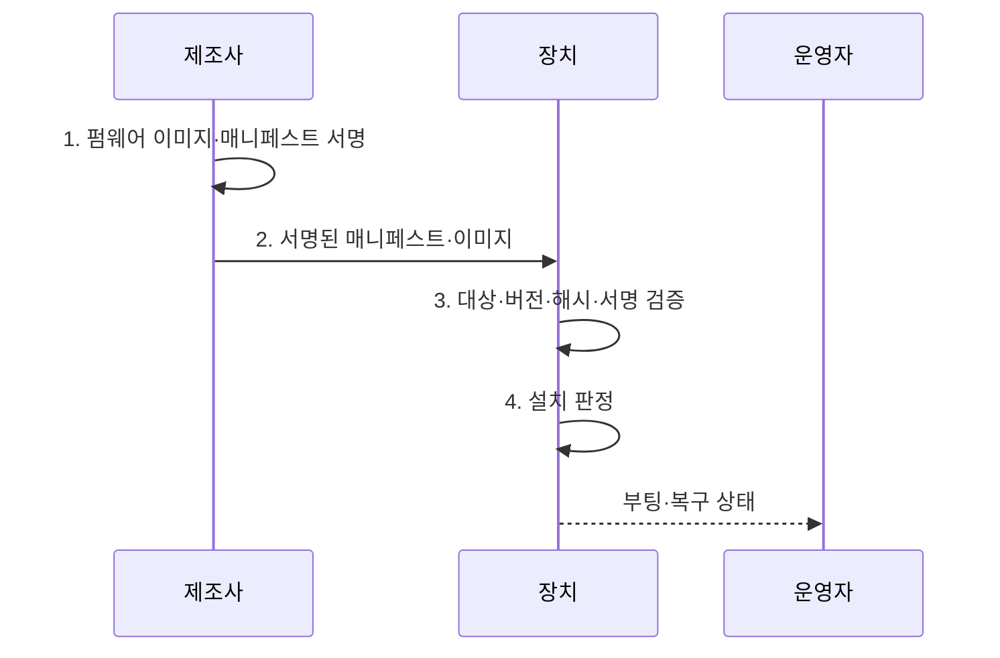

---
sidebar:
  order: 126
  label: "126. 펌웨어 보안 — 하드코딩 자격증명 (Firmware Security)"
  badge:
    text: "기출 · 70%"
    variant: note
title: 펌웨어 보안 — 하드코딩 자격증명 (Firmware Security)
date: "2026-08-02T23:56:00+09:00"
tags:
  - notes-security
weight: 126
extra:
  question_no: "126"
  source_status: "기출"
  source_history: "138회"
  priority: 70
  priority_note: "138회 기출이며 펌웨어 신뢰·업데이트 설계가 중요함"
---

## Ⅰ. 개요

핵심 용어

- **펌웨어 보안(Firmware Security)**: 하드웨어를 초기화·제어하는 저수준 소프트웨어의 실행 무결성, 자격증명 보호와 서명 기반 갱신 신뢰성을 보장하는 활동이다.

- 정의/개념: 하드웨어와 운영체제 사이 펌웨어의 **실행·갱신 신뢰성 보장**
- 배경/필요성: 운영체제 보안만으로는 하위 펌웨어의 **지속성 공격 차단 불가**

#### 한줄 요약

- 운영체제보다 먼저 실행되는 펌웨어가 바뀌면 위에서 동작하는 보안 기능도 믿기 어려움

## Ⅱ. 특징

핵심 용어

- **하드코딩 자격증명**: 계정·암호·키를 코드에 고정해 추출·공유될 수 있는 결함이다.
- **인증 업데이트**: 승인된 주체가 서명한 정식 펌웨어만 설치하는 기능이다.

- 최초 실행·고권한의 **탐지·복구 난도**
- 공용 비밀 추출의 **동일 장치군 확산**
- 서명·버전·복구 기반 **갱신 신뢰성**

#### 한줄 요약

- 업데이트를 막으면 취약점을 못 고치고 아무 업데이트나 허용하면 공격자가 펌웨어를 바꿈

## Ⅲ. 구조 및 구성요소

핵심 용어

- **신뢰 루트**: 신뢰 사슬을 시작하는 변조 방지 하드웨어·코드·키 기반이다.
- **롤백 방지**: 취약한 구형 정식 버전의 재설치를 차단하는 기능이다.

| 구성요소 | 책임 |
|:---|:---|
| 하드웨어 신뢰 루트 | 첫 **검증 키·정책** 보호 |
| 부팅 진위·무결성 검증 | 단계별 **서명·버전** 확인 |
| 장치별 비밀·서명키 | **생성·주입·회전·폐기** 통제 |
| 인증 갱신·롤백 방지 | **대상·버전·서명** 검증 |
| 변조 탐지·안전 복구 | **정상 이미지 전환·증적** 확보 |

#### 한줄 요약

- 바꿀 수 없는 첫 코드가 다음 코드를 검증하고 실패하면 알려진 정상 이미지로 복구함

## Ⅳ. 흐름도

핵심 용어

- **무선 원격 업데이트(Over-the-Air Update, OTA)·소프트웨어 자재명세서(Software Bill of Materials, SBOM)**: 펌웨어를 원격 배포하는 방식과 구성요소·버전·의존성을 기록한 명세서이다.

**동작 원리**

- **1. 펌웨어 이미지·매니페스트 서명**: SBOM·대상·버전·정책을 결합해 제조사 서명 생성
- **2. 서명된 매니페스트·이미지**: 분리된 키와 OTA로 배포
- **3. 대상·버전·해시·서명 검증**: 장치 정책과 배포물의 일치 확인
- **4. 설치 판정**: 원자적 설치와 부팅 허용 여부 결정

#### 한줄 요약

- 파일 서명뿐 아니라 어떤 장치에 어떤 순서로 설치할지와 실패 후 복구까지 검증함

## Ⅴ. 종류 및 비교

핵심 용어

- **장치별 비밀**: 하나의 장치가 노출돼도 동일 모델 전체로 피해가 확산되지 않게 개별 관리하는 비밀이다.

| 펌웨어 비밀 관리 | 공용 비밀 | 장치별 비밀 | 고유값 파생 |
|:---|:---|:---|:---|
| 적용 기준 | **사용 금지·제거** 대상 | 장치별 **회수·교체** 필요 | 원시 키 저장 최소화 |
| 핵심 특징 | 같은 **비밀을 코드에 고정** | 제조 시 **개별 비밀 주입** | **장치 고유값** 으로 파생 |
| 한계 | 한 번 추출로 **전체 침해** | 제조 **등록부·주입** 노출 | **파생 함수·고유값** 노출 |

> 요약: 공용 비밀을 없애고 장치별 수명주기를 추적함

#### 한줄 요약

- 장치 하나의 비밀이 노출돼도 같은 모델 전체가 침해되지 않도록 비밀을 분리함

## Ⅵ. 실무 고려사항 및 대책

핵심 용어

- **미국 국립표준기술연구소 특별간행물(National Institute of Standards and Technology Special Publication, NIST SP) 800-193**: 플랫폼 펌웨어의 보호·탐지·복구 복원력 지침이다.
- **인터넷국제표준화기구 의견요청서(Internet Engineering Task Force Request for Comments, IETF RFC) 9019·9124**: 사물인터넷(Internet of Things, IoT) 펌웨어 업데이트 구조와 매니페스트 정보 모델을 정의한다.

| 문제 | 대책 | 효과 |
|:---|:---|:---|
| **펌웨어 복원력** | **NIST SP 800-193 적용** | **보호·탐지·복구** 확보 |
| **IoT 갱신 구조** | **IETF RFC 9019 적용** | **참여자·신뢰 경계** 명확화 |
| **갱신 메타데이터** | **IETF RFC 9124 적용** | **대상·버전·서명** 검증 |

#### 한줄 요약

- 제조사가 서명한 매니페스트의 장치 대상과 버전을 검증하고 실패 시에도 취약본이 아닌 서명된 복구 이미지로 전환한다.

## Ⅶ. 결론

핵심 용어

- **안전 복구**: 변조·설치 실패를 탐지하고 서명된 정상 이미지로 되돌리는 기능이다.

- 서명·대상·버전 검증과 복구 가능성을 충족한 **펌웨어만 설치**

#### 한줄 요약

- 변조 차단뿐 아니라 변조를 알아내고 정상 상태로 안전하게 되돌릴 수 있어야 함
