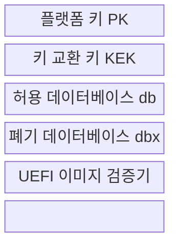
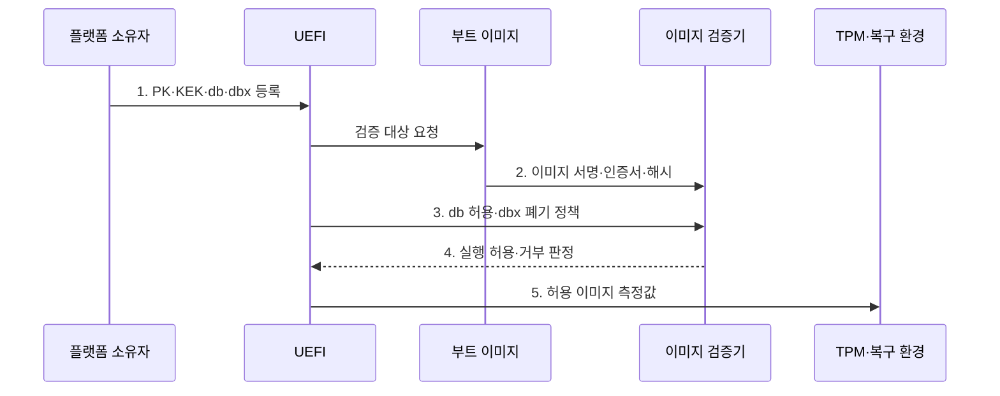

---
sidebar:
  order: 127
  label: "127. Secure Boot 보안 부팅 (Secure Boot)"
  badge:
    text: "기출 · 70%"
    variant: note
title: Secure Boot 보안 부팅 (Secure Boot)
date: "2026-08-02T23:57:00+09:00"
tags:
  - notes-security
weight: 127
extra:
  question_no: "127"
  source_status: "기출"
  source_history: "138회"
  priority: 70
  priority_note: "138회 기출이며 부팅 신뢰사슬의 핵심 통제임"
---

## Ⅰ. 개요

핵심 용어

- **보안 부팅(Secure Boot)**: UEFI의 신뢰 키·허용 목록·폐기 목록으로 부트 이미지 서명을 단계별 검증해 허가된 코드만 실행하는 기술이다.
- **UEFI**: 하드웨어 초기화·부팅 서비스와 보안 부팅 변수를 관리하는 펌웨어 인터페이스이다.

- 정의/개념: UEFI 신뢰 정책으로 **부트 이미지 실행을 통제하는 보안 기술**
- 배경/필요성: 운영체제 보안만으로는 선행 부트킷의 **권한 탈취 차단 불가**

### 쉽게 이해하기 (학습용)

- 컴퓨터가 켜질 때 다음 프로그램의 서명과 금지 목록을 확인해 승인된 코드만 실행함

## Ⅱ. 특징

핵심 용어

- **PK·KEK**: 플랫폼 정책 소유권과 허용·폐기 데이터베이스의 갱신 권한을 통제하는 키이다.
- **db·dbx**: 실행 허용 대상과 취약·폐기 대상을 저장하는 UEFI 데이터베이스이다.

- PK·KEK 기반 **정책 소유·갱신 권한**
- db·dbx 기반 **허용·폐기 판정**
- 펌웨어·부트로더의 **연속 신뢰 사슬**

### 쉽게 이해하기 (학습용)

- 서명이 유효해도 취약성이 발견되면 dbx에 등록해 이후 부팅을 막아야 함

## Ⅲ. 구조 및 구성요소

핵심 용어

- **신뢰 사슬**: 첫 신뢰 키에서 시작해 다음 부팅 구성요소를 연속 검증하는 구조이다.

| 구성요소 | 책임 |
|:---|:---|
| 플랫폼 키 PK | **플랫폼 정책 소유권** 설정 |
| 키 교환 키 KEK | **db·dbx 갱신 권한** 검증 |
| 허용 데이터베이스 db | **허용 서명·인증서·해시** 저장 |
| 폐기 데이터베이스 dbx | **취약·폐기 대상** 거부 |
| UEFI 이미지 검증기 | **서명 체인·정책** 판정 |

### 쉽게 이해하기 (학습용)

- 소유권 키가 목록 변경을 통제하고 허용·폐기 목록이 실제 부트 파일 실행을 결정함

## Ⅳ. 흐름도

핵심 용어

- **TPM**: 암호 키와 플랫폼의 부팅 측정값을 보호하는 신뢰 플랫폼 모듈이다.

**동작 원리**

- **1. PK·KEK·db·dbx 등록**: 소유권·갱신·허용 정책 설정
- **2. 이미지 서명·인증서·해시**: 부트로더·드라이버 검증 정보
- **3. db 허용·dbx 폐기 정책**: 신뢰 체인·폐기 여부 확인 기준
- **4. 실행 허용·거부 판정**: 미승인 코드 차단·복구 전환
- **5. 허용 이미지 측정값**: 다음 단계 실행과 TPM 증적 기록

### 쉽게 이해하기 (학습용)

- 허용 목록에 있어도 폐기 목록에 포함되면 실행하지 않고 인증된 복구 경로로 전환함

## Ⅴ. 종류 및 비교

핵심 용어

- **Trusted Boot·Measured Boot**: 운영체제 구성요소를 연속 검증하는 방식과 측정값을 TPM에 기록하는 방식이다.

| 부팅 신뢰 기술 | Secure Boot | Trusted Boot | Measured Boot |
|:---|:---|:---|:---|
| 적용 기준 | 실행 전 **부트 이미지 통제** | OS 구성요소까지 **연속 검증** | 부팅 상태 **원격 증명** |
| 핵심 특징 | **미승인 이미지** 실행 차단 | 다음 구성요소 **진위 확인** | TPM에 **측정값 기록** |
| 한계 | **키·dbx 오류** 시 부팅 불가 | **OS 정책 침해** 가능 | 측정만으로 **차단 불가** |

> 요약: 실행 차단, 연속 검증, 상태 증명을 구분함

### 쉽게 이해하기 (학습용)

- Secure Boot는 차단하고 Trusted Boot는 이어 검증하며 Measured Boot는 증거를 남김

## Ⅵ. 실무 고려사항 및 대책

핵심 용어

- **UEFI Specification 2.11**: Secure Boot·드라이버 서명·키 교환 구조를 정의한 규격이다.
- **NIST SP 800-193**: 플랫폼 펌웨어의 보호·탐지·복구 복원력 지침이다.

| 문제 | 대책 | 효과 |
|:---|:---|:---|
| 키 소유권이 불명확하면 정책이 변조됨 | **UEFI Specification 2.11 적용** | PK·KEK·db·dbx 표준화 |
| 부팅 차단만으로 장애 복구가 불가능함 | **NIST SP 800-193 적용** | 보호·탐지·복구 확보 |
| 측정값이 위조되면 원격 판정이 오염됨 | **TCG TPM 2.0 Library 적용** | 측정·원격 증명 기반 확보 |

### 쉽게 이해하기 (학습용)

- 조직이 승인한 부트로더·커널 서명만 db에 두고 취약 서명자는 dbx로 폐기하며 복구 키와 절차를 별도 검증한다.

## Ⅶ. 결론

핵심 용어

- **허용·폐기 동시 판정**: 서명이 허용 목록에 있고 폐기 목록에는 없어야 실행하는 원칙이다.

- db 허용과 dbx 비폐기를 모두 충족한 **부트 이미지만 실행**

### 쉽게 이해하기 (학습용)

- 서명 기능보다 누구를 신뢰하고 언제 폐기하며 실패를 어떻게 복구할지가 중요함
