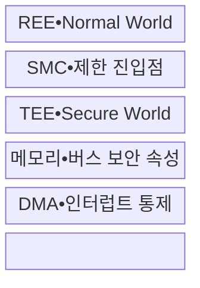
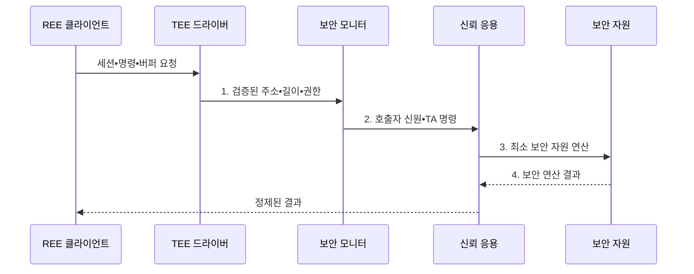

---
sidebar:
  order: 128
  label: "128. ARM TrustZone (ARM TrustZone)"
  badge:
    text: "기출 • 70%"
    variant: note
title: ARM TrustZone (ARM TrustZone)
date: "2026-08-04T17:11:00+09:00"
tags:
  - notes-security
weight: 128
extra:
  question_no: "128"
  source_status: "기출"
  source_history: "138회"
  priority: 70
  priority_note: "138회 기출이며 TEE•격리 비교에 활용되는 하드웨어임"
---

## Ⅰ. 개요

핵심 용어

- **SoC(System on Chip)**: 시스템 기능을 하나의 칩에 통합한 반도체이다.
- **CPU(Central Processing Unit)**: 명령을 해석•실행하는 중앙처리장치이다.
- **Arm TrustZone**: SoC 자원 접근을 보안•비보안 상태로 구분하는 격리 기술이다.

- 정의/개념: SoC 자원을 보안 상태별로 분리하는 **하드웨어 격리 기술**
- 배경/필요성: 소프트웨어 권한 분리만으로는 커널 침해 시 **비밀 보호 불가**

#### 한줄 요약

- 같은 칩 안에 일반 공간과 보호 공간을 만들고 하드웨어가 접근 가능한 자원을 구분함

## Ⅱ. 특징

핵심 용어

- **TCB(Trusted Computing Base)**: 보안을 위해 반드시 신뢰해야 하는 최소 구성요소 집합이다.
- **TEE(Trusted Execution Environment)**: 신뢰 응용을 격리 실행하는 환경이다.
- **REE(Rich Execution Environment)**: 범용 OS와 일반 응용이 실행되는 환경이다.
- **OS(Operating System)**: 하드웨어 자원과 응용 실행을 관리하는 운영체제이다.

- CPU•메모리•버스의 **보안 속성 전파**
- A-profile•M-profile의 **하드웨어 상태 격리**
- 제한 진입점•최소 TCB의 **경계 통제**

#### 한줄 요약

- 하드웨어가 벽을 만들지만 출입구•공유 메모리•보호 공간 코드는 소프트웨어가 안전하게 설계해야 함

## Ⅲ. 구조 및 구성요소

핵심 용어

- **SMC(Secure Monitor Call)**: 보안 상태 전환을 요청하는 호출이다.
- **TA(Trusted Application)**: TEE 내부에서 제한된 서비스를 수행하는 응용이다.
- **DMA(Direct Memory Access)**: CPU 없이 주변장치가 메모리를 직접 읽고 쓰는 기능이다.

| 구성요소 | 책임 |
|:---|:---|
| REE•Normal World | **범용 OS•일반 응용** 실행 |
| SMC•제한 진입점 | **요청 검증•상태 전환** |
| TEE•Secure World | **TA•키•보안 서비스** 실행 |
| 메모리•버스 보안 속성 | 영역별 **접근 경로 분리** |
| DMA•인터럽트 통제 | **CPU를 거치지 않는 DMA 접근** 제한 |

#### 한줄 요약

- 일반 앱은 정해진 진입점으로 필요한 만큼만 TEE 서비스를 요청하고 결과만 돌려받음

## Ⅳ. 흐름도

핵심 용어

- **TOCTOU(Time of Check to Time of Use)**: 검증 후 사용 전에 공유 데이터가 바뀌는 취약점이다.
- **실행 환경 호출 경계**: REE 요청을 TEE가 검증해 TA에 전달하는 경계이다.

**동작 원리**

- **1. 검증된 주소•길이•권한**: 공유 메모리 복사•재검증 결과
- **2. 호출자 신원•TA 명령**: 제한 진입점의 서비스 호출 정보
- **3. 최소 보안 자원 연산**: 키•암호•보호 저장소의 제한 사용
- **4. 보안 연산 결과**: 비밀을 제거한 허용 출력 범위

#### 한줄 요약

- 보호 영역 입구에서 공유 버퍼를 복사•재검증하고 필요한 결과만 일반 영역으로 반환함

## Ⅴ. 종류 및 비교

핵심 용어

- **SAU(Security Attribution Unit)**: Armv8-M에서 메모리 영역의 보안 속성을 설정하는 장치이다.
- **MCU(Microcontroller Unit)**: 처리기•메모리•입출력을 통합한 마이크로컨트롤러이다.

| 실행환경 격리 | Arm A-profile | Armv8-M | 하이퍼바이저 |
|:---|:---|:---|:---|
| 적용 기준 | 범용 OS의 **키•인증 격리** | MCU **펌웨어•메모리 분리** | 여러 **OS•가상머신 분리** |
| 핵심 특징 | **Secure•Normal World** | **SAU 기반 보안 속성** | 가상화 **자원별 격리** |
| 한계 | **SMC•공유 버퍼 오류** | **속성•주변장치 설정** 누락 | 취약점의 **게스트 확산** |

> 요약: 대상 처리기와 신뢰 서비스 범위에 맞춰 선택함

#### 한줄 요약

- A-profile은 범용 OS, Armv8-M은 소형 장치, 하이퍼바이저는 다중 OS 격리에 적합함

## Ⅵ. 실무 고려사항 및 대책

핵심 용어

- **API(Application Programming Interface)**: 응용이 기능을 호출하는 연결 규격이다.
- **GlobalPlatform TEE API**: TA의 암호•저장•시간 기능을 정의한 규격이다.
- **속성•시점 통제**: SAU 설정과 TOCTOU 방어를 함께 적용하는 통제이다.
- **실행•메모리 경계**: TEE가 REE 입력을 재검증하고 DMA를 제한하는 경계이다.

| 문제 | 대책 | 효과 |
|:---|:---|:---|
| 영역 속성이 누락되면 MCU 자원이 노출됨 | **Armv8-M Security Extension 적용** | SAU•진입점 속성 통제 |
| TA마다 API가 다르면 경계 검증이 누락됨 | **GlobalPlatform TEE API v1.4 적용** | TA 기능•경계 표준화 |
| 검사 뒤 공유 버퍼가 바뀌면 입력이 오염됨 | **복사 후 주소•길이 재검증** | **TOCTOU** 변조 차단 |

#### 한줄 요약

- REE가 준 주소•길이•권한을 TEE에서 복사•재검증하고 DMA와 인터럽트의 보안 속성도 함께 제한한다.

## Ⅶ. 결론

핵심 용어

- **최소 격리**: 키•인증 등 민감 기능만 TEE에 두어 신뢰 코드와 공격면을 줄이는 원칙이다.

- 키•인증은 **TEE에 최소 격리**, 일반 기능은 REE에 배치

#### 한줄 요약

- Secure World라는 이름보다 경계 검증과 최소 신뢰 코드의 운영 품질이 중요함
