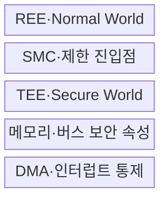
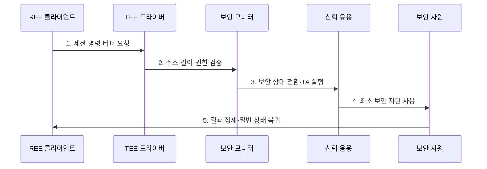

---
sidebar:
  order: 128
  label: "128. ARM TrustZone (ARM TrustZone)"
  badge:
    text: "기출 · 70%"
    variant: note
title: ARM TrustZone (ARM TrustZone)
date: "2026-07-27T23:59:59+09:00"
tags:
  - notes-security
weight: 128
extra:
  question_no: "128"
  source_status: "기출"
  source_history: "138회"
  priority: 70
  priority_note: "138회 기출이며 TEE·격리 비교에 활용되는 하드웨어임"
---

## 미리 알고가기

- **Arm TrustZone**: 하나의 시스템온칩 자원을 Secure·Non-secure 보안 상태로 분리하는 Arm 기술이다.
- **시스템온칩(System on Chip, SoC)**: 처리기·메모리 제어·주변장치 기능을 한 칩에 통합한 시스템이다.
- **보안 실행환경(Trusted Execution Environment, TEE)**: 일반 실행환경과 격리해 신뢰 응용을 실행하는 환경이다.
- **일반 실행환경(Rich Execution Environment, REE)**: 범용 운영체제와 일반 응용이 실행되는 환경이다.
- **보안 모니터 호출(Secure Monitor Call, SMC)**: Arm A-profile에서 보안 상태 전환을 요청하는 명령이다.
- **신뢰 응용(Trusted Application, TA)**: TEE 내부에서 제한된 보안 서비스를 수행하는 응용이다.
- **보안 속성 장치(Security Attribution Unit, SAU)**: Armv8-M에서 메모리 영역의 보안 속성을 설정하는 장치이다.
- **직접 메모리 접근(Direct Memory Access, DMA)**: CPU 없이 주변장치가 메모리를 직접 읽고 쓰는 기능이다.
- **검사·사용 시점 불일치(Time of Check to Time of Use, TOCTOU)**: 검증 후 사용 전에 공유 데이터가 바뀌는 취약점이다.
- **신뢰 컴퓨팅 기반(Trusted Computing Base, TCB)**: 보안을 위해 반드시 신뢰해야 하는 최소 하드웨어·소프트웨어 집합이다.
- **GlobalPlatform TEE Internal Core API v1.4**: TA의 암호·저장·시간 등 내부 API를 정의한 규격이다.

## Ⅰ. 개요

- 정의: SoC 자원의 **Secure·Non-secure 상태 격리**
- 목적: 일반 실행환경 침해의 **핵심 비밀·서비스 확산 차단**

### 쉽게 이해하기 (학습)

- 같은 칩 안에 일반 공간과 보호 공간을 만들고 하드웨어가 접근 가능한 자원을 구분함

## Ⅱ. 특징

- CPU·메모리·버스의 **보안 속성 전파**
- A-profile·M-profile의 **하드웨어 상태 격리**
- 제한 진입점·최소 TCB의 **경계 통제**

### 쉽게 이해하기 (학습)

- 하드웨어가 벽을 만들지만 출입구·공유 메모리·보호 공간 코드는 소프트웨어가 안전하게 설계해야 함

## Ⅲ. 구조 및 구성요소

| 설계 요소 | 설명 |
|:---|:---|
| REE·Normal World | 범용 OS·일반 응용 실행 |
| SMC·제한 진입점 | 요청 검증·상태 전환 |
| TEE·Secure World | TA·키·보안 서비스 실행 |
| 메모리·버스 보안 속성 | 영역별 접근 경로 분리 |
| DMA·인터럽트 통제 | 주변장치 우회 접근 제한 |

### 쉽게 이해하기 (학습)

- 일반 앱은 정해진 진입점으로 필요한 만큼만 TEE 서비스를 요청하고 결과만 돌려받음

## Ⅳ. 흐름도

| 절차 | 설명 |
|:---|:---|
| 1. 세션·명령·버퍼 요청 | 호출자·서비스·입력 지정 |
| 2. 주소·길이·권한 검증 | 공유 메모리 복사·재검증 |
| 3. 보안 상태 전환·TA 실행 | 제한 진입점·신원 확인 |
| 4. 최소 보안 자원 사용 | 키·암호·보호 저장소 접근 |
| 5. 결과 정제·일반 상태 복귀 | 비밀 제거·출력 범위 제한 |

### 쉽게 이해하기 (학습)

- 보호 영역 입구에서 공유 버퍼를 복사·재검증하고 필요한 결과만 일반 영역으로 반환함

## Ⅴ. 종류 및 비교

| 실행환경 격리 | Arm A-profile | Armv8-M | 하이퍼바이저 |
|:---|:---|:---|:---|
| 적용 기준 | 범용 OS의 키·인증 격리 | MCU 펌웨어·메모리 분리 | 여러 OS·가상머신 분리 |
| 핵심 특징 | Secure·Normal World | SAU 기반 보안 속성 | 가상화 자원별 격리 |
| 한계 | SMC·공유 버퍼 오류 | 속성·주변장치 설정 누락 | 취약점의 게스트 확산 |

> 요약: 대상 처리기와 신뢰 서비스 범위에 맞춰 선택함

### 쉽게 이해하기 (학습)

- A-profile은 범용 OS, Armv8-M은 소형 장치, 하이퍼바이저는 다중 OS 격리에 적합함

## Ⅵ. 실무 고려사항 및 대책

| 고려사항 | 대책 | 효과 |
|:---|:---|:---|
| MCU 보안 영역 분할 | **Armv8-M Security Extension 적용** | SAU·진입점 속성 통제 |
| TEE 내부 서비스 API | **GlobalPlatform TEE API v1.4 적용** | TA 기능·경계 표준화 |
| 공유 메모리 TOCTOU | **복사 후 주소·길이 재검증** | 검사 후 변조 차단 |

### 쉽게 이해하기 (학습)

- REE가 준 주소·길이·권한을 TEE에서 복사·재검증하고 DMA와 인터럽트의 보안 속성도 함께 제한한다.

## Ⅶ. 결론

- **자산 민감도·경계·TCB·부채널**로 격리 범위를 결정한다.

### 쉽게 이해하기 (학습)

- Secure World라는 이름보다 경계 검증과 최소 신뢰 코드의 운영 품질이 중요함
