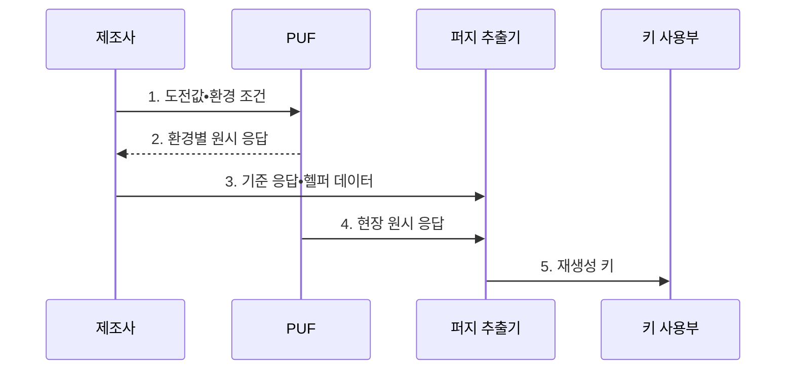

---
sidebar:
  order: 129
  label: "129. PUF 물리적 복제 불가 함수 (PUF)"
  badge:
    text: "기출 • 30%"
    variant: note
title: PUF 물리적 복제 불가 함수 (PUF)
date: "2026-08-04T17:17:00+09:00"
tags:
  - notes-security
weight: 129
extra:
  question_no: "129"
  source_status: "기출"
  source_history: "125회"
  priority: 30
  priority_note: "125회 기출이나 PUF 단독 반복 흐름은 제한적임"
---

## Ⅰ. 개요

핵심 용어

- **PUF(Physically Unclonable Function)**: 제조 편차로 장치마다 고유한 응답을 만드는 하드웨어 함수이다.

- 정의/개념: 제조 편차를 이용해 장치별 응답을 만드는 **하드웨어 보안 함수**
- 배경/필요성: 비휘발성 메모리에 저장한 키는 **물리 분석으로 추출 가능**

#### 한줄 요약

- 같은 설계의 칩도 미세하게 달라 그 차이를 장치마다 다른 전자 지문처럼 활용함

## Ⅱ. 특징

핵심 용어

- **고유성**: 서로 다른 장치의 응답이 달라야 하는 속성이다.
- **재현성**: 같은 장치의 응답을 환경 변화에도 다시 얻는 속성이다.
- **퍼지 추출기**: 잡음이 섞인 응답에서 동일 키를 재생성하고 오류를 보정하는 장치이다.

- 제조 편차 기반 **장치 간 고유성**
- 온도•전압•노화에도 **장치 내 재현성**
- 퍼지 추출기 기반 **오류 보정•키 파생**

#### 한줄 요약

- 전자 지문은 매번 조금 흔들리므로 보정하되 헬퍼 데이터가 공격 단서가 되지 않아야 함

## Ⅲ. 구조 및 구성요소

핵심 용어

- **CRP(Challenge-Response Pair)**: PUF의 입력 도전값과 대응 출력값의 쌍이다.
- **헬퍼 데이터**: 응답을 같은 키로 보정하도록 저장하는 비밀이 아닌 보조 정보이다.

| 구성요소 | 책임 |
|:---|:---|
| 도전값•측정 조건 | **물리 경로•온도•전압** 설정 |
| PUF 물리 구조 | **제조 편차** 를 비트열로 변환 |
| 잡음 포함 원시 응답 | **편차•환경 영향** 측정값 |
| 퍼지 추출기•헬퍼 데이터 | **오류 보정•안정 키** 파생 |
| 복원 키•인증 기능 | 사용 후 **원시값•키 제거** |

#### 한줄 요약

- 흔들리는 측정값을 그대로 키로 쓰지 않고 오류 보정과 추출을 거쳐 안정된 비밀로 만듦

## Ⅳ. 흐름도

핵심 용어

- **등록**: 제조 시 기준 응답과 헬퍼 데이터를 생성하는 절차이다.
- **재생성**: 현장의 잡음 응답을 보정해 같은 키를 만드는 절차이다.

**동작 원리**

- **1. 도전값•환경 조건**: 온도•전압•노화 범위의 측정 입력
- **2. 환경별 원시 응답**: 고유성•재현성•비트 오류율 시험값
- **3. 기준 응답•헬퍼 데이터**: 등록 단계의 오류 보정 정보
- **4. 현장 원시 응답**: 실제 환경에서 다시 측정한 비트열
- **5. 재생성 키**: 오류 보정과 추출 뒤 일시 사용하는 비밀

#### 한줄 요약

- 공장에서 기준을 등록하고 현장에서는 흔들린 응답을 보정해 같은 키를 잠시 만들어 사용함

## Ⅴ. 종류 및 비교

핵심 용어

- **약한 PUF**: 소수 CRP로 내부 키를 파생하는 방식이다.
- **강한 PUF**: 많은 CRP를 이용해 장치를 인증하는 방식이다.
- **SRAM PUF(Static Random-Access Memory PUF)**: 메모리 셀의 초기값 편차로 응답을 만드는 방식이다.

| PUF 구현 방식 | SRAM PUF | Arbiter PUF | Ring Oscillator PUF |
|:---|:---|:---|:---|
| 적용 기준 | 내부 **키 재생성** | 다수 CRP **장치 인증** | 주파수 기반 **장치 인증** |
| 핵심 특징 | **SRAM 초기값 편차** | **신호 경로 지연 경쟁** | **발진기 주파수 편차** |
| 한계 | **불안정 비트 선택** 오류 | 질의 기반 **모델링 공격** | **온도•전압•노화** 영향 |

> 요약: 용도와 환경에 맞는 고유성•재현성을 검증함

#### 한줄 요약

- SRAM•Arbiter•Ring Oscillator는 서로 다른 물리 편차를 측정하므로 위협도 다름

## Ⅵ. 실무 고려사항 및 대책

핵심 용어

- **ISO(International Organization for Standardization)**: 국제표준화기구이다.
- **IEC(International Electrotechnical Commission)**: 국제전기기술위원회이다.
- **ISO/IEC 20897-1**: PUF의 보안 요구사항을 규정한 표준이다.
- **ISO/IEC 20897-2**: PUF의 설계•통계 시험평가 방법을 규정한 표준이다.
- **모델링 공격**: 다수 CRP를 학습해 관측하지 않은 응답을 예측하는 공격이다.

| 문제 | 대책 | 효과 |
|:---|:---|:---|
| 출력 요구가 없으면 복제불가성을 입증하기 어려움 | **ISO/IEC 20897-1:2020 적용** | 요구 수준•용도 명확화 |
| 환경 변화로 응답이 흔들리면 키 복원이 실패함 | **ISO/IEC 20897-2:2022 적용** | 고유성•재현성 검증 |
| 헬퍼•CRP가 노출되면 응답 예측이 쉬워짐 | **무결성 보호•질의율 제한** | 모델링•키 누출 억제 |

#### 한줄 요약

- 실제 온도•전압•노화에서 비트 오류율과 장치 간 거리를 측정하고 헬퍼 변조와 대량 CRP 수집도 시험한다.

## Ⅶ. 결론

핵심 용어

- **질의 제한**: 공격자가 CRP를 대량 수집하지 못하도록 요청 횟수와 속도를 통제하는 방법이다.
- **약한 PUF 키 파생**: 외부 질의 노출을 줄이고 내부 키를 재생성하는 방식이다.

- CRP 노출이 크면 **약한 PUF 기반 키 파생**, 인증은 **질의 제한** 적용

#### 한줄 요약

- 물리 편차 자체보다 환경 시험과 헬퍼 데이터•질의•키 수명 통제가 중요함
