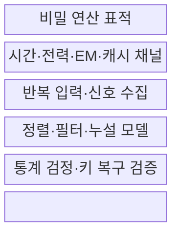
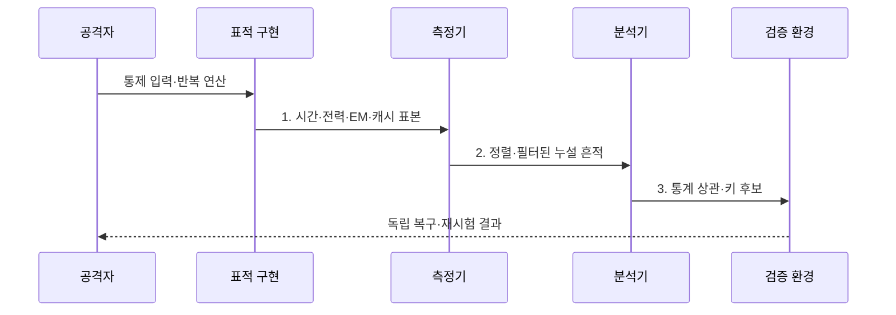

---
sidebar:
  order: 130
  label: "130. 사이드채널 공격 (Side-Channel Attack)"
  badge:
    text: "미출제 · 50%"
    variant: note
title: 사이드채널 공격 (Side-Channel Attack)
date: "2026-07-31T11:23:49+09:00"
tags:
  - notes-security
weight: 130
extra:
  question_no: "130"
  source_status: "미출제"
  source_history: ""
  priority: 50
  priority_note: "누설원·측정·마스킹을 잇는 독립 하드웨어 공격임"
---

## Ⅰ. 개요

핵심 용어

- **부채널 공격**: 암호 수학이 아닌 시간·전력·전자기·캐시 등 구현 흔적에서 비밀을 추론하는 공격이다.

- 정의/개념: 구현 흔적을 관측해 비밀을 추론하는 **비침습 구현 공격**
- 배경/필요성: 수학적으로 안전한 암호도 **구현 누설로 키 노출 가능**

### 쉽게 이해하기 (학습용)

- 금고를 직접 열지 않고 소리와 동작 시간 차이로 내부 번호를 알아내는 것과 비슷함

## Ⅱ. 특징

핵심 용어

- **구현 종속성**: 같은 알고리즘도 장치·컴파일·배치에 따라 누설 특성이 달라지는 성질이다.
- **고차 누설**: 여러 마스킹 공유값의 누설을 결합할 때 비밀과 상관이 나타나는 현상이다.

- 실제 장치·컴파일 결과의 **구현 종속성**
- 반복 측정·통계 분석의 **미세 누설 증폭**
- 로컬 센서·원격 공유자원의 **다양한 관측면**

### 쉽게 이해하기 (학습용)

- 같은 코드도 CPU·컴파일 옵션·배치가 바뀌면 누설 방식이 달라 실제 환경 검증이 필요함

## Ⅲ. 구조 및 구성요소

핵심 용어

- **누설 모델**: 비밀 중간값과 관측 신호 사이의 관계를 가정해 키 후보를 평가하는 모델이다.

| 구성요소 | 책임 |
|:---|:---|
| 비밀 연산 표적 | **키·분기·중간값** 선정 |
| 시간·전력·EM·캐시 채널 | 공격자의 **관측 능력** 정의 |
| 반복 입력·신호 수집 | **통제 입력·트리거·표본** 확보 |
| 정렬·필터·누설 모델 | **잡음 제거·예측값** 생성 |
| 통계 검정·키 복구 검증 | **상관·분류·독립 재현** |

### 쉽게 이해하기 (학습용)

- 많은 흔적을 같은 시점에 맞춘 뒤 어떤 키 후보가 신호 변화와 가장 잘 맞는지 비교함

## Ⅳ. 흐름도

핵심 용어

- **흔적 정렬·필터링**: 반복 측정 신호의 시점을 맞추고 잡음을 줄여 통계 분석이 가능하게 하는 과정이다.

**동작 원리**

- **1. 시간·전력·EM·캐시 표본**: 표적 중간값의 반복 측정값
- **2. 정렬·필터된 누설 흔적**: 잡음을 줄인 분석 입력 데이터
- **3. 통계 상관·키 후보**: 누설 모델과 가설별 유의성 결과

### 쉽게 이해하기 (학습용)

- 신호 차이만 보지 않고 실제 키 복구가 되는지와 수정 후에도 남는 누설을 확인함

## Ⅴ. 종류 및 비교

핵심 용어

- **타이밍·캐시 공격**: 실행 시간과 비밀 의존 메모리 접근 패턴을 관측하는 공격이다.
- **SPA·DPA**: 단일 전력 파형의 특징과 다수 파형의 통계적 차이를 분석하는 기법이다.
- **결함 주입**: 전압·클록·빛으로 오류를 유도해 검사를 우회하거나 키를 추론하는 공격이다.

| 구현 공격 유형 | 타이밍·캐시 | 전력·EM | 결함 주입 |
|:---|:---|:---|:---|
| 적용 기준 | 원격·**공유 자원 관측** | 장치 근접 **신호 측정** | 물리 자극으로 **연산 교란** |
| 핵심 특징 | **시간·접근 패턴** 분석 | 단일·다수 파형의 **SPA·DPA 분석** | **오류 결과·검사 우회** |
| 한계 | 반복 측정으로 **분기 노출** | 키와 **중간값 상관** 노출 | **인증 우회·키 추론** |

> 요약: 관측형 부채널과 능동형 결함 주입을 구분함

### 쉽게 이해하기 (학습용)

- 부채널은 실행 흔적을 읽고 결함 주입은 실행 자체를 흔든다는 차이가 있음

## Ⅵ. 실무 고려사항 및 대책

핵심 용어

- **상수 시간·마스킹**: 비밀과 무관한 실행 경로를 유지하고 중간값을 난수 공유값으로 나누는 방어 기법이다.
- **ISO/IEC 17825·20085-1**: 비침습 공격 완화 시험 지표와 신호 수집·분석 요구사항을 규정한다.

| 문제 | 대책 | 효과 |
|:---|:---|:---|
| 판정 기준이 다르면 누설 시험 결과가 달라짐 | **ISO/IEC 17825:2024 적용** | 시험 지표·판정 일관성 |
| 장비 교정이 없으면 신호 분석을 재현하기 어려움 | **ISO/IEC 20085-1:2019 적용** | 신호 수집·분석 재현성 |
| 실행 흔적이 비밀에 따라 달라지면 키가 노출됨 | **상수시간·마스킹·격리 적용** | 시간·통계 상관 약화 |

### 쉽게 이해하기 (학습용)

- 소스뿐 아니라 컴파일된 코드를 확인하고 실제 장치에서 고차 누설과 독립 키 복구까지 재시험한다.

## Ⅶ. 결론

핵심 용어

- **실장 검증**: 소스뿐 아니라 컴파일된 코드와 실제 장치에서 누설·키 복구 가능성을 재시험하는 활동이다.

- 시간·캐시는 **상수시간**, 전력·EM은 마스킹·차폐 우선 적용

### 쉽게 이해하기 (학습용)

- 안전한 알고리즘도 실행 흔적이 비밀을 말하지 않도록 구현해야 비로소 안전함
