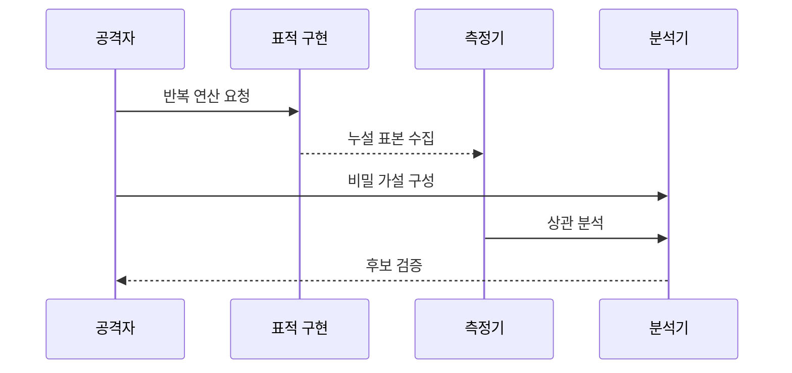

---
sidebar:
  order: 130
  label: "130. 사이드채널 공격 (Side-Channel Attack)"
  badge:
    text: "미출제 · 50%"
    variant: note
title: 사이드채널 공격 (Side-Channel Attack)
date: "2026-07-25T01:00:00+09:00"
tags:
  - notes-security
weight: 130
extra:
  question_no: "130"
  source_status: "미출제"
  source_history: ""
  priority: 50
  priority_note: "누설원·측정·마스킹을 잇는 독립 하드웨어 공격임"
---

## 미리 알고가기

- **부채널 공격(Side-Channel Attack)**: 암호 수학을 깨지 않고 실행 시간·전력·전자기파·캐시 같은 구현 흔적에서 비밀을 추론하는 공격
- **타이밍 공격(Timing Attack)**: 비밀값에 따라 달라지는 실행 시간을 반복 측정해 비밀 분기나 키를 추론하는 부채널 공격
- **단순 전력 분석(Simple Power Analysis, SPA)**: 영문 머리글자를 딴 공식 표기라 “에스피에이”로 읽으며, 단일 전력 파형에서 연산 순서와 비밀을 추론한다
- **차분 전력 분석(Differential Power Analysis, DPA)**: 영문 머리글자를 딴 공식 표기라 “디피에이”로 읽으며, 다수 전력 파형의 통계적 차이로 키 후보를 판별한다
- **캐시 공격(Cache Attack)**: 비밀에 따라 달라지는 캐시 적중·실패와 접근 시간을 관측해 메모리 접근 패턴을 추론하는 공격
- **마스킹(Masking)**: 비밀 중간값을 난수 공유값으로 나눠 단일 누설과 비밀의 통계적 관계를 약화하는 기법
- **상수 시간(Constant-Time)**: 비밀값과 무관하게 실행 경로와 메모리 접근을 일정하게 유지해 시간 누설을 줄이는 구현 원칙
- **전자기(Electromagnetic, EM)**: 영문 머리글자를 딴 통용 표기라 “이엠”으로 읽으며, 연산 중 방출되는 전자기 신호를 측정하는 부채널을 가리킨다
- **중앙처리장치(Central Processing Unit, CPU)**: 영문 머리글자를 딴 공식 표기라 “씨피유”로 읽으며, 명령 실행과 캐시 동작이 부채널 흔적을 만드는 처리 장치
- **결함 주입(Fault Injection)**: 전압·클록·빛으로 연산 오류를 유도해 검사 우회나 오류 결과 기반 키 추론을 시도하는 공격
- **고차 누설**: 여러 마스킹 공유값의 누설을 결합해야 비밀과 상관관계가 나타나는 부채널

## Ⅰ. 개요

- 정의/개념: 구현 시 관측 정보로 비밀을 추론함
- **배경/필요성**: 암호 구현의 시간·전력 노출 취약함

### 쉽게 이해하기 (학습용)

- 금고를 직접 열지 않고 소리와 동작 시간의 차이로 내부 번호를 알아내는 것과 비슷함

## Ⅱ. 특징

- 실제 장치·소프트웨어 실행 특성 이용한다.
- 통계적 기법으로 미세 누설을 증폭한다.
- 로컬 센서와 원격 경로를 모두 이용한다.
- 환경·구현 변경 시 반복 검증이 필요한다.

### 쉽게 이해하기 (학습용)

- 코드가 같아도 CPU와 컴파일 옵션이 바뀌면 새는 방식이 달라질 수 있어 실제 환경 검증이 필요함

## Ⅲ. 아키텍처 및 구성요소

| 구성요소 | 설명 |
|:---|:---|
| 표적 | 비밀 상태·키·분기 선정 |
| 채널 | 시간·전력·EM·캐시 신호 |
| 입력 | 연산 반복 통제 트리거 |
| 전처리 | 파형 정렬·잡음 제거 |
| 검증 | 상관·분류 통계 평가 |

### 쉽게 이해하기 (학습용)

- 많은 흔적을 같은 시점에 맞춘 뒤 비밀 후보가 신호 변화와 가장 잘 맞는지 비교함

## Ⅳ. 원리 및 절차 흐름도

| 절차 | 설명 |
|:---|:---|
| 반복 연산 요청 | 통제 입력으로 표적을 반복 실행 |
| 누설 표본 수집 | 시간·전력·전자기 신호 정렬 |
| 비밀 가설 구성 | 중간값별 누설 예측값 생성 |
| 상관 분석 | 예측값과 측정값 관계 계산 |
| 후보 검증 | 독립 표본으로 키 복구 재현 |

### 쉽게 이해하기 (학습용)

- 신호 차이가 보이는지만 확인하지 말고 실제 비밀 복구 가능성과 수정 후 잔여 누설을 검증해야 함

## Ⅴ. 종류 및 비교

| 비교 축 | 타이밍·캐시 | 전력·EM | 결함 주입 |
|:---|:---|:---|:---|
| 핵심 특징 | 시간·캐시 접근 패턴을 관측 | 전력·전자기 파형을 통계 분석 | 연산을 교란해 오류 결과를 유도 |
| 적용 기준 | 원격·공유 자원에서 흔적을 모을 때 | 장치에 물리적으로 가까이 접근할 때 | 물리 자극으로 검사를 우회할 때 |
| 주요 위험 | 반복 측정으로 비밀 분기 노출 | 중간 연산값과 키의 상관관계 노출 | 인증 우회·오류 결과로 키 추론 |

> 요약: 구현 누설 정보 기반 비밀 추론 대응 필요

### 쉽게 이해하기 (학습용)

- 부채널은 실행 흔적을 읽고 결함 주입은 실행 자체를 흔든다는 차이가 있음

## Ⅵ. 실무 사례

1. 비밀 분기·테이블 제거 후 기계어 확인
2. 마스킹 난수·고차 누설을 평가
3. 공유 캐시 실행을 코어·시간으로 격리
4. 키 복구 시험으로 차폐 잔여 누설 검증

### 쉽게 이해하기 (학습용)

- 비밀 의존 분기·테이블을 없애고 컴파일된 코드까지 확인함
- 마스킹은 난수 품질과 공유값 결합에서 생기는 고차 누설을 평가함
- 공유 캐시·가상화 환경은 실행 격리와 스케줄링을 함께 통제함
- 잡음·차폐만 믿지 않고 실제 키 복구 시험으로 잔여 누설을 검증함

## Ⅶ. 결론

- 비밀 의존 누설은 상수 시간·마스킹 후 재검증

### 쉽게 이해하기 (학습용)

- 안전한 알고리즘도 실행 흔적이 비밀을 말하지 않도록 구현해야 비로소 안전해짐
