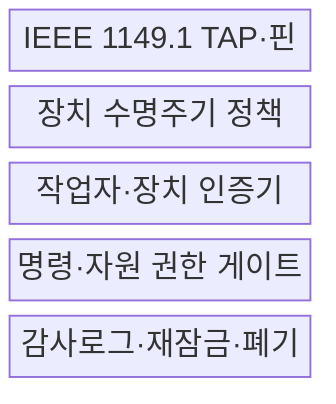
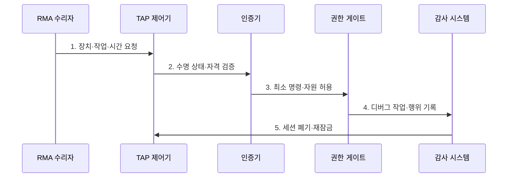

---
sidebar:
  order: 131
  label: "131. JTAG 디버그 포트 보안 (JTAG Security)"
  badge:
    text: "기출 · 50%"
    variant: note
title: JTAG 디버그 포트 보안 (JTAG Security)
date: "2026-07-27T23:59:59+09:00"
tags:
  - notes-security
weight: 131
extra:
  question_no: "131"
  source_status: "기출"
  source_history: "126회"
  priority: 50
  priority_note: "126회 기출이나 디버그포트 단독 최근성은 낮음"
---

## 미리 알고가기

- **합동 테스트 액션 그룹(Joint Test Action Group, JTAG)**: 칩 시험·경계주사·디버그에 쓰이는 하드웨어 접근 방식이다.
- **IEEE 1149.1-2013**: 테스트 접근 포트와 경계주사 구조·동작을 규정한 JTAG 공식 표준이다.
- **테스트 접근 포트(Test Access Port, TAP)**: JTAG 명령과 시험 데이터를 칩에 전달하는 물리·논리 인터페이스이다.
- **TAP 제어기(TAP Controller)**: JTAG 명령·데이터 레지스터의 상태 전이를 제어하는 상태 기계이다.
- **경계주사(Boundary Scan)**: 입출력 핀의 셀을 직렬로 연결해 보드 배선과 핀 상태를 관측·제어하는 기법이다.
- **IEEE 1687-2014**: IEEE 1149.1 TAP 등을 통해 칩 내부 계측기에 접근·제어하는 방법을 규정한다.
- **반품 승인(Return Material Authorization, RMA)**: 회수 제품에 승인된 진단·수리 예외 접근을 부여하는 절차이다.
- **디버그 인증(Debug Authentication)**: 장치·작업자·명령 범위를 검증한 뒤 잠금을 제한적으로 해제하는 통제이다.
- **수명주기 상태(Lifecycle State)**: 제조·운영·수리 단계별 JTAG 기능과 전이 조건을 구분한 장치 상태이다.
- **디버그 잠금(Debug Lock)**: 운영 단계에서 CPU·메모리 접근 등 위험한 디버그 명령을 비활성화하는 통제이다.

## Ⅰ. 개요

- 정의: JTAG 시험·디버그의 **수명주기별 접근 통제**
- 목적: 개방 포트의 **펌웨어·키 추출·보안 우회 방지**

### 쉽게 이해하기 (학습)

- 개발용 포트를 승인된 수리자에게 필요한 기능만 잠시 열고 작업 뒤 다시 잠금

## Ⅱ. 특징

- 제조·운영·수리별 **수명주기 상태**
- 인증서·토큰 기반 **제한적 잠금 해제**
- 자원·명령·시간 기반 **최소 디버그 권한**

### 쉽게 이해하기 (학습)

- 포트를 영구 폐쇄하면 수리가 어렵고 계속 열면 장악되므로 제품 상태에 따라 권한을 달리함

## Ⅲ. 구조 및 구성요소

| 설계 요소 | 설명 |
|:---|:---|
| IEEE 1149.1 TAP·핀 | 시험 명령·데이터 전달 |
| 장치 수명주기 정책 | 단계별 기능·전이 조건 |
| 작업자·장치 인증기 | 인증서·토큰·용도 검증 |
| 명령·자원 권한 게이트 | CPU·메모리 접근 제한 |
| 감사로그·재잠금·폐기 | 작업 기록·단기 권한 회수 |

### 쉽게 이해하기 (학습)

- 수명 정책과 인증기가 작업자를 확인하면 권한 게이트가 승인된 기능만 열어 줌

## Ⅳ. 흐름도

| 절차 | 설명 |
|:---|:---|
| 1. 장치·작업·시간 요청 | RMA·목적·유효기간 제출 |
| 2. 수명 상태·자격 검증 | 인증서·제품 상태 판정 |
| 3. 최소 명령·자원 허용 | 읽기·쓰기·코어 범위 제한 |
| 4. 디버그 작업·행위 기록 | 명령·결과·작업자 감사 |
| 5. 세션 폐기·재잠금 | 토큰·임시 키 제거·잠금 |

### 쉽게 이해하기 (학습)

- 수리 목적과 권한을 검증하고 필요한 명령만 허용한 뒤 세션과 임시 비밀을 폐기함

## Ⅴ. 종류 및 비교

| JTAG 운영 방식 | 개방형 디버그 | 영구 비활성화 | 인증형 디버그 |
|:---|:---|:---|:---|
| 적용 기준 | 격리 개발·시험 장치 | 현장 수리가 불필요 | 제조·수리 기능 유지 |
| 핵심 특징 | 인증 없이 기능 허용 | 출고 후 완전 차단 | 인증 후 범위·시간 제한 |
| 한계 | 펌웨어·키 추출 | 장애 분석·복구 불가 | 인증키·해제 구현 공격면 |

> 요약: 수리 필요성과 공격면에 따라 잠금 방식을 선택함

### 쉽게 이해하기 (학습)

- 운영 장치는 인증형 디버그로 필요한 명령만 정해진 시간 동안 여는 방식이 적합함

## Ⅵ. 실무 고려사항 및 대책

| 고려사항 | 대책 | 효과 |
|:---|:---|:---|
| 외부 시험·경계주사 | **IEEE 1149.1-2013 준수** | TAP·명령 구조 명확화 |
| 내부 계측기 접근 | **IEEE 1687-2014 통제** | 숨은 디버그 경로 관리 |
| RMA 예외 접근 | **인증서·단기 토큰 적용** | 신원·범위·시간 제한 |

### 쉽게 이해하기 (학습)

- RMA 장치는 작업자 인증서와 허용 명령을 검증한 경우만 JTAG를 열고 종료 즉시 토큰을 폐기해 재잠근다.

## Ⅶ. 결론

- **수명 상태·신원·명령 범위·재잠금**으로 접근을 결정한다.

### 쉽게 이해하기 (학습)

- 누가 언제 어떤 명령을 쓸 수 있는지 검사하고 작업 뒤 다시 잠가야 개발성과 보안을 함께 지킴
