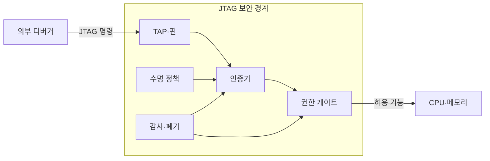
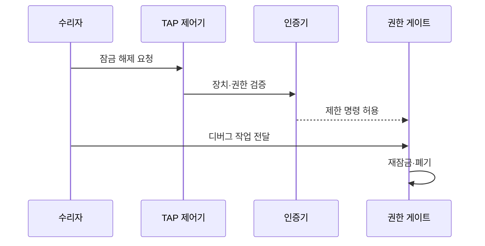

---
sidebar:
  order: 131
  label: "131. JTAG 디버그 포트 보안 (JTAG Security)"
  badge:
    text: "기출 · 50%"
    variant: note
title: JTAG 디버그 포트 보안 (JTAG Security)
date: "2026-07-27T23:59:59+09:00"
tags:
  - notes-security
weight: 131
extra:
  question_no: "131"
  source_status: "기출"
  source_history: "126회"
  priority: 50
  priority_note: "126회 기출이나 디버그포트 단독 최근성은 낮음"
---

## 미리 알고가기

- **합동 테스트 액션 그룹(Joint Test Action Group, JTAG)**: 영문 머리글자를 딴 공식 표기라 “제이태그”로 읽으며, 칩의 경계 스캔과 디버그 접속 규격을 가리킨다
- **전기전자공학자협회(Institute of Electrical and Electronics Engineers, IEEE)**: 영문 머리글자를 딴 공식 표기라 “아이 트리플 이”로 읽으며, JTAG의 IEEE 1149.1 표준을 제정한다
- **테스트 접근 포트(Test Access Port, TAP)**: 영문 머리글자를 딴 공식 표기라 “탭”으로 읽으며, JTAG 명령과 테스트 데이터를 칩에 전달하는 포트
- **TAP 제어기(TAP Controller)**: “탭 컨트롤러”로 읽으며, 테스트 모드와 명령·데이터 레지스터의 상태 전이를 제어한다
- **경계 스캔(Boundary Scan)**: 칩 입출력 핀의 셀을 직렬로 연결해 보드 배선과 핀 상태를 관측·제어하는 시험 기법
- **중앙처리장치(Central Processing Unit, CPU)**: 영문 머리글자를 딴 공식 표기라 “씨피유”로 읽으며, JTAG 디버그 명령이 제어할 핵심 연산 자원
- **반품 승인(Return Material Authorization, RMA)**: 영문 머리글자를 딴 공식 표기라 “알엠에이”로 읽으며, 고장 제품을 회수해 승인된 수리 권한을 부여하는 절차
- **디버그 인증(Debug Authentication)**: 장치·작업자·명령 범위를 검증한 뒤 디버그 잠금을 제한적으로 해제하는 통제
- **수명주기 상태(Lifecycle State)**: 제조·운영·수리 단계별로 허용할 JTAG 기능과 전이 조건을 구분한 장치 상태
- **디버그 잠금(Debug Lock)**: 운영 단계에서 CPU·메모리 접근 같은 위험한 디버그 명령을 비활성화하는 통제

## Ⅰ. 개요

- 정의: JTAG 시험·디버그의 **수명주기별 통제**
- 기존 한계: 개방 디버그 포트의 **펌웨어·키 추출**

### 쉽게 이해하기 (학습용)

- 개발용 포트를 제품에 남기되 승인된 수리자에게 필요한 명령만 잠시 열고 작업 뒤 다시 잠근다.

## Ⅱ. 특징

- 제조·운영·수리별 **수명주기 상태**
- 디버그 인증 기반 **제한적 잠금 해제**
- CPU·메모리별 **최소 명령·시간 권한**

### 쉽게 이해하기 (학습용)

- 포트를 없애면 수리가 어렵고 계속 열어 두면 장치를 장악당하므로 제품 상태에 따라 권한을 달리한다.

## Ⅲ. 아키텍처 및 구성요소

| 설계 요소 | 설명 |
|:---|:---|
| TAP·핀 | 테스트 명령·데이터 전달 경로 |
| 수명 정책 | 단계별 허용 명령과 전이 조건 |
| 인증기 | 장치·작업자·권한 검증 |
| 권한 게이트 | CPU·메모리 접근 범위 제한 |
| 감사·폐기 | 작업 기록과 단기 권한 회수 |

### 쉽게 이해하기 (학습용)

- 수명 정책과 인증기가 작업자를 확인하면 권한 게이트가 CPU·메모리의 승인된 기능만 열어 준다.

## Ⅳ. 원리 및 절차 흐름도

| 절차 | 설명 |
|:---|:---|
| 잠금 해제 요청 | 작업 목적·장치·시간 제출 |
| 장치·권한 검증 | 수명 상태와 인증 정보 판정 |
| 제한 명령 허용 | 승인된 명령·자원만 개방 |
| 디버그 작업 전달 | 허용 범위 안에서 수리 수행 |
| 재잠금·폐기 | 세션 종료 후 권한·비밀 회수 |

### 쉽게 이해하기 (학습용)

- 수리자는 장치 상태와 작업 권한을 검증받고 필요한 명령만 사용한 뒤 세션과 임시 비밀을 폐기한다.

## Ⅴ. 종류 및 비교

| JTAG 운영 방식 | 개방형 디버그 | 영구 비활성화 | 인증형 디버그 |
|:---|:---|:---|:---|
| 적용 기준 | 격리된 개발·시험 장치 | 수리·현장 분석이 불필요한 장치 | 제조·수리와 운영 보안을 함께 유지할 때 |
| 핵심 특징 | 인증 없이 기능 허용 | 출고 후 기능 완전 차단 | 인증 후 범위·시간 제한 개방 |
| 한계 | 펌웨어·키 추출 | 장애 분석·복구 불가 | 인증키·해제 구현 공격면 |

> 요약: 인증형 디버그는 신원·범위 확인 후 제한적 개방함

### 쉽게 이해하기 (학습용)

- 운영 장치는 인증형 디버그로 필요한 명령만 잠시 엽니다.

## Ⅵ. 실무 사례

1. RMA 장치의 **작업자·명령 범위 인증**
2. 디버그 종료의 **임시 권한 폐기·재잠금**

### 쉽게 이해하기 (학습용)

- 포트를 숨기는 대신 칩이 작업자와 요청 범위를 검사해 실패한 잠금 해제 시도를 제한한다.

## Ⅶ. 결론

- **수명 상태·수리 필요성**에 따른 JTAG 통제

### 쉽게 이해하기 (학습용)

- 칩이 누가 언제 어떤 명령을 쓸 수 있는지 검사하고 작업 뒤 다시 잠가야 개발성과 운영 보안을 함께 지킨다.
