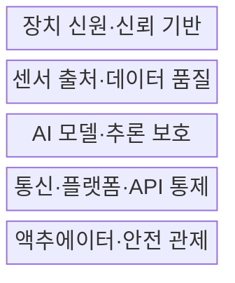
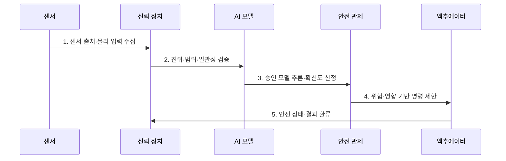

---
sidebar:
  order: 132
  label: "132. IoT 디바이스 보안 — AIoT (AIoT Security)"
  badge:
    text: "기출 · 50%"
    variant: note
title: IoT 디바이스 보안 — AIoT (AIoT Security)
date: "2026-07-27T23:59:59+09:00"
tags:
  - notes-security
weight: 132
extra:
  question_no: "132"
  source_status: "기출"
  source_history: "132회"
  priority: 50
  priority_note: "132회 기출이며 AIoT 장치·모델 복합 보안에 유용함"
---

## 미리 알고가기

- **인공지능(Artificial Intelligence, AI)**: 데이터로 학습한 모델이 입력을 분석해 예측·판단하는 기술이다.
- **사물인터넷(Internet of Things, IoT)**: 센서·장치를 네트워크로 연결해 데이터를 수집·교환·제어하는 기술이다.
- **지능형 사물인터넷(Artificial Intelligence of Things, AIoT)**: 연결된 IoT 장치에 AI 학습·추론 기능을 결합한 체계이다.
- **엣지 인공지능(Edge Artificial Intelligence, Edge AI)**: 장치나 근거리 게이트웨이에서 AI 추론을 수행하는 방식이다.
- **센서 스푸핑(Sensor Spoofing)**: 물리 신호나 센서 입력을 위조해 모델·제어기의 오판을 유도하는 공격이다.
- **적대적 예제(Adversarial Example)**: 입력을 의도적으로 변형해 AI 모델의 오판을 유도하는 표본이다.
- **모델 추출(Model Extraction)**: 반복 질의와 출력 관찰로 대상 모델의 기능·파라미터를 복제하는 공격이다.
- **모델 드리프트(Model Drift)**: 학습·운영 데이터 분포 차이로 모델 판단 성능이 변하는 현상이다.
- **무선 업데이트(Over-the-Air Update, OTA)**: 펌웨어·모델을 통신망으로 원격 배포·갱신하는 방식이다.
- **ISO/IEC 27400:2022**: IoT 솔루션의 보안·프라이버시 위험·원칙·통제 지침이다.
- **NIST AI RMF 1.0**: AI 위험을 Govern·Map·Measure·Manage 기능으로 관리하는 프레임워크이다.
- **NIST IR 8259 Rev.1**: IoT 제품 제조자가 판매 전 수행할 기본 사이버보안 활동 지침이다.

## Ⅰ. 개요

- 정의: 장치·센서·모델·제어의 **AIoT 통합 보안**
- 목적: IoT 침해·AI 오판의 **물리 제어 피해 방지**

### 쉽게 이해하기 (학습)

- 센서의 잘못된 판단이 문 열림·설비 동작으로 이어지므로 입력부터 물리 제어까지 함께 보호함

## Ⅱ. 특징

- 장치·통신·모델·제어의 **연결 공격면**
- 센서 진위·모델 강건성의 **입력 검증**
- 추론 불확실성 기반 **안전 상태 전환**

### 쉽게 이해하기 (학습)

- 장치 해킹뿐 아니라 AI 확신이 낮거나 입력이 이상할 때 물리 동작을 멈출 기준이 필요함

## Ⅲ. 구조 및 구성요소

| 설계 요소 | 설명 |
|:---|:---|
| 장치 신원·신뢰 기반 | 고유 신원·보안 부팅·갱신 |
| 센서 출처·데이터 품질 | 진위·범위·다중 센서 대조 |
| AI 모델·추론 보호 | 서명·권한·질의율·드리프트 |
| 통신·플랫폼·API 통제 | 상호 인증·테넌트 격리 |
| 액추에이터·안전 관제 | 이상·저확신 시 동작 제한 |

### 쉽게 이해하기 (학습)

- 신뢰 장치와 검증된 센서 입력만 모델에 넣고 불확실한 결과는 물리 동작으로 전달하지 않음

## Ⅳ. 흐름도

| 절차 | 설명 |
|:---|:---|
| 1. 센서 출처·물리 입력 수집 | 장치 신원·시간·원시값 결합 |
| 2. 진위·범위·일관성 검증 | 다중 센서·업무 규칙 대조 |
| 3. 승인 모델 추론·확신도 산정 | 서명 버전·이상치 확인 |
| 4. 위험·영향 기반 명령 제한 | 승인·속도·범위·중지 통제 |
| 5. 안전 상태·결과 환류 | 실패 안전·드리프트 갱신 |

### 쉽게 이해하기 (학습)

- 모델의 확신이 낮거나 센서가 충돌하면 자동 제어를 중단하고 사전에 정한 안전 상태로 전환함

## Ⅴ. 종류 및 비교

| AIoT 추론 위치 | 클라우드 | 엣지 게이트웨이 | 장치 내 |
|:---|:---|:---|:---|
| 적용 기준 | 대규모 연산·중앙 관리 | 지연·대역폭 절충 | 저지연·오프라인 동작 |
| 핵심 특징 | 중앙 모델·데이터 운영 | 장치군 근거리 추론 | 개별 장치 즉시 판단 |
| 한계 | 전송·계정·테넌트 노출 | 침해의 장치군 확산 | 모델 추출·자원 부족 |

> 요약: 추론 위치에 따라 지연·노출·관리점을 절충함

### 쉽게 이해하기 (학습)

- 추론이 현장에 가까울수록 빠르지만 장치별 모델·키·업데이트 보호 지점이 늘어남

## Ⅵ. 실무 고려사항 및 대책

| 고려사항 | 대책 | 효과 |
|:---|:---|:---|
| IoT 보안·프라이버시 | **ISO/IEC 27400:2022 적용** | 장치·서비스 통제 연계 |
| AI 신뢰성·위험 | **NIST AI RMF 1.0 적용** | 위험·성능·영향 환류 |
| 제조자 보안 활동 | **NIST IR 8259 Rev.1 적용** | 판매 전 요구·지원 명확화 |

### 쉽게 이해하기 (학습)

- 센서 이상과 낮은 확신도를 감지하면 제어를 중단하고 모델·펌웨어 버전과 입력 증거를 남겨 원인을 분석한다.

## Ⅶ. 결론

- **입력 진위·확신도·물리 영향·복구성**으로 제어를 결정한다.

### 쉽게 이해하기 (학습)

- 센서 입력부터 AI 판단과 액추에이터 동작까지 한 경로로 보고 이상하면 안전 상태로 전환함
