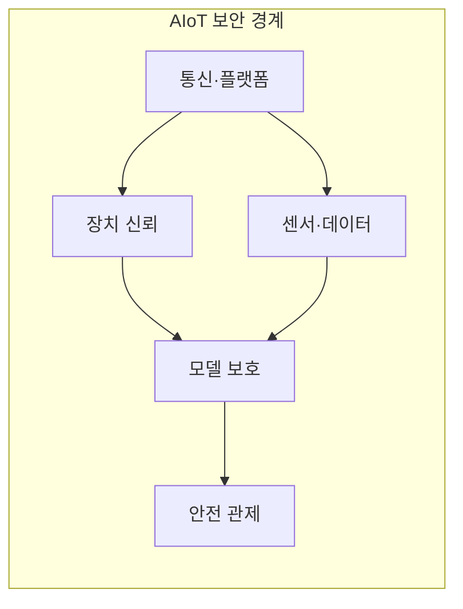
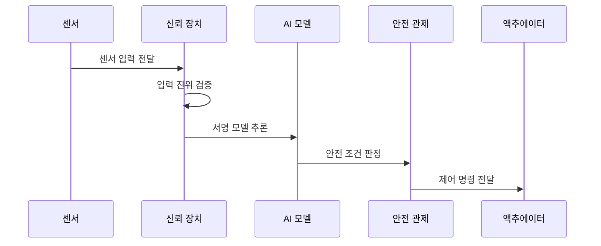

---
sidebar:
  order: 132
  label: "132. IoT 디바이스 보안 — AIoT (AIoT Security)"
  badge:
    text: "기출 · 50%"
    variant: note
title: IoT 디바이스 보안 — AIoT (AIoT Security)
date: "2026-07-27T23:59:59+09:00"
tags:
  - notes-security
weight: 132
extra:
  question_no: "132"
  source_status: "기출"
  source_history: "132회"
  priority: 50
  priority_note: "132회 기출이며 AIoT 장치·모델 복합 보안에 유용함"
---

## 미리 알고가기

- **인공지능(Artificial Intelligence, AI)**: 영문 머리글자를 딴 공식 표기라 “에이아이”로 읽으며, 데이터에서 학습한 모델로 센서 입력을 추론한다
- **사물인터넷(Internet of Things, IoT)**: 영문 머리글자를 딴 공식 표기라 “아이오티”로 읽으며, 센서·장치를 네트워크에 연결해 데이터를 교환한다
- **지능형 사물인터넷(Artificial Intelligence of Things, AIoT)**: `AI`와 `IoT`를 결합한 통용 표기라 “에이아이오티”로 읽으며, 연결 장치에 AI 학습·추론을 결합한다
- **엣지 인공지능(Edge Artificial Intelligence, Edge AI)**: `Artificial Intelligence`를 `AI`로 줄인 표기라 “엣지 에이아이”로 읽으며, 장치나 근거리 게이트웨이에서 추론한다
- **센서 스푸핑(Sensor Spoofing)**: 물리 신호나 센서 입력을 위조해 AI 모델과 제어기의 오판을 유도하는 공격
- **적대적 예제(Adversarial Example)**: 사람이 알아채기 어려운 입력 변형으로 AI 모델이 의도한 오판을 내게 하는 표본
- **모델 추출(Model Extraction)**: 반복 질의와 출력 관찰로 대상 모델의 기능이나 파라미터를 복제하는 공격
- **모델 드리프트(Model Drift)**: 학습 데이터와 운영 데이터의 분포 차이로 모델의 판단 품질이 변하는 현상
- **무선 업데이트(Over-the-Air Update, OTA)**: 영문 주요 글자를 딴 공식 표기라 “오티에이”로 읽으며, 서명된 펌웨어·모델을 원격으로 갱신한다
- **소프트웨어 자재명세서(Software Bill of Materials, SBOM)**: 영문 머리글자를 딴 공식 표기라 “에스봄”으로 읽으며, 펌웨어·AI 구성요소와 의존성의 취약점을 추적한다
- **응용 프로그래밍 인터페이스(Application Programming Interface, API)**: 영문 머리글자를 딴 공식 표기라 “에이피아이”로 읽으며, AIoT 장치와 플랫폼의 데이터·제어 호출을 중개한다
- **액추에이터**: 디지털 제어 명령을 모터·밸브 등 물리 동작으로 바꾸는 장치
- **강건성**: 잡음·조작·환경 변화가 있어도 모델이 허용 범위의 결과를 내는 성질
- **테넌트 격리**: 같은 클라우드 자원을 쓰는 고객의 데이터·권한·연산이 서로 섞이지 않게 분리하는 통제

## Ⅰ. 개요

- 정의: 장치·센서·AI·제어의 **통합 보안**
- 기존 한계: IoT 보안만으로 **모델 오판 통제 부족**

### 쉽게 이해하기 (학습용)

- 카메라나 센서의 잘못된 판단이 문 열림과 설비 동작으로 이어지므로 데이터부터 물리 제어까지 함께 보호한다.

## Ⅱ. 특징

- 장치·통신·모델·제어의 **연결 공격면**
- 센서 진위·모델 강건성의 **입력 검증**
- 추론 불확실성 기반 **안전 상태 전환**

### 쉽게 이해하기 (학습용)

- 장치 해킹뿐 아니라 AI의 확신이 낮거나 입력이 이상할 때 물리 동작을 멈출 기준도 필요하다.

## Ⅲ. 아키텍처 및 구성요소

| 설계 요소 | 설명 |
|:---|:---|
| 장치 신뢰 | 신원·보안 부팅으로 실행 기반 검증 |
| 센서·데이터 | 출처·일관성·범위로 입력 검증 |
| 모델 보호 | 서명·권한·질의 제한으로 보호 |
| 통신·플랫폼 | 상호 인증과 API 호출 통제 |
| 안전 관제 | 이상·불확실성에서 안전 상태 전환 |

### 쉽게 이해하기 (학습용)

- 장치와 센서 입력을 확인한 뒤 보호된 모델이 추론하고 안전 관제가 불확실한 결과의 물리 동작을 제한한다.

## Ⅳ. 원리 및 절차 흐름도

| 절차 | 설명 |
|:---|:---|
| 센서 입력 전달 | 물리 신호와 출처 정보 수집 |
| 입력 진위 검증 | 범위·일관성·다중 센서 대조 |
| 서명 모델 추론 | 승인 버전으로 입력을 추론 |
| 안전 조건 판정 | 이상치·확신도로 동작 제한 |
| 제어 명령 전달 | 허용 결과만 액추에이터에 전달 |

### 쉽게 이해하기 (학습용)

- 센서 입력과 모델 버전을 확인하고 추론의 확신이 낮으면 액추에이터를 안전 상태로 전환한다.

## Ⅴ. 종류 및 비교

| AIoT 추론 위치 | 클라우드 추론 | 엣지 게이트웨이 | 장치 내 추론 |
|:---|:---|:---|:---|
| 적용 기준 | 풍부한 연산·중앙 관리가 필요할 때 | 지연·대역폭과 중앙 관리를 절충할 때 | 저지연·오프라인 동작이 필요할 때 |
| 핵심 특징 | 중앙 대규모 모델 운영 | 근거리 장치군 통합 추론 | 개별 장치 즉시 추론 |
| 한계 | 전송·계정·테넌트 노출 | 침해의 장치군 확산 | 모델 추출·자원 부족 |

> 요약: 추론이 장치에 가까울수록 관리 지점 증가

### 쉽게 이해하기 (학습용)

- 추론 위치가 현장에 가까울수록 장치별 보호가 중요합니다.

## Ⅵ. 실무 사례

1. AIoT 센서의 **다중 입력 위조 검증**
2. 저확신 추론의 **안전 상태 전환**
3. 모델 출력의 **정보 누출 평가**
4. AI·펌웨어의 **SBOM 취약점 추적**

### 쉽게 이해하기 (학습용)
- 여러 센서 값을 비교해 한 센서의 조작 입력을 가려냄
- 이상치나 낮은 확신도에서는 자동 제어를 안전 상태로 전환함
- 필요한 데이터만 수집하고 모델·출력에서 정보가 새는지 평가함
- AI 모델과 펌웨어의 SBOM으로 취약한 구성요소를 추적함

## Ⅶ. 결론

- **입력 진위·추론 확신도**에 따라 제어 전환

### 쉽게 이해하기 (학습용)

- 센서 입력부터 AI 판단과 액추에이터 동작까지 한 경로로 보고 이상하면 안전 상태로 전환한다.
