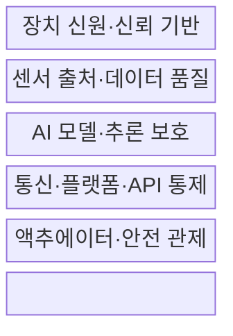
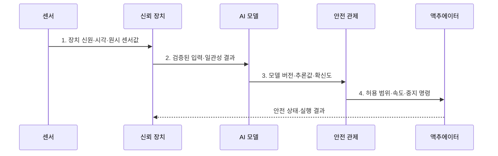

---
sidebar:
  order: 132
  label: "132. IoT 디바이스 보안 — AIoT (AIoT Security)"
  badge:
    text: "기출 · 50%"
    variant: note
title: IoT 디바이스 보안 — AIoT (AIoT Security)
date: "2026-07-31T11:24:25+09:00"
tags:
  - notes-security
weight: 132
extra:
  question_no: "132"
  source_status: "기출"
  source_history: "132회"
  priority: 50
  priority_note: "132회 기출이며 AIoT 장치·모델 복합 보안에 유용함"
---

## Ⅰ. 개요

핵심 용어

- **AIoT**: 연결된 IoT 장치에 AI 학습·추론 기능을 결합한 체계이다.

- 정의/개념: 장치·센서·모델·제어 전 경로의 **AIoT 보안 체계**
- 배경/필요성: 기존 IoT 보안만으로는 AI 오판에 따른 **물리 피해 통제 불가**

### 쉽게 이해하기 (학습용)

- 센서의 잘못된 판단이 문 열림·설비 동작으로 이어지므로 입력부터 물리 제어까지 함께 보호함

## Ⅱ. 특징

핵심 용어

- **센서 스푸핑·적대적 예제**: 물리 신호 또는 입력을 조작해 모델과 제어기의 오판을 유도하는 공격이다.

- 장치·통신·모델·제어의 **연결 공격면**
- 센서 스푸핑·적대적 예제 대응의 **입력 검증**
- 추론 불확실성 기반 **안전 상태 전환**

### 쉽게 이해하기 (학습용)

- 장치 해킹뿐 아니라 AI 확신이 낮거나 입력이 이상할 때 물리 동작을 멈출 기준이 필요함

## Ⅲ. 구조 및 구성요소

핵심 용어

- **모델 추출**: 반복 질의와 출력 관찰로 대상 모델의 기능·파라미터를 복제하는 공격이다.
- **모델 드리프트**: 학습·운영 데이터 분포 차이로 모델 판단 성능이 변하는 현상이다.

| 구성요소 | 책임 |
|:---|:---|
| 장치 신원·신뢰 기반 | **고유 신원·보안 부팅·갱신** |
| 센서 출처·데이터 품질 | **진위·범위·다중 센서** 대조 |
| AI 모델·추론 보호 | **서명·권한·질의율·드리프트** 통제 |
| 통신·플랫폼·API 통제 | **상호 인증·테넌트 격리** |
| 액추에이터·안전 관제 | **이상·저확신 시 동작** 제한 |

### 쉽게 이해하기 (학습용)

- 신뢰 장치와 검증된 센서 입력만 모델에 넣고 불확실한 결과는 물리 동작으로 전달하지 않음

## Ⅳ. 흐름도

핵심 용어

- **안전 상태 전환**: 입력 이상이나 낮은 확신도를 감지하면 물리 제어를 제한·중지하는 동작이다.

**동작 원리**

- **1. 장치 신원·시각·원시 센서값**: 출처가 결합된 물리 입력
- **2. 검증된 입력·일관성 결과**: 다중 센서·업무 규칙 대조값
- **3. 모델 버전·추론값·확신도**: 승인 모델의 판단과 불확실성
- **4. 허용 범위·속도·중지 명령**: 물리 영향에 따른 제한 제어

### 쉽게 이해하기 (학습용)

- 모델의 확신이 낮거나 센서가 충돌하면 자동 제어를 중단하고 사전에 정한 안전 상태로 전환함

## Ⅴ. 종류 및 비교

핵심 용어

- **Edge AI**: 장치나 근거리 게이트웨이에서 AI 추론을 수행하는 방식이다.

| AIoT 추론 위치 | 클라우드 | 엣지 게이트웨이 | 장치 내 |
|:---|:---|:---|:---|
| 적용 기준 | **대규모 연산·중앙 관리** | **현장 지연 단축·전송량 절감** | **저지연·오프라인 동작** |
| 핵심 특징 | **중앙 모델·데이터 운영** | 장치군 **근거리 추론** | 개별 장치 **즉시 판단** |
| 한계 | **전송·계정·테넌트** 노출 | 침해의 **장치군 확산** | **모델 추출·자원 부족** |

> 요약: 현장 근접 추론은 **지연·전송량 감소**, **장치 관리점 증가**

### 쉽게 이해하기 (학습용)

- 추론이 현장에 가까울수록 빠르지만 장치별 모델·키·업데이트 보호 지점이 늘어남

## Ⅵ. 실무 고려사항 및 대책

핵심 용어

- **ISO/IEC 27400**: IoT 솔루션의 보안·프라이버시 위험·원칙·통제 지침이다.
- **NIST AI RMF·IR 8259**: AI 위험관리와 IoT 제조자 기본 보안 활동을 다루는 지침이다.

| 문제 | 대책 | 효과 |
|:---|:---|:---|
| 장치와 서비스 통제가 분리되면 경계가 누락됨 | **ISO/IEC 27400:2022 적용** | 보안·프라이버시 통제 연계 |
| 모델 성능만 보면 물리 영향이 빠질 수 있음 | **NIST AI RMF 1.0 적용** | 위험·성능·영향 환류 |
| 판매 전 보안 요구가 없으면 지원 책임이 모호함 | **NIST IR 8259 Rev.1 적용** | 제조자 활동·지원 명확화 |

### 쉽게 이해하기 (학습용)

- 센서 이상과 낮은 확신도를 감지하면 제어를 중단하고 모델·펌웨어 버전과 입력 증거를 남겨 원인을 분석한다.

## Ⅶ. 결론

핵심 용어

- **경로 전체 보호**: 센서 입력부터 모델 판단과 액추에이터 동작까지 연결해 통제하는 원칙이다.

- 입력 불일치·저확신·고위험이면 **자동 제어 중지·안전 상태 전환**

### 쉽게 이해하기 (학습용)

- 센서 입력부터 AI 판단과 액추에이터 동작까지 한 경로로 보고 이상하면 안전 상태로 전환함
