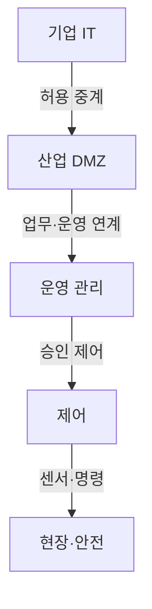
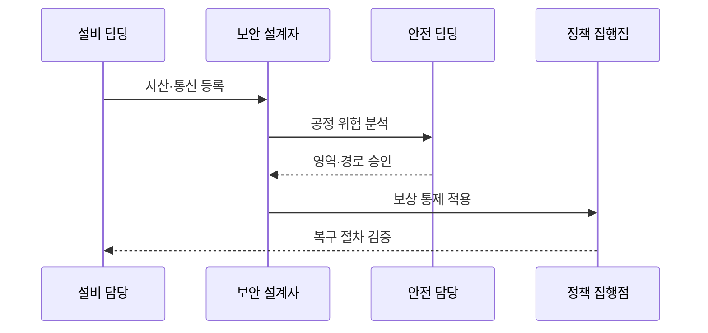

---
sidebar:
  order: 133
  label: "133. 스마트팩토리 OT 보안 (OT Security Smart Factory)"
  badge:
    text: "기출 · 70%"
    variant: note
title: 스마트팩토리 OT 보안 (OT Security Smart Factory)
date: "2026-07-25T01:00:00+09:00"
tags:
  - notes-security
weight: 133
extra:
  question_no: "133"
  source_status: "기출"
  source_history: "126회"
  priority: 70
  priority_note: "126회 기출이며 안전·가용성 중심 OT 설계가 독립적임"
---

## 미리 알고가기

- **운영기술(Operational Technology, OT)**: 영문 머리글자를 딴 공식 표기라 “오티”로 읽으며, 물리 공정과 설비를 감시·제어하는 기술
- **정보기술(Information Technology, IT)**: 영문 머리글자를 딴 공식 표기라 “아이티”로 읽으며, 업무 데이터와 컴퓨팅 자원을 처리하는 비교 영역
- **스마트팩토리(Smart Factory)**: 센서·제어 장치·MES·분석을 연결해 생산 공정을 자동화하는 제조 체계
- **프로그래머블 논리 제어기(Programmable Logic Controller, PLC)**: 영문 머리글자를 딴 공식 표기라 “피엘시”로 읽으며, 입력 신호에 따라 실시간 공정 제어 논리를 실행한다
- **제조 실행 시스템(Manufacturing Execution System, MES)**: 영문 머리글자를 딴 공식 표기라 “엠이에스”로 읽으며, 생산 계획과 현장 작업·실적을 연결한다
- **산업 사물인터넷(Industrial Internet of Things, IIoT)**: 영문 머리글자를 딴 공식 표기라 “아이아이오티”로 읽으며, 산업 장치 데이터를 플랫폼과 연결한다
- **영역·통로(Zone and Conduit)**: “존 앤드 콘듀잇”으로 읽으며, 자산을 보안 수준별 영역으로 묶고 영역 간 허용 통신 경로를 통제한다
- **안전 계장 시스템(Safety Instrumented System, SIS)**: 영문 머리글자를 딴 공식 표기라 “에스아이에스”로 읽으며, 위험 조건에서 공정을 안전 상태로 전환한다
- **비무장지대(Demilitarized Zone, DMZ)**: 영문 머리글자를 딴 공식 표기라 “디엠지”로 읽으며, IT와 OT의 직접 연결을 차단하고 필요한 서비스를 중계한다
- **감시 제어·데이터 수집(Supervisory Control and Data Acquisition, SCADA)**: 영문 머리글자를 딴 공식 표기라 “스카다”로 읽으며, 분산 설비의 상태를 원격 감시·제어한다
- **분산 제어 시스템(Distributed Control System, DCS)**: 영문 머리글자를 딴 공식 표기라 “디시에스”로 읽으며, 공정 제어 기능을 여러 제어기에 분산한다
- **인간·기계 인터페이스(Human-Machine Interface, HMI)**: 영문 머리글자를 딴 공식 표기라 “에이치엠아이”로 읽으며, 작업자가 공정 상태를 확인하고 제어 명령을 입력한다
- **보상 통제**: 패치처럼 원래 통제를 적용하기 어려울 때 같은 위험을 낮추도록 대신 적용하는 통제
- **무선 업데이트(Over-the-Air Update, OTA)**: 영문 주요 글자를 딴 공식 표기라 “오티에이”로 읽으며, 네트워크를 통해 장치 소프트웨어를 원격 갱신한다

## Ⅰ. 개요

- **정의/개념**: 공정 안전을 유지하며 제어 장치·명령 보호
- **배경/필요성**: IT 연계 침해가 생산 중단·안전 사고로 전이

### 쉽게 이해하기 (학습용)

- 공장 보안은 정보 유출뿐 아니라 잘못된 차단이나 명령이 생산 중단과 인명 사고를 만들지 않게 해야 한다.

## Ⅱ. 특징

- 안전·가용성·실시간성 우선한다.
- 장기 운영 장비 및 독점 프로토콜을 쓴다.
- IT·OT·공급자 접속 경계 집중한다.
- 공정 영향 및 안전 승인 기반 변경한다.

### 쉽게 이해하기 (학습용)

- 설비를 즉시 재부팅하기 어려우므로 패치를 시험하고 정비 시간에 적용하며 그전에는 통신 경로를 제한한다.

## Ⅲ. 아키텍처 및 구성요소

| 설계 요소 | 설명 |
|:---|:---|
| 기업 IT | 외부망 연결과 사용자 관리 |
| 산업 DMZ | IT·OT 연결 중계·차단 |
| 운영 관리 | MES·SCADA 접근 통제 |
| 제어 | PLC·DCS 명령 보호 |
| 현장·안전 | 센서·SIS로 물리 공정 보호 |

### 쉽게 이해하기 (학습용)

- 기업망에서 현장 설비로 바로 접속하지 못하게 DMZ와 운영·제어 계층을 거쳐 필요한 명령만 전달한다.

## Ⅳ. 원리 및 절차 흐름도

| 절차 | 설명 |
|:---|:---|
| 자산·통신 등록 | 설비·프로토콜·의존성 식별 |
| 공정 위험 분석 | 침해·차단의 안전 영향 평가 |
| 영역·경로 승인 | 안전 기준으로 통신 경계 확정 |
| 보상 통제 적용 | 패치 전 접근·명령 범위 제한 |
| 복구 절차 검증 | 오프라인 복구와 안전 전환 시험 |

### 쉽게 이해하기 (학습용)

- 설비와 통신 흐름을 파악한 뒤 안전 담당의 승인을 받아 경계를 적용하고 오프라인 복구까지 시험한다.

## Ⅴ. 종류 및 비교

| 비교축 | OT 환경 | IT 환경 | IIoT 연계 |
|:---|:---|:---|:---|
| 핵심 특징 | 물리 공정·실시간 제어 중심 | 정보·업무 시스템 중심 | 산업 장치 데이터를 플랫폼과 연결 |
| 적용 기준 | 정지 영향·안전 승인이 필요한 설비 | 재부팅 가능한 업무 시스템 | 원격 분석·예지정비 연계 |
| 주요 위험 | 차단·패치가 공정 사고 유발 | 기밀정보 유출·업무 중단 | 게이트웨이 침해가 현장으로 확산 |

> 요약: OT는 공정 안전 승인 후 통제를 단계 적용

### 쉽게 이해하기 (학습용)

- OT 통제는 차단보다 공정 안전 검토가 먼저입니다.

## Ⅵ. 실무 사례

1. 검증한 패치를 승인된 정비 시간에 적용
2. 공급자 접속의 시간·장치·명령 제한
3. 오프라인 공정 복구 절차 시험
4. SIS와 일반 제어망의 독립성 유지

### 쉽게 이해하기 (학습용)
- 패치는 시험 환경에서 검증한 뒤 승인된 정비 시간에 적용함
- 공급자 원격 접속은 시간·장치·명령을 제한하고 작업을 기록함
- 네트워크가 끊겨도 현장에서 복구할 수 있는 오프라인 절차를 시험함
- SIS는 일반 제어망과 독립성을 유지해 침해 때도 공정을 안전 상태로 전환함

## Ⅶ. 결론

- 공정 영향·안전 승인으로 영역·변경 통제

### 쉽게 이해하기 (학습용)

- 보안 조치가 공정을 더 위험하게 만들지 않도록 안전 승인을 받은 통제를 정비 일정에 맞춰 단계적으로 적용한다.
