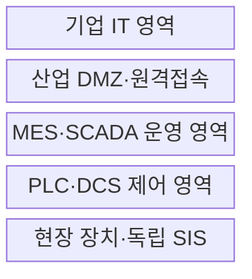
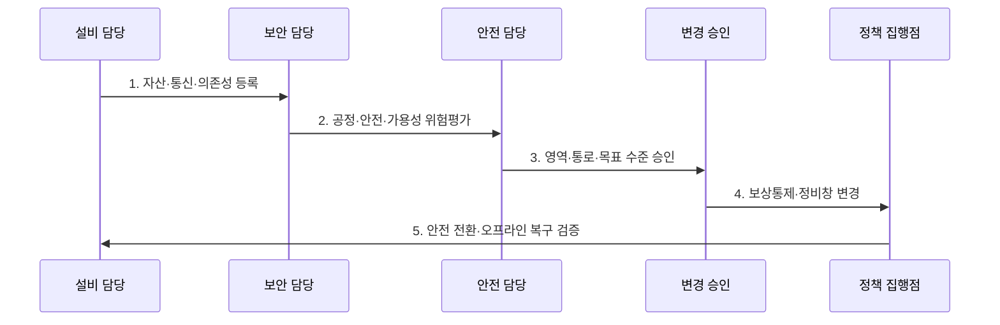

---
sidebar:
  order: 133
  label: "133. 스마트팩토리 OT 보안 (OT Security Smart Factory)"
  badge:
    text: "기출 · 70%"
    variant: note
title: 스마트팩토리 OT 보안 (OT Security Smart Factory)
date: "2026-07-27T23:59:59+09:00"
tags:
  - notes-security
weight: 133
extra:
  question_no: "133"
  source_status: "기출"
  source_history: "126회"
  priority: 70
  priority_note: "126회 기출이며 안전·가용성 중심 OT 설계가 독립적임"
---

## 미리 알고가기

- **운영기술(Operational Technology, OT)**: 물리 공정·산업 설비를 실시간 감시·제어하는 기술 영역이다.
- **정보기술(Information Technology, IT)**: 업무 데이터와 컴퓨팅 자원을 처리·저장·전송하는 기술 영역이다.
- **스마트팩토리(Smart Factory)**: 센서·제어장치·MES·분석을 연결해 생산 공정을 자동화한 제조 체계이다.
- **프로그래머블 논리 제어기(Programmable Logic Controller, PLC)**: 입력과 제어 논리에 따라 공정을 실시간 제어하는 장치이다.
- **제조 실행 시스템(Manufacturing Execution System, MES)**: 생산 계획과 현장 작업을 연결해 실적·품질·자원을 관리하는 시스템이다.
- **영역·통로(Zone and Conduit)**: 자산을 보안 영역으로 묶고 영역 간 허용 통신 경로를 통제하는 모델이다.
- **안전 계장 시스템(Safety Instrumented System, SIS)**: 위험 조건에서 공정을 사전 정의된 안전 상태로 전환하는 독립 시스템이다.
- **산업 비무장지대(Industrial Demilitarized Zone, IDMZ)**: IT·OT 직접 연결을 막고 필요한 교환만 중계하는 완충 영역이다.
- **감시 제어·데이터 수집(Supervisory Control and Data Acquisition, SCADA)**: 분산 설비의 상태를 원격 수집·감시·제어하는 시스템이다.
- **IEC 62443-3-2:2020**: IACS의 영역·통로 위험평가와 목표 보안수준 설정 요구사항이다.
- **IEC 62443-3-3:2013**: IACS 시스템 보안 요구사항과 보안수준을 규정한 국제표준이다.
- **NIST SP 800-82 Rev.3**: 안전·신뢰성·성능을 고려한 OT 보안 지침이다.

## Ⅰ. 개요

- 정의: 공정 안전 중심의 **제어 자산·명령·연결 보호**
- 목적: 침해·오조치의 **생산 중단·물리 사고 방지**

### 쉽게 이해하기 (학습)

- 공장 보안은 정보 유출뿐 아니라 차단·명령이 생산 중단과 인명 사고를 만들지 않게 해야 함

## Ⅱ. 특징

- 안전·가용성·실시간성의 **우선 보호**
- 영역·통로 기반 **IT·OT 통신 분리**
- 공정 영향·정비창 기반 **변경 통제**

### 쉽게 이해하기 (학습)

- 설비를 즉시 재부팅하기 어려워 패치를 시험하고 정비 시간에 적용하며 그전에는 통신을 제한함

## Ⅲ. 구조 및 구성요소

| 설계 요소 | 설명 |
|:---|:---|
| 기업 IT 영역 | 외부 연결·업무·사용자 관리 |
| 산업 DMZ·원격접속 | 중계·세션 녹화·직접접속 차단 |
| MES·SCADA 운영 영역 | 생산·감시 기능 접근 통제 |
| PLC·DCS 제어 영역 | 제어 명령·프로토콜 허용목록 |
| 현장 장치·독립 SIS | 물리 공정·안전 상태 보호 |

### 쉽게 이해하기 (학습)

- 기업망에서 PLC로 바로 접속하지 못하게 DMZ와 운영 계층을 거쳐 승인된 명령만 전달함

## Ⅳ. 흐름도

| 절차 | 설명 |
|:---|:---|
| 1. 자산·통신·의존성 등록 | 설비·프로토콜·소유자 식별 |
| 2. 공정·안전·가용성 위험평가 | 침해·차단의 물리 영향 분석 |
| 3. 영역·통로·목표 수준 승인 | SL-T·통신 경계 확정 |
| 4. 보상통제·정비창 변경 | 시험·단계 적용·롤백 준비 |
| 5. 안전 전환·오프라인 복구 검증 | SIS 독립성·복구본 시험 |

### 쉽게 이해하기 (학습)

- 설비 흐름과 차단 영향을 파악하고 안전 담당 승인 후 통제하며 오프라인 복구까지 시험함

## Ⅴ. 종류 및 비교

| 운영 환경 보안 | OT 환경 | IT 환경 | IIoT 연계 |
|:---|:---|:---|:---|
| 적용 기준 | 정지 영향·안전 승인 필요 | 재부팅 가능한 업무계 | 원격 분석·예지정비 |
| 핵심 특징 | 물리 공정·실시간 제어 | 정보·업무 시스템 | 산업 장치·플랫폼 연결 |
| 한계 | 차단·패치의 공정 영향 | 정보 유출·업무 중단 | 침해의 현장 확산 |

> 요약: OT는 보안 조치의 물리 안전 영향부터 판단함

### 쉽게 이해하기 (학습)

- IT는 정보 중심이고 OT는 보안 통제가 공정을 더 위험하게 만들지 않는지가 우선임

## Ⅵ. 실무 고려사항 및 대책

| 고려사항 | 대책 | 효과 |
|:---|:---|:---|
| 영역·통로 위험평가 | **IEC 62443-3-2:2020 적용** | SL-T·경계 근거 확보 |
| 시스템 보안 요구 | **IEC 62443-3-3:2013 적용** | 기능·보안수준 구체화 |
| OT 고유 안전·가용성 | **NIST SP 800-82 Rev.3 연계** | 보상통제·복구 정합성 |

### 쉽게 이해하기 (학습)

- PLC 패치는 복제 환경에서 공정 영향과 롤백을 확인한 뒤 안전 담당자가 승인한 정비창에 단계 적용한다.

## Ⅶ. 결론

- **공정 영향·안전·가용성·복구성**으로 통제 순서를 결정한다.

### 쉽게 이해하기 (학습)

- 보안 조치가 공정을 더 위험하게 만들지 않도록 안전 승인과 정비 일정에 맞춰 적용함
