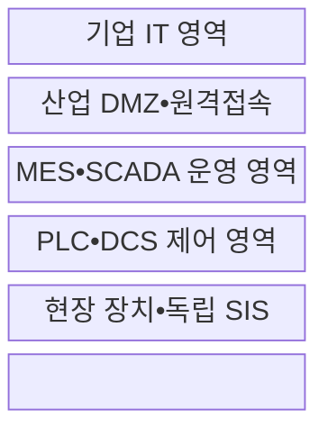
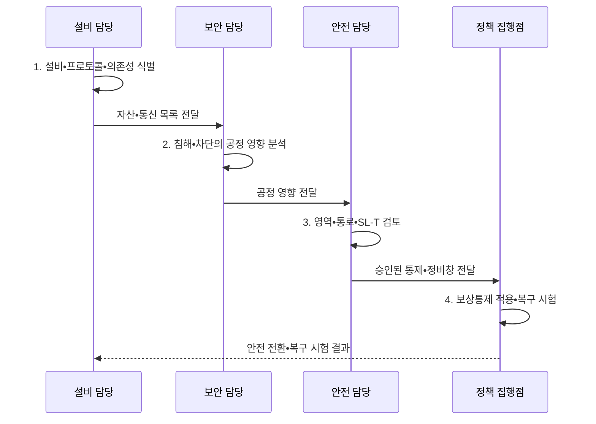

---
sidebar:
  order: 133
  label: "133. 스마트팩토리 OT 보안 (OT Security Smart Factory)"
  badge:
    text: "기출 • 70%"
    variant: note
title: 스마트팩토리 OT 보안 (OT Security Smart Factory)
date: "2026-08-04T14:24:32+09:00"
tags:
  - notes-security
weight: 133
extra:
  question_no: "133"
  source_status: "기출"
  source_history: "126회"
  priority: 70
  priority_note: "126회 기출이며 안전•가용성 중심 OT 설계가 독립적임"
---

## Ⅰ. 개요

핵심 용어

- **OT(Operational Technology)**: 물리 공정•산업 설비를 감시•제어하는 운영기술이다.
- **MES(Manufacturing Execution System)**: 생산 실행을 계획•추적하는 제조실행시스템이다.
- **스마트팩토리**: 센서•제어장치•MES•분석을 연결한 제조 체계이다.

- 정의/개념: 공정 안전•가용성을 우선하며 제어망•산업 프로토콜•현장 장치를 보호하는 **스마트팩토리 OT 보안 체계**
- 배경/필요성: IT 보안 통제를 그대로 적용하면 **공정 중단•물리 사고 가능**

#### 한줄 요약

- 공장 보안은 정보 유출뿐 아니라 차단•명령이 생산 중단과 인명 사고를 만들지 않게 해야 함

## Ⅱ. 특징

핵심 용어

- **영역•통로**: 자산을 보안 영역으로 묶고 영역 간 허용 통신 경로를 통제하는 모델이다.
- **정비창**: 공정 영향을 검토한 변경을 승인된 시간대에 적용하는 운영 구간이다.
- **IT(Information Technology)**: 업무 정보를 처리•저장•전송하는 기술이다.
- **IT•OT 경계**: 업무망과 공정망 사이에 승인 통신만 허용하는 기준이다.

- 안전•가용성•실시간성의 **우선 보호**
- 영역•통로 기반 **IT•OT 통신 분리**
- 공정 영향•정비창 기반 **변경 통제**

#### 한줄 요약

- 설비를 즉시 재부팅하기 어려워 패치를 시험하고 정비 시간에 적용하며 그전에는 통신을 제한함

## Ⅲ. 구조 및 구성요소

핵심 용어

- **IDMZ(Industrial Demilitarized Zone)**: IT와 OT의 직접 연결을 막는 중계 영역이다.
- **SCADA(Supervisory Control and Data Acquisition)**: 산업 공정을 원격 감시•제어하는 체계이다.
- **PLC(Programmable Logic Controller)**: 산업 장치의 논리 제어를 수행하는 제어기이다.
- **DCS(Distributed Control System)**: 공정 제어를 여러 제어기에 분산한 체계이다.
- **SIS(Safety Instrumented System)**: 위험 시 공정을 안전 상태로 전환하는 독립 체계이다.

| 구성요소 | 책임 |
|:---|:---|
| 기업 IT 영역 | **외부 연결•업무•사용자** 관리 |
| 산업 DMZ•원격접속 | **중계•세션 녹화•직접접속** 차단 |
| MES•SCADA 운영 영역 | **생산•감시 기능** 접근 통제 |
| PLC•DCS 제어 영역 | **제어 명령•프로토콜** 허용목록 |
| 현장 장치•독립 SIS | **물리 공정•안전 상태** 보호 |

#### 한줄 요약

- 기업망에서 PLC로 바로 접속하지 못하게 DMZ와 운영 계층을 거쳐 승인된 명령만 전달함

## Ⅳ. 흐름도

핵심 용어

- **SL-T(Security Level-Target)**: 위험평가로 정한 영역•통로의 목표 보안수준이다.

**동작 원리**

- **1. 설비•프로토콜•의존성 식별**: 자산•통신•소유자 식별
- **2. 침해•차단의 공정 영향 분석**: 안전•가용성•실시간성 분석
- **3. 영역•통로•SL-T 검토**: 위험에 따른 통신 경계와 목표 수준의 안전 영향 확인
- **4. 보상통제 적용•복구 시험**: 단계 적용•롤백•오프라인 복구 검증

#### 한줄 요약

- 설비 흐름과 차단 영향을 파악하고 안전 담당 승인 후 통제하며 오프라인 복구까지 시험함

## Ⅴ. 종류 및 비교

핵심 용어

- **IIoT(Industrial Internet of Things)**: 산업 장치와 원격 플랫폼을 연결한 사물인터넷이다.

| 운영 환경 보안 | OT 환경 | IT 환경 | IIoT 연계 |
|:---|:---|:---|:---|
| 적용 기준 | **정지 영향•안전 승인** 필요 | 재부팅 가능한 **업무계** | **원격 분석•예지정비** |
| 핵심 특징 | **물리 공정•실시간 제어** | **정보•업무 시스템** | **산업 장치•플랫폼** 연결 |
| 한계 | 차단•패치의 **공정 영향** | **정보 유출•업무 중단** | 침해의 **현장 확산** |

> 요약: OT는 보안 조치의 물리 안전 영향부터 판단함

#### 한줄 요약

- IT는 정보 중심이고 OT는 보안 통제가 공정을 더 위험하게 만들지 않는지가 우선임

## Ⅵ. 실무 고려사항 및 대책

핵심 용어

- **IEC(International Electrotechnical Commission)**: 국제전기기술위원회이다.
- **IACS(Industrial Automation and Control Systems)**: 산업자동화•제어시스템이다.
- **IEC 62443-3-2**: IACS 영역•통로 위험평가 표준이다.
- **IEC 62443-3-3**: IACS 시스템 보안 요구사항 표준이다.
- **NIST(National Institute of Standards and Technology)**: 미국 국립표준기술연구소이다.
- **SP(Special Publication)**: NIST가 발행하는 특별간행물이다.
- **NIST SP 800-82**: 안전•신뢰성을 고려한 OT 보안 지침이다.

| 문제 | 대책 | 효과 |
|:---|:---|:---|
| 자산 연결을 모르면 위험이 다른 영역으로 전파됨 | **IEC 62443-3-2:2020 적용** | SL-T•경계 근거 확보 |
| 목표 수준만으로는 구현 요구를 정할 수 없음 | **IEC 62443-3-3:2013 적용** | 기능•보안수준 구체화 |
| IT 통제가 공정 안전•가용성을 해칠 수 있음 | **NIST SP 800-82 Rev.3 적용•Rev.4 추적** | 보상통제•복구 정합성 |

#### 한줄 요약

- PLC 패치는 복제 환경에서 공정 영향과 롤백을 확인한 뒤 안전 담당자가 승인한 정비창에 단계 적용한다.

## Ⅶ. 결론

핵심 용어

- **보상통제**: 즉시 패치하기 어려운 설비의 위험을 격리•허용목록•감시 등으로 줄이는 통제이다.

- 공정 영향이 크면 **격리•보상통제 후 정비창에서 단계 변경**

#### 한줄 요약

- 보안 조치가 공정을 더 위험하게 만들지 않도록 안전 승인과 정비 일정에 맞춰 적용함
