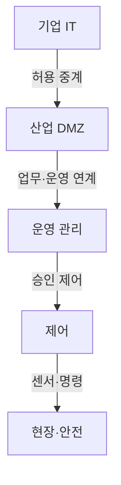
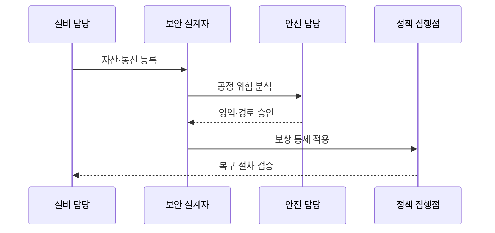

---
sidebar:
  order: 133
  label: "133. 스마트팩토리 OT 보안 (OT Security Smart Factory)"
  badge:
    text: "기출 · 70%"
    variant: note
title: 스마트팩토리 OT 보안 (OT Security Smart Factory)
date: "2026-07-27T23:59:59+09:00"
tags:
  - notes-security
weight: 133
extra:
  question_no: "133"
  source_status: "기출"
  source_history: "126회"
  priority: 70
  priority_note: "126회 기출이며 안전·가용성 중심 OT 설계가 독립적임"
---

## 미리 알고가기

- **운영기술(Operational Technology, OT)**: 물리 공정과 산업 설비를 실시간으로 감시·제어하는 기술 영역이다.
- **정보기술(Information Technology, IT)**: 업무 데이터와 컴퓨팅 자원을 처리·저장·전송하는 기술 영역이다.
- **스마트팩토리(Smart Factory)**: 센서·제어 장치·MES·분석을 연결해 생산 공정을 자동화하는 제조 체계
- **프로그래머블 논리 제어기(Programmable Logic Controller, PLC)**: 입력 신호와 제어 논리에 따라 산업 공정을 실시간으로 제어하는 장치이다.
- **제조 실행 시스템(Manufacturing Execution System, MES)**: 생산 계획을 현장 작업과 연결하고 공정 실적·품질·자원을 관리하는 시스템이다.
- **산업 사물인터넷(Industrial Internet of Things, IIoT)**: 산업 장치와 센서의 데이터를 네트워크와 분석 플랫폼에 연결하는 기술이다.
- **영역·통로(Zone and Conduit)**: 자산을 보안 수준별 영역으로 묶고 영역 사이의 허용 통신 경로를 통제하는 분리 모델이다.
- **안전 계장 시스템(Safety Instrumented System, SIS)**: 위험 조건을 감지하면 공정을 사전에 정의한 안전 상태로 전환하는 독립 안전 시스템이다.
- **비무장지대(Demilitarized Zone, DMZ)**: IT와 OT의 직접 연결을 차단하고 필요한 교환 서비스만 중계하는 완충 네트워크이다.
- **감시 제어·데이터 수집(Supervisory Control and Data Acquisition, SCADA)**: 지리적으로 분산된 산업 설비의 상태를 원격으로 수집·감시·제어하는 시스템이다.
- **분산 제어 시스템(Distributed Control System, DCS)**: 연속 공정의 제어 기능을 여러 제어기에 분산하여 운영하는 시스템이다.
- **인간·기계 인터페이스(Human-Machine Interface, HMI)**: 작업자가 공정 상태를 확인하고 제어 명령을 입력하는 사용자 인터페이스이다.
- **보상 통제**: 패치처럼 원래 통제를 적용하기 어려울 때 같은 위험을 낮추도록 대신 적용하는 통제
- **무선 업데이트(Over-the-Air Update, OTA)**: 통신망을 통해 장치의 펌웨어와 소프트웨어를 원격 배포·갱신하는 방식이다.

## Ⅰ. 개요

- 정의: 공정 안전 중심의 **제어 장치·명령 보호**
- 기존 한계: IT 보안 적용의 **실시간·가용성 충돌**

### 쉽게 이해하기 (학습용)

- 공장 보안은 정보 유출뿐 아니라 잘못된 차단이나 명령이 생산 중단과 인명 사고를 만들지 않게 해야 한다.

## Ⅱ. 특징

- 안전·가용성·실시간성 중심 **우선순위**
- 영역·통로 기반 **IT·OT 통신 분리**
- 공정 영향·정비 창 기반 **변경 통제**

### 쉽게 이해하기 (학습용)

- 설비를 즉시 재부팅하기 어려우므로 패치를 시험하고 정비 시간에 적용하며 그전에는 통신 경로를 제한한다.

## Ⅲ. 아키텍처 및 구성요소

| 설계 요소 | 설명 |
|:---|:---|
| 기업 IT | 외부망 연결과 사용자 관리 |
| 산업 DMZ | IT·OT 연결 중계·차단 |
| 운영 관리 | MES·SCADA 접근 통제 |
| 제어 | PLC·DCS 명령 보호 |
| 현장·안전 | 센서·SIS로 물리 공정 보호 |

### 쉽게 이해하기 (학습용)

- 기업망에서 현장 설비로 바로 접속하지 못하게 DMZ와 운영·제어 계층을 거쳐 필요한 명령만 전달한다.

## Ⅳ. 원리 및 절차 흐름도

| 절차 | 설명 |
|:---|:---|
| 자산·통신 등록 | 설비·프로토콜·의존성 식별 |
| 공정 위험 분석 | 침해·차단의 안전 영향 평가 |
| 영역·경로 승인 | 안전 기준으로 통신 경계 확정 |
| 보상 통제 적용 | 패치 전 접근·명령 범위 제한 |
| 복구 절차 검증 | 오프라인 복구와 안전 전환 시험 |

### 쉽게 이해하기 (학습용)

- 설비와 통신 흐름을 파악한 뒤 안전 담당의 승인을 받아 경계를 적용하고 오프라인 복구까지 시험한다.

## Ⅴ. 종류 및 비교

| 운영 환경 보안 | OT 환경 | IT 환경 | IIoT 연계 |
|:---|:---|:---|:---|
| 적용 기준 | 정지 영향·안전 승인이 필요한 설비 | 재부팅 가능한 업무 시스템 | 원격 분석·예지정비 연계 |
| 핵심 특징 | 물리 공정·실시간 제어 | 정보·업무 시스템 | 산업 장치·플랫폼 연결 |
| 한계 | 차단·패치의 공정 영향 | 정보 유출·업무 중단 | 침해의 현장 확산 |

> 요약: OT는 공정 안전 승인 후 통제를 단계 적용

### 쉽게 이해하기 (학습용)

- OT 통제는 차단보다 공정 안전 검토가 먼저입니다.

## Ⅵ. 실무 사례

1. 제어기 패치의 **시험 환경 검증 후 정비 창 적용**

### 쉽게 이해하기 (학습용)
- PLC 패치는 복제 시험 환경에서 공정 영향과 롤백을 확인한 뒤 안전 담당자가 승인한 정비 시간에 단계적으로 적용한다.

## Ⅶ. 결론

- 보안 조치가 생산과 물리 안전을 해치는 것을 막기 위해 공정 영향·가용성·안전 계통·정비 창·복구 가능성을 검토하여, 안전 승인을 거친 OT 보안 통제를 적용해야 한다.

### 쉽게 이해하기 (학습용)

- 보안 조치가 공정을 더 위험하게 만들지 않도록 안전 승인을 받은 통제를 정비 일정에 맞춰 단계적으로 적용한다.
