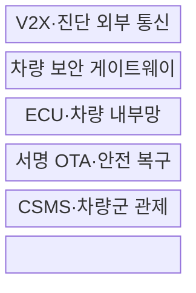
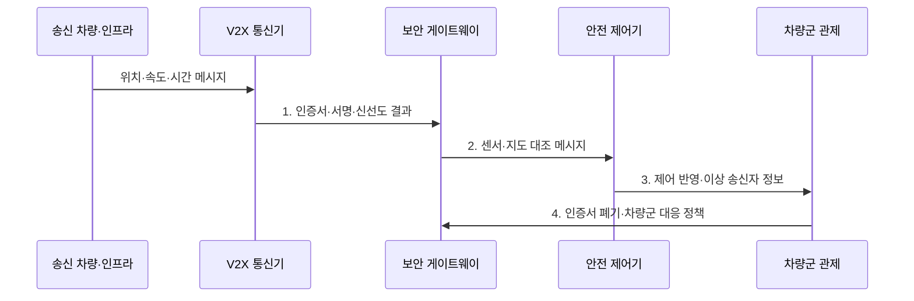

---
sidebar:
  order: 134
  label: "134. 차량 사이버 보안 — V2X 위협 (Vehicle Cybersecurity V2X)"
  badge:
    text: "기출 · 70%"
    variant: note
title: 차량 사이버 보안 — V2X 위협 (Vehicle Cybersecurity V2X)
date: "2026-07-31T02:20:37+09:00"
tags:
  - notes-security
weight: 134
extra:
  question_no: "134"
  source_status: "기출"
  source_history: "138회"
  priority: 70
  priority_note: "138회 최신 기출이며 V2X 신뢰·OTA 보안으로 확장됨"
---

## Ⅰ. 개요

핵심 용어

- **차량·사물 통신(Vehicle-to-Everything, V2X)**: 차량이 차량·인프라·보행자·망과 안전·교통 정보를 교환하는 통신이다.
- **무선 원격 업데이트(Over-the-Air Update, OTA)**: 통신망으로 차량 소프트웨어를 원격 배포·검증·갱신하는 방식이다.

- 정의/개념: 외부 통신·진단·원격 업데이트에서 내부 제어까지 위험을 전 수명주기에서 관리하는 **차량 사이버·물리 보안 체계**
- 배경/필요성: 차량 내부 경계 통제만으로는 V2X 메시지 위조·악성 진단·변조 업데이트 등 **외부 접점 위협 대응 곤란**

#### 한줄 요약

- 차량 통신·업데이트 조작은 화면 오류를 넘어 제동·조향 같은 물리 동작에 영향을 줄 수 있음

## Ⅱ. 특징

핵심 용어

- **위협 분석·위험 평가(Threat Analysis and Risk Assessment, TARA)**: 자산·공격경로·영향·가능성을 분석해 보안 목표를 정하는 활동이다.
- **사이버보안 관리체계(Cyber Security Management System, CSMS)·소프트웨어 업데이트 관리체계(Software Update Management System, SUMS)**: 차량 사이버 위험과 소프트웨어 업데이트를 전 수명주기에서 관리하는 체계이다.
- **차량·사물 통신(Vehicle-to-Everything, V2X) 다중 검증**: 서명·신선도·물리 개연성을 함께 확인해 위조·재전송을 막는 통제이다.

- TARA 기반 **자산·공격경로·영향 평가**
- CSMS·SUMS 기반 **전 수명주기 관리**
- 서명·신선도·개연성의 **V2X 다중 검증**

#### 한줄 요약

- 출고 때만 검사하지 않고 공급망과 운행 중 발견된 취약점·공격을 차량군 전체에서 추적함

## Ⅲ. 구조 및 구성요소

핵심 용어

- **전자제어장치(Electronic Control Unit, ECU)·제어기 영역 네트워크(Controller Area Network, CAN)**: 차량 기능을 제어하는 장치와 ECU들이 메시지를 공유하는 내부 통신 버스이다.
- **무선 원격 업데이트(Over-the-Air Update, OTA)**: 통신망을 통해 차량 소프트웨어를 원격 배포·검증·갱신하는 방식이다.
- **차량·사물 통신(Vehicle-to-Everything, V2X)·사이버보안 관리체계(Cyber Security Management System, CSMS)**: 외부 메시지를 검증하고 차량군의 취약점·사고·상태를 추적하는 경계와 관리체계이다.

| 구성요소 | 책임 |
|:---|:---|
| V2X·진단 외부 통신 | **인증서·서명·신선도** 검증 |
| 차량 보안 게이트웨이 | **도메인·메시지·권한** 통제 |
| ECU·차량 내부망 | **제어 명령·최소 기능** 보호 |
| 서명 OTA·안전 복구 | **호환성·버전·롤백** 검증 |
| CSMS·차량군 관제 | **취약점·사고·차량 상태** 추적 |

#### 한줄 요약

- 외부 통신과 업데이트를 게이트웨이에서 검증하고 필요한 정보만 ECU에 전달하며 차량군을 추적함

## Ⅳ. 흐름도

핵심 용어

- **개연성 검사**: 인증된 메시지도 위치·속도·시간상 가능한지 주변 정보와 대조하는 검사이다.
- **차량·사물 통신(Vehicle-to-Everything, V2X) 신뢰**: 인증서·서명·신선도와 센서·지도 기반 물리 개연성을 함께 확인하는 기준이다.

**동작 원리**

- **1. 인증서·서명·신선도 결과**: 신뢰 체인·유효기간·재생 검증값
- **2. 센서·지도 대조 메시지**: 물리 개연성을 통과한 안전 정보
- **3. 제어 반영·이상 송신자 정보**: 제한 제어 결과와 오동작 증거
- **4. 인증서 폐기·차량군 대응 정책**: 이상 송신자 차단·환류 기준

#### 한줄 요약

- 서명이 맞아도 위치·속도·시간이 불가능하면 거부하고 이상 송신자 정보를 차량군에 환류함

## Ⅴ. 종류 및 비교

핵심 용어

- **차량 간 통신(Vehicle-to-Vehicle, V2V)·차량·인프라 통신(Vehicle-to-Infrastructure, V2I)·차량·네트워크 통신(Vehicle-to-Network, V2N)**: 차량, 도로 인프라, 이동통신망과 각각 정보를 교환하는 차량·사물 통신(V2X) 유형이다.
- **응용 프로그래밍 인터페이스(Application Programming Interface, API)**: 차량·클라우드 서비스가 데이터와 원격 기능을 주고받는 연결 경계이다.

| V2X 통신 유형 | V2V | V2I | V2N |
|:---|:---|:---|:---|
| 적용 기준 | **충돌·급정거** 공유 | **신호·공사·도로** 정보 | **관제·지도·원격 서비스** |
| 핵심 특징 | 차량 간 **저지연 메시지** | 노변 인프라 **구간 정보** | **이동통신·클라우드** 연결 |
| 한계 | **위조·재전송 메시지** | 노변 장치 **탈취·변조** | **계정·API·클라우드** 침해 |

> 요약: 통신 상대와 제어 영향에 따라 검증을 달리함

#### 한줄 요약

- 차량·도로시설·클라우드는 공격 경로가 달라 인증 이후의 개연성·권한 검사도 달라야 함

## Ⅵ. 실무 고려사항 및 대책

핵심 용어

- **국제표준화기구·자동차공학회(International Organization for Standardization/Society of Automotive Engineers, ISO/SAE) 21434**: 차량 전기·전자 시스템의 수명주기 사이버보안 공학 요구사항이다.
- **유엔 규정(United Nations Regulation, UN Regulation) 155·156**: 차량 형식승인의 사이버보안 관리체계(CSMS)와 소프트웨어 업데이트 관리체계(SUMS)를 다루는 규정이다.
- **차량·사물 통신(Vehicle-to-Everything, V2X)**: 통신 메시지의 서명과 물리 개연성을 함께 검증해야 하는 외부 차량 경계이다.

| 문제 | 대책 | 효과 |
|:---|:---|:---|
| 설계 단계 위험이 운영 중 차량군까지 이어짐 | **ISO/SAE 21434:2021 적용** | 보안 목표·증거 추적 |
| 제조사 위험관리가 없으면 형식별 대응이 단절됨 | **UN Regulation No. 155 준수** | CSMS·차량 위험 지속 관리 |
| 업데이트 이력이 없으면 안전성과 호환성을 입증하기 어려움 | **UN Regulation No. 156 준수** | SUMS·업데이트 추적성 |

#### 한줄 요약

- V2X 서명과 위치·속도·시간을 주변 센서로 대조하고 유효 키를 가진 오동작 장치도 관제에 보고한다.

## Ⅶ. 결론

핵심 용어

- **다중 신뢰 검증**: 서명뿐 아니라 신선도·권한·물리 개연성을 함께 확인하는 원칙이다.
- **차량·사물 통신(Vehicle-to-Everything, V2X) 제한 반영**: 다중 검증을 통과한 메시지만 차량 제어 판단에 제한적으로 사용하는 원칙이다.

- 서명·개연성을 통과한 **V2X만 제한 반영**, 이상 인증서는 차량군 폐기

#### 한줄 요약

- 제조사와 공급망이 통신·업데이트 위험을 설계부터 폐기까지 계속 추적·개선해야 함
