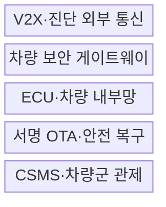
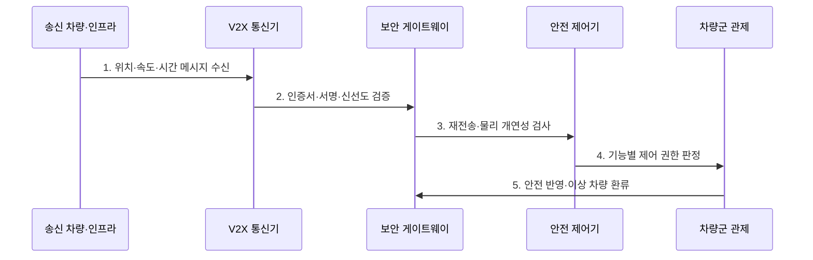

---
sidebar:
  order: 134
  label: "134. 차량 사이버 보안 — V2X 위협 (Vehicle Cybersecurity V2X)"
  badge:
    text: "기출 · 70%"
    variant: note
title: 차량 사이버 보안 — V2X 위협 (Vehicle Cybersecurity V2X)
date: "2026-07-27T23:59:59+09:00"
tags:
  - notes-security
weight: 134
extra:
  question_no: "134"
  source_status: "기출"
  source_history: "138회"
  priority: 70
  priority_note: "138회 최신 기출이며 V2X 신뢰·OTA 보안으로 확장됨"
---

## 미리 알고가기

- **차량·모든 대상 간 통신(Vehicle-to-Everything, V2X)**: 차량이 차량·인프라·보행자·망과 안전·교통 정보를 교환하는 통신이다.
- **전자 제어 장치(Electronic Control Unit, ECU)**: 센서 입력을 처리해 제동·조향·엔진 등 차량 기능을 제어하는 장치이다.
- **제어기 영역 네트워크(Controller Area Network, CAN)**: ECU들이 우선순위 기반 메시지를 공유하는 차량 내부 통신 버스이다.
- **위협 분석·위험 평가(Threat Analysis and Risk Assessment, TARA)**: 자산·공격경로·영향·가능성을 분석해 보안 목표를 정하는 활동이다.
- **사이버보안 관리체계(Cyber Security Management System, CSMS)**: 차량 전 수명주기의 사이버 위험·활동·증거를 관리하는 체계이다.
- **소프트웨어 업데이트 관리체계(Software Update Management System, SUMS)**: 차량 업데이트의 적합성·추적성·안전성을 관리하는 체계이다.
- **무선 업데이트(Over-the-Air Update, OTA)**: 통신망을 통해 차량 소프트웨어를 원격 배포·검증·갱신하는 방식이다.
- **개연성 검사(Plausibility Check)**: 인증된 메시지도 위치·속도·시간상 가능한지 검증하는 검사이다.
- **ISO/SAE 21434:2021**: 차량 전기·전자 시스템의 수명주기 사이버보안 공학 요구사항이다.
- **UN Regulation No. 155**: 차량 형식승인과 제조사 CSMS에 관한 국제 규정이다.
- **UN Regulation No. 156**: 차량 소프트웨어 업데이트와 제조사 SUMS에 관한 국제 규정이다.

## Ⅰ. 개요

- 정의: V2X·진단·OTA의 **차량 수명주기 위험관리**
- 목적: 외부 입력·업데이트의 **제어·안전 피해 방지**

### 쉽게 이해하기 (학습)

- 차량 통신·업데이트 조작은 화면 오류를 넘어 제동·조향 같은 물리 동작에 영향을 줄 수 있음

## Ⅱ. 특징

- TARA 기반 **자산·공격경로·영향 평가**
- CSMS·SUMS 기반 **전 수명주기 관리**
- 서명·신선도·개연성의 **V2X 다중 검증**

### 쉽게 이해하기 (학습)

- 출고 때만 검사하지 않고 공급망과 운행 중 발견된 취약점·공격을 차량군 전체에서 추적함

## Ⅲ. 구조 및 구성요소

| 설계 요소 | 설명 |
|:---|:---|
| V2X·진단 외부 통신 | 인증서·서명·신선도 검증 |
| 차량 보안 게이트웨이 | 도메인·메시지·권한 통제 |
| ECU·차량 내부망 | 제어 명령·최소 기능 보호 |
| 서명 OTA·안전 복구 | 호환성·버전·롤백 검증 |
| CSMS·차량군 관제 | 취약점·사고·차량 상태 추적 |

### 쉽게 이해하기 (학습)

- 외부 통신과 업데이트를 게이트웨이에서 검증하고 필요한 정보만 ECU에 전달하며 차량군을 추적함

## Ⅳ. 흐름도

| 절차 | 설명 |
|:---|:---|
| 1. 위치·속도·시간 메시지 수신 | V2V·V2I·V2N 정보 입력 |
| 2. 인증서·서명·신선도 검증 | 신뢰 체인·유효기간·재생 확인 |
| 3. 재전송·물리 개연성 검사 | 센서·지도·주행 상태 대조 |
| 4. 기능별 제어 권한 판정 | 메시지별 허용 영향 제한 |
| 5. 안전 반영·이상 차량 환류 | 제어 적용·오동작 인증서 보고 |

### 쉽게 이해하기 (학습)

- 서명이 맞아도 위치·속도·시간이 불가능하면 거부하고 이상 송신자 정보를 차량군에 환류함

## Ⅴ. 종류 및 비교

| V2X 통신 유형 | V2V | V2I | V2N |
|:---|:---|:---|:---|
| 적용 기준 | 충돌·급정거 공유 | 신호·공사·도로 정보 | 관제·지도·원격 서비스 |
| 핵심 특징 | 차량 간 저지연 메시지 | 노변 인프라 구간 정보 | 이동통신·클라우드 연결 |
| 한계 | 위조·재전송 메시지 | 노변 장치 탈취·변조 | 계정·API·클라우드 침해 |

> 요약: 통신 상대와 제어 영향에 따라 검증을 달리함

### 쉽게 이해하기 (학습)

- 차량·도로시설·클라우드는 공격 경로가 달라 인증 이후의 개연성·권한 검사도 달라야 함

## Ⅵ. 실무 고려사항 및 대책

| 고려사항 | 대책 | 효과 |
|:---|:---|:---|
| 차량 수명주기 TARA | **ISO/SAE 21434:2021 적용** | 보안 목표·증거 추적 |
| 차량 CSMS·형식승인 | **UN Regulation No. 155 준수** | 조직·차량 위험 지속 관리 |
| OTA·SUMS·형식승인 | **UN Regulation No. 156 준수** | 업데이트 안전·추적성 |

### 쉽게 이해하기 (학습)

- V2X 서명과 위치·속도·시간을 주변 센서로 대조하고 유효 키를 가진 오동작 장치도 관제에 보고한다.

## Ⅶ. 결론

- **제어 영향·메시지 신뢰·OTA·차량군**으로 대응을 결정한다.

### 쉽게 이해하기 (학습)

- 제조사와 공급망이 통신·업데이트 위험을 설계부터 폐기까지 계속 추적·개선해야 함
