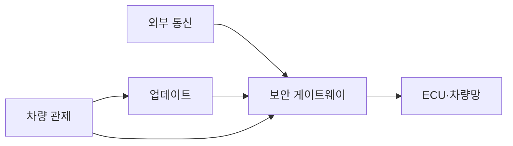
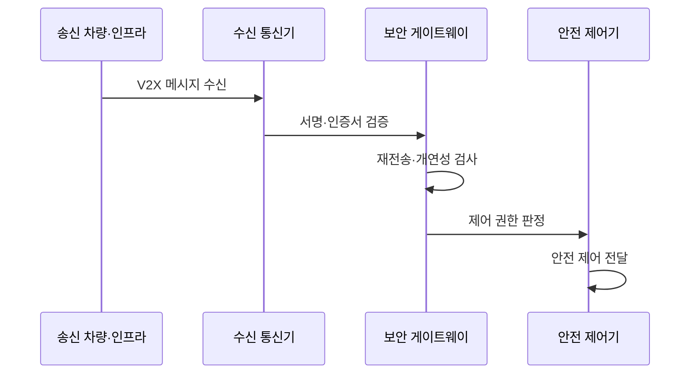

---
sidebar:
  order: 134
  label: "134. 차량 사이버 보안 — V2X 위협 (Vehicle Cybersecurity V2X)"
  badge:
    text: "기출 · 70%"
    variant: note
title: 차량 사이버 보안 — V2X 위협 (Vehicle Cybersecurity V2X)
date: "2026-07-27T23:59:59+09:00"
tags:
  - notes-security
weight: 134
extra:
  question_no: "134"
  source_status: "기출"
  source_history: "138회"
  priority: 70
  priority_note: "138회 최신 기출이며 V2X 신뢰·OTA 보안으로 확장됨"
---

## 미리 알고가기

- **차량·모든 대상 간 통신(Vehicle-to-Everything, V2X)**: 숫자 `2`를 `to`로 쓴 공식 표기라 “브이투엑스”로 읽으며, 차량이 다른 차량·인프라·보행자·네트워크와 정보를 교환한다
- **전자 제어 장치(Electronic Control Unit, ECU)**: 영문 머리글자를 딴 공식 표기라 “이시유”로 읽으며, 제동·조향·엔진 같은 차량 기능을 제어한다
- **제어기 영역 네트워크(Controller Area Network, CAN)**: 영문 머리글자를 딴 공식 표기라 “캔”으로 읽으며, 차량 제어기들이 우선순위 기반 메시지를 공유하는 내부 버스
- **위협 분석·위험 평가(Threat Analysis and Risk Assessment, TARA)**: 영문 머리글자를 딴 공식 표기라 “타라”로 읽으며, 차량 자산·공격 경로·영향으로 보안 목표를 정한다
- **사이버보안 관리 체계(Cyber Security Management System, CSMS)**: 영문 머리글자를 딴 공식 표기라 “씨에스엠에스”로 읽으며, 제조사가 개발부터 폐기까지 차량 보안을 관리한다
- **소프트웨어 업데이트 관리 체계(Software Update Management System, SUMS)**: 영문 머리글자를 딴 공식 표기라 “섬스”로 읽으며, 차량 업데이트의 적합성·추적성·안전을 관리한다
- **무선 업데이트(Over-the-Air Update, OTA)**: 영문 주요 글자를 딴 공식 표기라 “오티에이”로 읽으며, 통신망으로 차량 소프트웨어를 원격 배포·갱신한다
- **차량 간 통신(Vehicle-to-Vehicle, V2V)**: 숫자 `2`를 `to`로 쓴 공식 표기라 “브이투브이”로 읽으며, 차량끼리 위치·속도·위험 정보를 교환한다
- **차량·인프라 간 통신(Vehicle-to-Infrastructure, V2I)**: 숫자 `2`를 `to`로 쓴 공식 표기라 “브이투아이”로 읽으며, 차량과 신호등·노변 장치가 정보를 교환한다
- **차량·네트워크 간 통신(Vehicle-to-Network, V2N)**: 숫자 `2`를 `to`로 쓴 공식 표기라 “브이투엔”으로 읽으며, 차량과 이동통신·클라우드 서비스가 연결된다
- **응용 프로그래밍 인터페이스(Application Programming Interface, API)**: 영문 머리글자를 딴 공식 표기라 “에이피아이”로 읽으며, V2N에서 차량과 클라우드 기능을 연결하는 호출 규약
- **개연성 검사**: 인증된 메시지도 물리 위치·속도·시간상 가능한지 확인하는 검사
- **차량 사이버보안 공학(ISO/SAE 21434:2021)**: 아이에스오 에스에이이 이일사삼사로 읽으며, 차량 E/E 시스템의 전 수명주기 사이버보안 위험관리 요구사항을 제시

## Ⅰ. 개요

- 정의: V2X·진단·OTA의 **차량 사이버 위험관리**
- 기존 한계: 연결 차량의 **외부 입력·갱신 신뢰 부족**

### 쉽게 이해하기 (학습용)

- 차량 통신이나 업데이트가 조작되면 화면 오류가 아니라 제동·조향 같은 물리 동작으로 이어질 수 있다.

## Ⅱ. 특징

- TARA 기반 **차량 자산·공격 경로 평가**
- CSMS 기반 **전 수명주기 위험관리**
- 서명·개연성 기반 **V2X 메시지 검증**

### 쉽게 이해하기 (학습용)

- 차량은 오래 운행되므로 출고 때만 검사하지 않고 공급망과 운행 중 발견된 취약점을 계속 추적·수정한다.

## Ⅲ. 아키텍처 및 구성요소

| 설계 요소 | 설명 |
|:---|:---|
| 외부 통신 | V2X·진단 연결의 출처 인증 |
| 보안 게이트웨이 | 도메인 간 메시지·권한 통제 |
| ECU·차량망 | 제어 메시지와 최소 기능 보호 |
| 업데이트 | 서명·호환성·복구 검증 |
| 차량 관제 | 취약점·사고·차량군 상태 추적 |

### 쉽게 이해하기 (학습용)

- 외부 통신과 업데이트를 게이트웨이에서 검증한 뒤 필요한 제어 메시지만 ECU로 전달하고 차량군 상태를 추적한다.

## Ⅳ. 원리 및 절차 흐름도

| 절차 | 설명 |
|:---|:---|
| V2X 메시지 수신 | 위치·속도·시간 정보를 수신 |
| 서명·인증서 검증 | 발급 신뢰·서명·유효기간 판정 |
| 재전송·개연성 검사 | 중복과 물리적 불가능성 거부 |
| 제어 권한 판정 | 메시지 유형별 허용 기능 제한 |
| 안전 제어 전달 | 검증 결과만 제어기에 반영 |

### 쉽게 이해하기 (학습용)

- 서명이 맞아도 위치·속도·시간이 불가능한 메시지는 거부하고 검증된 정보만 안전 제어에 반영한다.

## Ⅴ. 종류 및 비교

| V2X 통신 유형 | V2V | V2I | V2N |
|:---|:---|:---|:---|
| 적용 기준 | 충돌·급정거 정보를 즉시 공유할 때 | 신호·공사·도로 상태를 제공할 때 | 관제·지도·원격 서비스를 이용할 때 |
| 핵심 특징 | 차량 간 저지연 메시지 | 도로 인프라 구간 정보 | 이동통신·클라우드 연결 |
| 한계 | 위조·재전송 메시지 | 노변 장치 탈취·변조 | 계정·API·클라우드 침해 |

> 요약: 통신 상대별 인증·개연성 위험이 다름

### 쉽게 이해하기 (학습용)

- 차량은 통신 상대마다 다른 위조 경로를 확인합니다.

## Ⅵ. 실무 사례

1. V2X 메시지의 **서명·물리 개연성 검증**

### 쉽게 이해하기 (학습용)
- 차량은 V2X 메시지의 인증서 서명뿐 아니라 위치·속도·시간이 주변 센서와 물리적으로 일치하는지 검증해 유효 키를 가진 오동작 장치도 거부한다.

## Ⅶ. 결론

- 연결 차량의 통신·업데이트 위험을 수명주기 전체에서 줄이기 위해 자산·TARA·V2X 신뢰·OTA 안전·공급망 책임을 검토하여, CSMS로 위험과 대응 증거를 지속 관리해야 한다.

### 쉽게 이해하기 (학습용)

- 제조사와 공급망이 차량군의 통신·업데이트 위험을 설계부터 폐기까지 계속 추적하고 갱신해야 한다.
