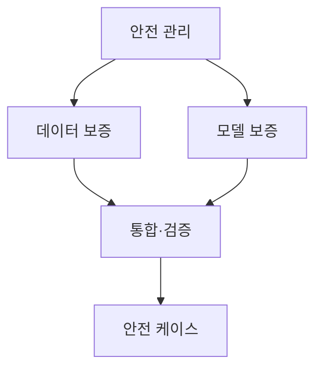
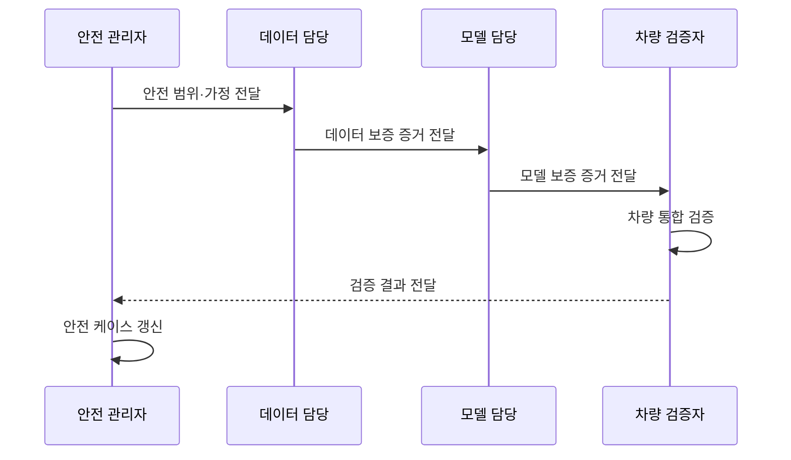

---
sidebar:
  order: 135
  label: "135. ISO/PAS 8800 AI 안전 (ISO PAS 8800)"
  badge:
    text: "기출 · 70%"
    variant: note
title: ISO/PAS 8800 AI 안전 (ISO PAS 8800)
date: "2026-07-27T23:59:59+09:00"
tags:
  - notes-security
weight: 135
extra:
  question_no: "135"
  source_status: "기출"
  source_history: "138회"
  priority: 70
  priority_note: "138회 최신 기출이며 차량 AI 안전보증과 연결됨"
---

## 미리 알고가기

- **국제표준화기구 공개 사양 8800(International Organization for Standardization/Publicly Available Specification 8800, ISO/PAS 8800)**: `ISO`는 언어별 약어 대신 그리스어 `isos`의 같음을 택한 공식명이고 `PAS`는 영문 머리글자라 “아이에스오 피에이에스 팔천팔백”으로 읽으며, AI 포함 차량 안전 보증 지침을 제공한다
- **인공지능 요소(Artificial Intelligence Element, AI Element)**: `Artificial Intelligence`를 `AI`로 줄여 “에이아이 엘리먼트”로 읽으며, 차량 안전 기능을 담당하는 학습 모델·시스템
- **안전 보증 주장**: 불합리한 위험 부존재의 논리적 증명
- **출력 불충분(Output Insufficiency)**: 요구 성능 미달 상태
- **체계적 오류(Systematic Error)**: 개발·학습·구현 단계 재현 결함
- **무작위 하드웨어 오류**: 물리적 확률적 고장
- **현장 모니터링**: 운행 중 이상·안전 사건 수집·검토
- **전기·전자 시스템(Electrical/Electronic System, E/E System)**: 슬래시로 전기와 전자를 함께 나타내는 공식 표기라 “이 슬래시 이 시스템”으로 읽으며, 차량 센서·제어기·통신·액추에이터를 포괄한다
- **ISO 26262**: “아이에스오 이육이육이”로 읽으며, 차량 E/E 시스템의 체계적 오류와 무작위 하드웨어 고장을 다루는 기능안전 표준
- **ISO 21448**: “아이에스오 이일사사팔”로 읽으며, 고장이 없어도 센서·알고리즘의 기능 한계나 합리적 오용으로 생기는 위험을 다루는 표준
- **안전 케이스**: 안전하다는 주장과 그 근거·증거를 구조적으로 연결한 문서
- **드리프트**: 운영 데이터 분포가 개발·학습 때와 달라져 모델 성능이 변하는 현상

## Ⅰ. 개요

- 정의: 차량 AI의 **안전 관련 동작 보증 지침**
- 기존 한계: 고장 분석만으로 **출력 불충분 설명 곤란**

### 쉽게 이해하기 (학습용)

- 평균 정확도가 높다는 말만으로는 부족하므로 AI가 어떤 상황에서 틀리고 차량이 어떻게 안전 상태로 가는지 증명한다.

## Ⅱ. 특징

- AI 요소의 **출력 불충분·오류 위험 분석**
- 데이터·모델·통합의 **수명주기 보증**
- 주장·근거·증거 기반 **안전 케이스**

### 쉽게 이해하기 (학습용)

- 자체 모델뿐 아니라 외부 AI와 데이터가 바뀔 때 차량 안전에 미치는 영향까지 증거로 추적한다.

## Ⅲ. 아키텍처 및 구성요소

| 설계 요소 | 설명 |
|:---|:---|
| 안전 관리 | 역할·계획·허용 위험 기준 |
| 데이터 보증 | 출처·대표성·편향 증거 |
| 모델 보증 | 학습·강건성·불확실성 증거 |
| 통합·검증 | 시나리오와 오류 전파 검증 |
| 안전 케이스 | 주장·근거·증거의 추적 연결 |

### 쉽게 이해하기 (학습용)

- 데이터와 모델의 검증 결과를 차량 통합 시험에 연결하고 그 증거가 차량 수준 안전 주장을 뒷받침하게 한다.

## Ⅳ. 원리 및 절차 흐름도

| 절차 | 설명 |
|:---|:---|
| 안전 범위·가정 전달 | 운행 환경·의존성·허용 위험 정의 |
| 데이터 보증 증거 전달 | 출처·대표성·분리 이력 제공 |
| 모델 보증 증거 전달 | 강건성·불확실성·한계 제공 |
| 차량 통합 검증 | 오류 전파와 안전 전환 평가 |
| 검증 결과 전달 | 통합 시험·잔여 위험 결과 제공 |
| 안전 케이스 갱신 | 현장 드리프트·변경 증거 반영 |

### 쉽게 이해하기 (학습용)

- 데이터나 모델이 바뀌면 기존 안전 주장을 그대로 쓰지 않고 차량 통합 시험과 안전 케이스를 다시 갱신한다.

## Ⅴ. 종류 및 비교

| 차량 안전 표준 | ISO/PAS 8800:2024 | ISO 26262 | ISO 21448 |
|:---|:---|:---|:---|
| 적용 기준 | 학습 기반 AI 요소 안전 보증 | E/E 고장·개발 오류 분석 | 센서·알고리즘 한계 분석 |
| 핵심 특징 | AI 출력·데이터·모델 보증 | 체계적·무작위 고장 관리 | 기능 한계·합리적 오용 관리 |
| 한계 | 기존 안전표준과 분리 적용 | AI 불확실성 설명 부족 | 데이터·모델 증거 부족 |

> 요약: AI 증거·고장·기능 한계를 함께 보완

### 쉽게 이해하기 (학습용)

- AI 안전은 데이터·모델·차량 검증 증거를 함께 봅니다.

## Ⅵ. 실무 사례

1. 자율주행 AI의 **희귀 운행 조건 안전성 평가**

### 쉽게 이해하기 (학습용)
- 평균 정확도뿐 아니라 폭우·역광·원거리 보행자 등 희귀 경계 조건의 성능과 실패 시 안전 전환을 시험해 차량 안전 케이스에 증거로 연결한다.

## Ⅶ. 결론

- AI 성능 불확실성이 차량 안전사고로 이어지는 것을 막기 위해 데이터 대표성·경계 성능·공통 원인·안전 전환·변경 영향을 검토하여, ISO/PAS 8800 기반 안전 케이스를 갱신해야 한다.

### 쉽게 이해하기 (학습용)

- AI가 안전하다고 선언하는 대신 실패 조건과 차량의 안전 전환을 시험 증거로 연결하고 변경 때 다시 확인한다.
