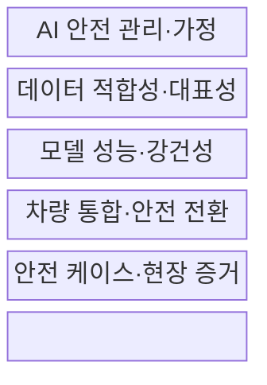
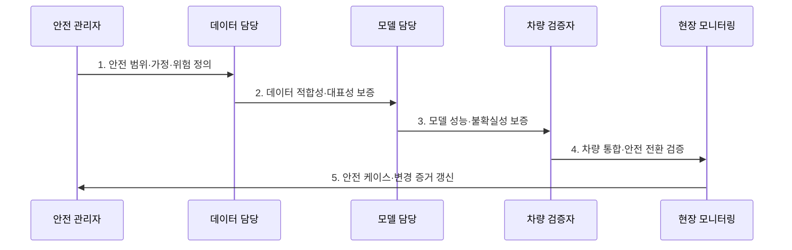

---
sidebar:
  order: 135
  label: "135. ISO/PAS 8800 AI 안전 (ISO PAS 8800)"
  badge:
    text: "기출 · 70%"
    variant: note
title: ISO/PAS 8800 AI 안전 (ISO PAS 8800)
date: "2026-07-30T19:00:00+09:00"
tags:
  - notes-security
weight: 135
extra:
  question_no: "135"
  source_status: "기출"
  source_history: "138회"
  priority: 70
  priority_note: "138회 최신 기출이며 차량 AI 안전보증과 연결됨"
---

## 미리 알고가기

- **ISO/PAS 8800:2024**: 양산 도로 차량의 안전 관련 AI 요소를 위한 안전 공학 공개 사양이다.
- **공개 사양(Publicly Available Specification, PAS)**: 긴급 시장 요구에 대응해 ISO가 신속 발행하는 합의 문서이다.
- **인공지능 요소(Artificial Intelligence Element, AI Element)**: 차량 안전 관련 기능을 담당하는 학습 모델·AI 시스템 구성요소이다.
- **출력 불충분(Output Insufficiency)**: AI 요소의 출력이 요구된 안전 성능을 충족하지 못하는 상태이다.
- **체계적 오류(Systematic Error)**: 개발·학습·구현 과정의 원인으로 결정론적으로 재현되는 오류이다.
- **무작위 하드웨어 오류(Random Hardware Error)**: 하드웨어의 물리적·확률적 고장으로 발생하는 오류이다.
- **안전 케이스(Safety Case)**: 안전 주장과 논거·증거를 구조적으로 연결한 보증 문서이다.
- **현장 모니터링(Field Monitoring)**: 운행 중 성능 저하·드리프트·안전 사건을 수집·분석하는 활동이다.
- **ISO 26262:2018 시리즈**: 차량 E/E 시스템의 체계적 오류와 무작위 하드웨어 고장을 다루는 기능안전 표준이다.
- **ISO 21448:2022**: 고장 없이도 기능·성능 불충분으로 생기는 위험을 다루는 SOTIF 표준이다.
- **의도된 기능 안전(Safety of the Intended Functionality, SOTIF)**: 기능 불충분으로 인한 불합리한 위험이 없는 상태이다.

## Ⅰ. 개요

- 정의/개념: 차량 AI 요소의 **출력·오류·증거 기반 안전 공학**
- 배경/필요성: 평균 성능만으로 못 잡는 **AI 안전 위험 보증**

### 쉽게 이해하기 (학습용)

- 평균 정확도가 아니라 어떤 상황에서 틀리고 차량이 어떻게 안전 상태로 가는지 증명함

## Ⅱ. 특징

- 출력 불충분·체계·하드웨어 **오류 통합 분석**
- 데이터·모델·통합·운영의 **수명주기 보증**
- 주장·논거·증거 기반 **AI 안전 케이스**

### 쉽게 이해하기 (학습용)

- 외부 AI·데이터 변경도 차량 안전에 미치는 영향을 추적하고 기존 증거가 유효한지 다시 확인함

## Ⅲ. 구조 및 구성요소

| 구성요소 | 책임 |
|:---|:---|
| AI 안전 관리·가정 | 역할·범위·허용 위험 기준 |
| 데이터 적합성·대표성 | 출처·분포·희귀 조건 증거 |
| 모델 성능·강건성 | 경계 성능·불확실성·오류 |
| 차량 통합·안전 전환 | 오류 전파·고장 대응 검증 |
| 안전 케이스·현장 증거 | 주장·논거·시험·변경 추적 |

### 쉽게 이해하기 (학습용)

- 데이터·모델 시험 결과를 차량 수준 안전 전환과 연결해 하나의 안전 주장을 뒷받침함

## Ⅳ. 흐름도

**동작 원리**

- **1. 안전 범위·가정·위험 정의**: 운행환경·의존성·허용치 확정
- **2. 데이터 적합성·대표성 보증**: 출처·분포·분리 이력 평가
- **3. 모델 성능·불확실성 보증**: 강건성·경계·오류 한계 평가
- **4. 차량 통합·안전 전환 검증**: 오류 전파·최소위험 상태 시험
- **5. 안전 케이스·변경 증거 갱신**: 드리프트·현장 사건·변경 반영

### 쉽게 이해하기 (학습용)

- 데이터나 모델이 바뀌면 차량 통합 시험과 안전 케이스가 여전히 유효한지 다시 검증함

## Ⅴ. 종류 및 비교

| 차량 안전 규격 | ISO/PAS 8800:2024 | ISO 26262:2018 | ISO 21448:2022 |
|:---|:---|:---|:---|
| 적용 기준 | 안전 관련 AI 요소 | E/E 고장·개발 오류 | 의도 기능·성능 한계 |
| 핵심 특징 | 데이터·모델·출력 보증 | 체계·무작위 고장 관리 | 기능 불충분·오용 관리 |
| 한계 | 기존 안전규격과 연계 필요 | AI 불확실성 설명 부족 | AI 수명주기 증거 부족 |

> 요약: AI 출력, E/E 고장, 기능 한계를 상호 보완함

### 쉽게 이해하기 (학습용)

- 세 규격은 경쟁 관계가 아니라 AI·고장·기능 한계라는 서로 다른 위험을 함께 다룸

## Ⅵ. 실무 고려사항 및 대책

| 고려사항 | 대책 | 효과 |
|:---|:---|:---|
| AI 출력·오류 안전성 | **ISO/PAS 8800:2024 적용** | 데이터·모델 증거 추적 |
| E/E 체계·무작위 고장 | **ISO 26262:2018 연계** | ASIL 기반 기능안전 보완 |
| 기능·성능 불충분 | **ISO 21448:2022 연계** | SOTIF 위험 통합 |

### 쉽게 이해하기 (학습용)

- 폭우·역광·원거리 보행자 등 희귀 조건의 성능과 실패 시 최소위험 상태 전환을 차량 안전 케이스에 연결한다.

## Ⅶ. 결론

- **경계 성능·불확실성·안전 전환·증거**로 출시를 결정한다.

### 쉽게 이해하기 (학습용)

- AI가 안전하다고 선언하지 말고 실패 조건과 안전 전환을 시험 증거로 연결하고 변경 때 재검증함
