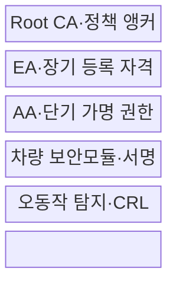
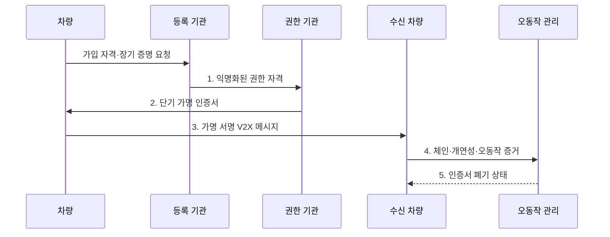

---
sidebar:
  order: 136
  label: "136. PKI 차량 인증 (Vehicle PKI)"
  badge:
    text: "기출 · 70%"
    variant: note
title: PKI 차량 인증 (Vehicle PKI)
date: "2026-07-31T02:21:45+09:00"
tags:
  - notes-security
weight: 136
extra:
  question_no: "136"
  source_status: "기출"
  source_history: "138회"
  priority: 70
  priority_note: "138회 기출이며 차량 메시지 신뢰체인의 핵심임"
---

## 미리 알고가기

- **차량 공개키 기반구조(Vehicle Public Key Infrastructure, Vehicle PKI)**: V2X 메시지 서명 인증서의 발급·사용·폐기를 관리하는 체계이다.
- **최상위 인증기관(Root Certificate Authority, Root CA)**: 차량 신뢰 도메인의 최상위 인증서와 하위 기관을 보증하는 기관이다.
- **등록 기관(Enrollment Authority, EA)**: 차량 가입 자격을 검증하고 장기 등록 자격증명을 발급하는 기관이다.
- **권한 기관(Authorization Authority, AA)**: 승인 차량에 단기 V2X 서비스 권한 인증서를 발급하는 기관이다.
- **가명 인증서(Pseudonym Certificate)**: 실명 대신 단기 공개키·권한을 증명해 장기 추적을 줄이는 인증서이다.
- **오동작 탐지(Misbehavior Detection)**: 서명은 유효하지만 거짓이거나 물리적으로 불가능한 메시지를 판별하는 기능이다.
- **인증서 폐기목록(Certificate Revocation List, CRL)**: 만료 전 폐기된 인증서 식별자와 상태를 배포하는 목록이다.
- **보안 자격증명 관리체계(Security Credential Management System, SCMS)**: V2X 인증서의 등록·권한·폐기 기능을 분리 운영하는 체계이다.
- **전송 계층 보안(Transport Layer Security, TLS)**: 차량과 서버 사이 인증·기밀성·무결성을 제공하는 프로토콜이다.
- **IEEE 1609.2-2022**: WAVE 응용·관리 메시지의 보안 서비스와 인증서 형식을 규정한다.
- **IEEE 1609.2.1-2026**: WAVE 종단 장치의 인증서 프로비저닝·관리 인터페이스를 규정한다.
- **ETSI TS 103 097 V2.2.1**: 유럽 ITS의 보안 헤더와 인증서 형식을 규정한 기술 사양이다.

> **키워드:** PKI 차량 인증 (Vehicle PKI)

## Ⅰ. 개요

- 정의/개념: V2X 인증서의 발급·사용·폐기를 관리하는 **공개키 기반구조**
- 배경/필요성: 장기 인증서를 방송에 쓰면 **차량 이동경로 추적 가능**

### 쉽게 이해하기 (학습용)

- 송신자 실명을 몰라도 허가된 차량의 변조되지 않은 메시지인지 확인해야 함

## Ⅱ. 특징

- 등록·권한 기관 분리의 **최소 정보 결합**
- 단기 가명 인증서의 **메시지 권한·프라이버시**
- 서명·신선도·개연성의 **다중 신뢰 검증**

### 쉽게 이해하기 (학습용)

- 이름을 가린 임시 자격증명을 바꿔 쓰되 위험 차량은 책임 있게 제재할 수 있어야 함

## Ⅲ. 구조 및 구성요소

| 구성요소 | 책임 |
|:---|:---|
| Root CA·정책 앵커 | **도메인 신뢰·하위 기관** 보증 |
| EA·장기 등록 자격 | **가입 차량·제조 자격** 확인 |
| AA·단기 가명 권한 | 서비스별 **단기 인증서** 발급 |
| 차량 보안모듈·서명 | **개인키 보호·메시지 서명** |
| 오동작 탐지·CRL | **거짓 메시지·폐기 상태** 배포 |

### 쉽게 이해하기 (학습용)

- 가입 확인 기관과 방송 이용권 기관을 나눠 한 기관이 차량의 모든 활동을 보기 어렵게 함

## Ⅳ. 흐름도

**동작 원리**

- **1. 익명화된 권한 자격**: 장기 식별자를 최소화한 가입 증명
- **2. 단기 가명 인증서**: 서비스·기간별 방송 권한
- **3. 가명 서명 V2X 메시지**: 단기 키로 보호한 안전 정보
- **4. 체인·개연성·오동작 증거**: 서명은 유효한 이상 행위 보고
- **5. 인증서 폐기 상태**: 위험 장치의 만료 전 사용 차단 정보

### 쉽게 이해하기 (학습용)

- 차량은 임시 인증서로 메시지를 보내고 수신자는 서명·시간·권한·물리 가능성을 함께 확인함

## Ⅴ. 종류 및 비교

| 차량 인증서 유형 | 등록 인증서 | 가명 인증서 | TLS 인증서 |
|:---|:---|:---|:---|
| 적용 기준 | EA **가입·권한 요청** | V2X **안전 메시지 서명** | 차량·서버 **연결 보호** |
| 핵심 특징 | **장기 가입 자격** 증명 | **단기 방송 권한** 증명 | **상대 인증·암호화 세션** |
| 한계 | **식별자 노출·장기 추적** | **교체 패턴 재연결** | 방송 권한으로 **사용 불가** |

> 요약: 장기 가입, 단기 방송, 서버 연결 자격을 분리함

### 쉽게 이해하기 (학습용)

- 차량 실명 자격과 방송용 가명 권한, 서버 연결 인증서는 목적이 서로 다름

## Ⅵ. 실무 고려사항 및 대책

| 고려사항 | 대책 | 효과 |
|:---|:---|:---|
| 메시지 형식이 다르면 차량 간 서명을 검증할 수 없음 | **IEEE 1609.2-2022 적용** | 보안 서비스·인증서 상호운용 |
| 관리 절차가 다르면 인증서 수명주기가 단절됨 | **IEEE 1609.2.1-2026 적용** | 등록·권한·폐기 표준화 |
| 지역별 형식 차이로 ITS 상호운용이 깨질 수 있음 | **ETSI TS 103 097 V2.2.1 적용** | 유럽 보안 헤더·인증서 호환 |

### 쉽게 이해하기 (학습용)

- 가명 인증서를 주기적으로 바꾸되 교체 시점·무선 식별자·메시지 패턴이 차량을 다시 연결하지 않게 한다.

## Ⅶ. 결론

- 방송은 **단기 가명 인증서**, 서버 연결은 TLS 인증서로 분리

### 쉽게 이해하기 (학습용)

- 실명을 공개하지 않고 메시지 권한을 확인하며 위험 장치를 제재할 수 있어야 함
