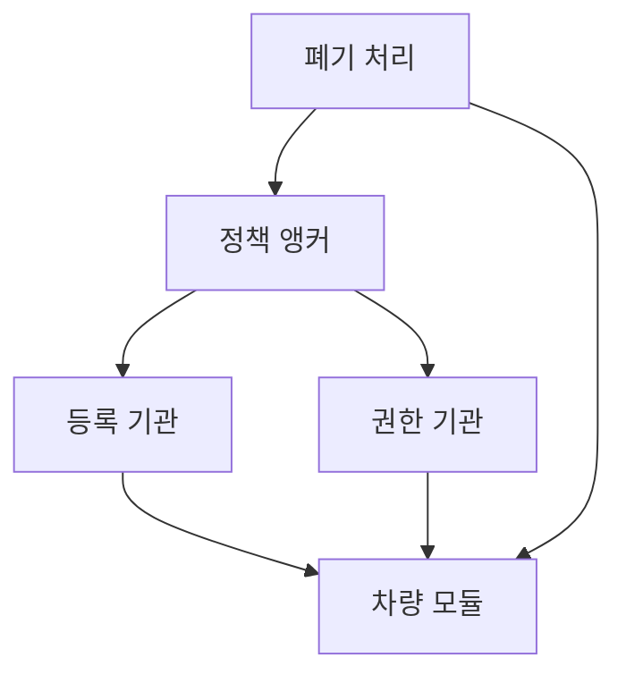
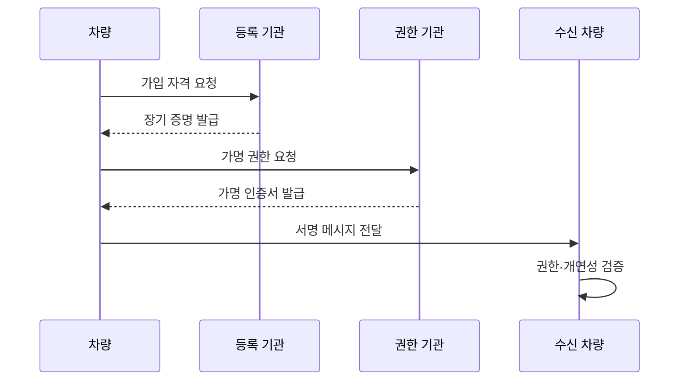

---
sidebar:
  order: 136
  label: "136. PKI 차량 인증 (Vehicle PKI)"
  badge:
    text: "기출 · 70%"
    variant: note
title: PKI 차량 인증 (Vehicle PKI)
date: "2026-07-27T23:59:59+09:00"
tags:
  - notes-security
weight: 136
extra:
  question_no: "136"
  source_status: "기출"
  source_history: "138회"
  priority: 70
  priority_note: "138회 기출이며 차량 메시지 신뢰체인의 핵심임"
---

## 미리 알고가기

- **차량 공개키 기반구조(Vehicle Public Key Infrastructure, Vehicle PKI, 비히클 피케이아이)**: `PKI`는 공개키 기반구조의 머리글자로, V2X 메시지 서명용 인증서의 수명주기를 관리
- **최상위 인증기관(Root Certificate Authority, Root CA)**: `Certificate Authority`를 `CA`로 줄여 “루트 씨에이”로 읽으며, 차량 신뢰 도메인의 최상위 인증서와 정책을 보증한다
- **등록 기관(Enrollment Authority, EA)**: 영문 머리글자를 딴 공식 표기라 “이에이”로 읽으며, 차량 가입 자격과 장기 자격 증명을 관리한다
- **권한 기관(Authorization Authority, AA)**: 영문 머리글자를 딴 공식 표기라 “에이에이”로 읽으며, 단기 V2X 서비스 권한 인증서를 발급한다
- **가명 인증서(Pseudonym Certificate)**: 차량 실명 대신 단기 공개키와 메시지 서명 권한을 증명해 장기 추적을 줄이는 인증서
- **오동작 탐지(Misbehavior Detection)**: 서명은 유효하지만 물리적으로 불가능하거나 거짓인 V2X 메시지를 분석해 대응하는 기능
- **인증서 폐기 목록(Certificate Revocation List, CRL)**: 영문 머리글자를 딴 공식 표기라 “씨알엘”로 읽으며, 더는 신뢰하지 않을 인증서의 상태를 배포한다
- **차량·모든 대상 간 통신(Vehicle-to-Everything, V2X)**: 숫자 `2`를 `to`로 쓴 공식 표기라 “브이투엑스”로 읽으며, 차량과 차량·인프라·네트워크가 안전 정보를 교환한다
- **인증기관(Certificate Authority, CA)**: 영문 머리글자를 딴 공식 표기라 “씨에이”로 읽으며, 공개키와 주체·권한의 관계를 인증서로 보증한다
- **전송 계층 보안(Transport Layer Security, TLS)**: 영문 머리글자를 딴 공식 표기라 “티엘에스”로 읽으며, 차량과 서버의 상호 인증과 암호화 세션을 제공한다
- **개연성 검사**: 서명이 유효한 메시지도 위치·속도·시간상 가능한지 확인하는 검사

## Ⅰ. 개요

- 정의/개념: V2X 자격·권한·무결성을 인증서로 검증
- 기존 한계: 장기 실명 인증서는 차량 이동 경로 추적 가능
- **배경/필요성**: V2X 신뢰 검증과 가명성의 동시 확보

### 쉽게 이해하기 (학습용)

- 주변 차량은 송신자의 실명을 몰라도 허가된 차량이 보낸 변조되지 않은 메시지인지 확인해야 함

## Ⅱ. 특징

- 서명·인증서로 메시지 출처·무결성·권한을 검증한다.
- 단기 가명 인증서 교체로 차량의 장기 추적을 줄인다.
- 인증서 유효성과 별도로 오동작 개연성을 검사한다.

### 쉽게 이해하기 (학습용)

- 이름을 가린 임시 자격증명을 바꾸어 쓰되 위험 차량은 책임 있게 차단할 수 있어야 함

## Ⅲ. 아키텍처 및 구성요소

| 설계 요소 | 설명 |
|:---|:---|
| 정책 앵커 | Root CA와 도메인 신뢰 정책 |
| 등록 기관 | 차량 가입 자격과 장기 증명 발급 |
| 권한 기관 | 단기 가명·서비스 권한 발급 |
| 차량 모듈 | 개인키 보호와 메시지 서명 |
| 폐기 처리 | 오동작 판정과 인증서 신뢰 조정 |

### 쉽게 이해하기 (학습용)

- 가입을 확인하는 기관과 실제 이용권을 주는 기관을 나누면 한 기관이 차량의 모든 활동을 보기 어려움

## Ⅳ. 원리 및 절차 흐름도

| 절차 | 설명 |
|:---|:---|
| 가입 자격 요청 | 차량·제조 자격을 EA에 제출 |
| 장기 증명 발급 | 가입 확인 후 장기 자격 발급 |
| 가명 권한 요청 | 서비스 권한과 단기 키 제출 |
| 가명 인증서 발급 | AA가 단기 메시지 권한 발급 |
| 서명 메시지 전달 | 가명 키로 V2X 메시지 서명 |
| 권한·개연성 검증 | 체인·시간·물리 가능성 판정 |

### 쉽게 이해하기 (학습용)

- 차량은 임시 인증서로 메시지를 보내고 수신자는 서명뿐 아니라 유효 시간과 서비스 권한도 확인함

## Ⅴ. 종류 및 비교

| 판단 기준 | 등록 인증서 | 가명 인증서 | TLS 인증서 |
|:---|:---|:---|:---|
| 적용 기준 | EA 가입·권한 요청의 기반이 필요할 때 | 실명 노출 없이 안전 메시지를 서명할 때 | 차량과 서버의 연결을 보호할 때 |
| 핵심 특징 | 차량의 장기 가입 자격 증명 | 단기 V2X 메시지 권한 증명 | 상대 인증·암호화 세션 수립 |
| 한계 | 장기 식별자 노출로 차량 추적 | 교체 패턴으로 차량 재연결 | 방송 권한 인증서로 오용 |

> 요약: 장기 가입과 단기 메시지 권한을 분리

### 쉽게 이해하기 (학습용)

- 차량 실명 자격과 방송용 가명 권한을 분리합니다.

## Ⅵ. 실무 사례

1. V2X의 **가명 인증서 기반 메시지 서명 검증**

### 쉽게 이해하기 (학습용)

- 차량은 가명 인증서로 안전 메시지의 발신 권한과 무결성을 검증하되 인증서를 주기적으로 교체해 장기 이동 경로 추적을 줄인다.

## Ⅶ. 결론

- V2X 메시지 신뢰와 운전자 프라이버시를 함께 확보하기 위해 등록·가명 발급·서명 검증·오동작 판정·폐지 배포를 검토하여, 권한이 분리된 차량 PKI를 운영해야 한다.

### 쉽게 이해하기 (학습용)

- 목표는 송신자의 실명을 공개하지 않고도 메시지 권한을 확인하고 위험 장치를 제재하는 것임
