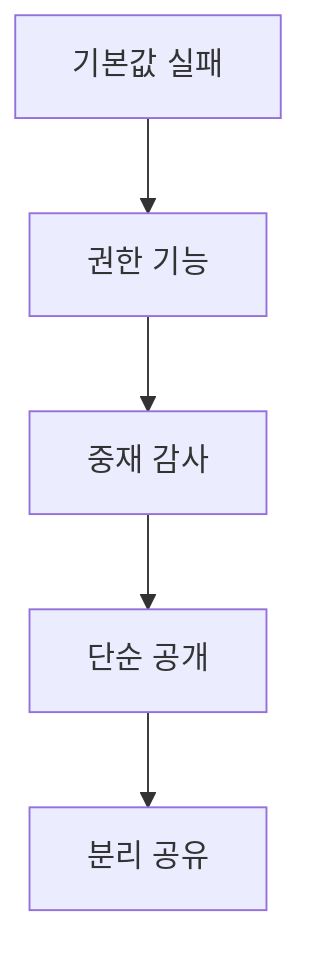
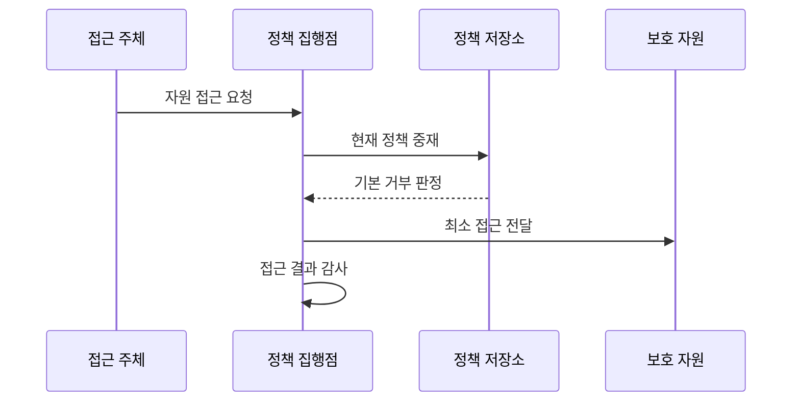

---
sidebar:
  order: 137
  label: "137. 보안 설계 원칙 — 페일 세이프·최소 노출 (Security Design Principles)"
  badge:
    text: "미출제 · 50%"
    variant: note
title: 보안 설계 원칙 — 페일 세이프·최소 노출 (Security Design Principles)
date: "2026-07-25T01:00:00+09:00"
tags:
  - notes-security
weight: 137
extra:
  question_no: "137"
  source_status: "미출제"
  source_history: ""
  priority: 50
  priority_note: "최소권한·안전실패·완전중재를 묶는 설계 우산임"
---

## 미리 알고가기

- **안전한 기본값(Fail-Safe Defaults)**: 명시적인 허용 근거가 없거나 설정이 누락되면 접근을 거부하는 설계 원칙이다.
- **최소 권한(Least Privilege)**: 주체에 업무상 필요한 최소 권한만 필요한 시간 동안 부여하는 설계 원칙이다.
- **완전 중재(Complete Mediation)**: 모든 자원 접근을 현재의 정책과 권한으로 매번 검사하는 설계 원칙이다.
- **메커니즘 경제성(Economy of Mechanism)**: 보안 메커니즘을 작고 단순하게 설계하여 이해와 검증 가능성을 높이는 원칙이다.
- **공개 설계(Open Design)**: 알고리즘 은닉이 아니라 키와 자격 증명처럼 제한된 비밀에만 보안을 의존하는 원칙이다.
- **권한 분리(Separation of Privilege)**: 민감한 작업에 둘 이상의 독립 조건이나 승인을 요구하는 설계 원칙이다.
- **최소 공통 메커니즘(Least Common Mechanism)**: 사용자와 구성요소 사이의 공유 상태·기능을 줄여 비인가 정보 흐름을 제한하는 원칙이다.
- **심층 방어(Defense in Depth)**: 독립된 통제를 여러 계층에 적용하여 단일 통제 실패가 전체 침해로 이어지는 것을 막는 원칙이다.
- **기밀성·무결성·가용성(Confidentiality, Integrity, Availability, CIA)**: 정보의 비인가 공개·변조·중단을 방지하기 위한 세 가지 핵심 보안 목표이다.
- **안전 실패(Fail Secure)**: 보안 기능에 장애가 발생해도 무단 접근을 허용하지 않는 안전한 상태로 전환하는 원칙이다.
- **장애 전환(Failover)**: 주 시스템이 실패하면 대체 시스템으로 서비스를 이어가는 가용성 확보 방식이다.
- **운영기술(Operational Technology, OT)**: 물리 공정과 설비를 감시·제어하며 보안 차단이 물리 안전에 영향을 줄 수 있는 기술 환경이다.
- **정책 결정 캐시**: 이전 접근 허용 결과를 잠시 저장해 반복 검사의 성능 비용을 줄이는 방식

## Ⅰ. 개요

- 정의/개념: 시스템 구조와 기본 동작에 보안 판단을 반영함
- **배경/필요성**: 사후 통제는 예외·공유 권한의 우회 경로 유발

### 쉽게 이해하기 (학습용)

- 기능을 만든 뒤 자물쇠를 붙이기보다 처음부터 문 수와 열쇠 범위를 줄이는 접근임

## Ⅱ. 특징

- 기본 거부로 설정 누락의 권한 확대 방지한다.
- 최소 권한·기능·공유로 침해 범위 제한한다.
- 현재 정책으로 매 접근을 완전 중재한다.
- 단순·공개 설계로 숨은 가정 검증한다.
- 독립 방어 계층으로 단일 실패 격리한다.

### 쉽게 이해하기 (학습용)

- 한 번 로그인했다고 이후 요청을 모두 믿지 않고 대상·행위·현재 권한을 계속 확인해야 함

## Ⅲ. 아키텍처 및 구성요소

| 설계 요소 | 설명 |
|:---|:---|
| 기본값 실패 | 허용 근거가 없으면 기본 거부 |
| 권한 기능 | 주체·서비스 권한과 기능 최소화 |
| 중재 감사 | 모든 접근을 현재 정책으로 검사 |
| 단순 공개 | 작고 공개 검토 가능한 구조 |
| 분리 공유 | 권한 분리와 공유 상태 축소 |

### 쉽게 이해하기 (학습용)

- 보호할 자산을 기준으로 기본 동작과 권한, 검사 지점을 정한 뒤 우회 경로가 없는지 검증함

## Ⅳ. 원리 및 절차 흐름도

| 절차 | 설명 |
|:---|:---|
| 자원 접근 요청 | 주체·대상·행위·맥락 제시 |
| 현재 정책 중재 | 캐시 무효화 후 최신 권한 조회 |
| 기본 거부 판정 | 허용 근거·검사 실패 시 거부 |
| 최소 접근 전달 | 승인된 자원·행위만 전달 |
| 접근 결과 감사 | 결정 근거와 사용 결과 기록 |

### 쉽게 이해하기 (학습용)

- 정상 사용만 설계하지 말고 설정이 빠지거나 인증기가 고장 났을 때 결과를 먼저 정해야 함

## Ⅴ. 종류 및 비교

| 비교 축 | 기본 거부 | 안전 실패 | 장애 전환 |
|:---|:---|:---|:---|
| 핵심 특징 | 허용 근거가 없으면 접근 거부 | 보안 통제 오류 때 무단 접근 차단 | 장애 때 대체 경로로 서비스 지속 |
| 적용 기준 | 접근 정책의 초기 상태를 정할 때 | 인증·인가 실패 동작을 정할 때 | 가용성 목표로 대체 시스템을 설계할 때 |
| 주요 위험 | 필수 업무까지 과도하게 차단 | 의료·OT에서 물리 안전을 해침 | 약한 대체 경로로 보안 우회 |

> 요약: 기본값·권한·중재 범위로 우회 제한

### 쉽게 이해하기 (학습용)

- 기본 거부, 오류 시 안전, 장애 시 서비스 전환은 이름이 비슷해도 해결하는 문제가 다름

## Ⅵ. 실무 사례

1. 중요 업무 API에 기본 거부와 최소 권한을 적용하고, 시간·기기·업무 조건을 매 요청마다 검증하며 권한 변경 시 정책 캐시를 즉시 무효화한다.

### 쉽게 이해하기 (학습용)

- 권한은 시간·기기·업무 조건과 종료 시 회수까지 관리함
- 접근 결정 캐시는 짧은 수명과 권한 변경 때 즉시 무효화하는 규칙을 둠
- OT·의료는 보안상 차단이 물리 위험을 만들 수 있어 안전 상태를 함께 설계함
- 단순화는 통제를 없애는 것이 아니라 신뢰 경계와 의존 관계를 줄이는 데 사용함

## Ⅶ. 결론

- 설계 단계에서 권한 우회와 단일 실패점을 줄이기 위해 자산·신뢰 경계·실패 상태·권한 수명·운영 영향을 검토하여, 기본 거부·최소 권한·완전 중재·심층 방어 원칙을 일관되게 적용해야 한다.

### 쉽게 이해하기 (학습용)

- 좋은 보안 구조는 운영자가 모든 실수를 피해야만 안전한 구조가 아니라 실수의 영향을 제한하는 구조임
