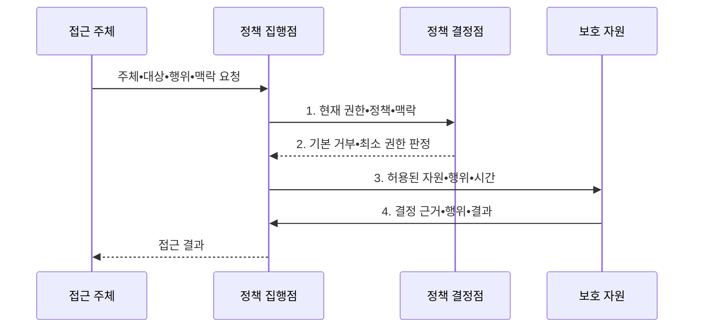

---
sidebar:
  order: 137
  label: "137. 보안 설계 원칙 — 페일 세이프•최소 노출 (Security Design Principles)"
  badge:
    text: "미출제 • 50%"
    variant: note
title: 보안 설계 원칙 — 페일 세이프•최소 노출 (Security Design Principles)
date: "2026-08-04T18:07:00+09:00"
tags:
  - notes-security
weight: 137
extra:
  question_no: "137"
  source_status: "미출제"
  source_history: ""
  priority: 50
  priority_note: "최소권한•안전실패•완전중재를 묶는 설계 우산임"
---

## Ⅰ. 개요

핵심 용어

- **보안 설계 원칙**: 시스템 구조와 기본 동작에 보안을 내재화해 예외•우회 경로를 줄이는 기준이다.

- 정의/개념: 기본 거부•최소 권한•완전 중재•안전 실패를 구조와 기본 동작에 내재화하는 **보안 설계 원칙**
- 배경/필요성: 사후 통제만으로는 **예외•공유 권한•우회 경로 제거 불가**

#### 한줄 요약

- 기능 뒤에 자물쇠를 붙이기보다 처음부터 문 수와 열쇠 범위를 줄이는 접근임

## Ⅱ. 특징

핵심 용어

- **안전한 기본값**: 허용 근거가 없으면 접근을 거부하는 원칙이다.
- **최소 권한**: 필요한 권한만 필요한 시간 동안 부여하는 원칙이다.
- **완전 중재**: 모든 자원 접근을 현재 정책과 권한으로 매번 검사하는 원칙이다.

- 기본 거부•안전 실패의 **예외 없는 초기 상태**
- 최소 권한•공유•기능의 **침해 범위 제한**
- 완전 중재•감사의 **지속적 정책 집행**

#### 한줄 요약

- 한 번 로그인했다고 이후 요청을 믿지 않고 대상•행위•현재 권한을 계속 확인함

## Ⅲ. 구조 및 구성요소

핵심 용어

- **메커니즘 경제성**: 보안 구조를 작고 단순하게 만드는 원칙이다.
- **공개 설계**: 알고리즘 은닉보다 제한된 비밀에 의존하는 원칙이다.
- **권한 분리**: 중요 작업에 둘 이상의 독립 조건을 요구하는 원칙이다.
- **최소 공통 메커니즘**: 주체 사이의 공유 상태를 줄이는 원칙이다.

| 구성요소 | 책임 |
|:---|:---|
| 기본 거부•안전 실패 | 허용 근거•검사 실패 시 **거부** |
| 최소 권한•최소 기능 | **자원•행위•시간 범위** 제한 |
| 완전 중재•감사 | 모든 접근의 **현재 정책 검사** |
| 단순•공개 메커니즘 | **이해•독립 검토** 가능한 구조 |
| 권한 분리•공유 최소화 | **단일 주체•공통 상태** 의존 축소 |

#### 한줄 요약

- 보호 자산을 기준으로 기본 동작•권한•검사 지점을 정하고 우회 경로가 없는지 검증함

## Ⅳ. 흐름도

핵심 용어

- **정책 집행점**: 접근 요청을 가로채 정책 결정을 실행하는 구성요소이다.
- **정책 결정점**: 현재 정책으로 접근 허용 여부를 판단하는 구성요소이다.

**동작 원리**

- **1. 현재 권한•정책•맥락**: 캐시 변경 여부까지 포함한 중재 입력
- **2. 기본 거부•최소 권한 판정**: 명시적으로 허용된 범위
- **3. 허용된 자원•행위•시간**: 보호 자원에 전달할 제한 권한
- **4. 결정 근거•행위•결과**: 권한 회수와 추적에 쓰는 감사 증적

#### 한줄 요약

- 정상 사용뿐 아니라 설정 누락•인증기 장애•권한 변경 때 결과를 먼저 정해야 함

## Ⅴ. 종류 및 비교

핵심 용어

- **안전 실패**: 보안 기능 장애 때 무단 접근 없는 상태로 전환하는 원칙이다.
- **장애 전환**: 장애 시 대체 시스템으로 서비스를 잇는 방식이다.
- **OT(Operational Technology) 안전 영향**: 보안 통제가 물리 공정에 미치는 결과이다.

| 실패•가용성 원칙 | 기본 거부 | 안전 실패 | 장애 전환 |
|:---|:---|:---|:---|
| 적용 기준 | **접근 정책 초기 상태** | **보안 통제 오류 상태** | **서비스 장애 대체 경로** |
| 핵심 특징 | 허용 근거 없으면 **거부** | **무단 접근 없는 상태** 전환 | 대체 시스템으로 **지속** |
| 한계 | **필수 업무 과도 차단** | 의료•OT **물리 안전 영향** | 약한 대체 경로로 **주 통제 우회** |

> 요약: 정책 누락, 보안 오류, 서비스 장애를 구분함

#### 한줄 요약

- 기본 거부•안전 실패•장애 전환은 이름이 비슷해도 적용할 실패 상황이 다름

## Ⅵ. 실무 고려사항 및 대책

핵심 용어

- **NIST(National Institute of Standards and Technology)**: 미국 국립표준기술연구소이다.
- **SP(Special Publication)**: NIST가 발행하는 특별간행물이다.
- **NIST SP 800-160**: 보안 시스템 수명주기 공학 지침이다.
- **NIST SP 800-53**: 시스템•조직 보안 통제 지침이다.
- **AC(Access Control)**: 접근 권한을 제한하는 통제군이다.
- **AU(Audit and Accountability)**: 감사•책임추적 통제군이다.
- **API(Application Programming Interface)**: 서비스 기능을 호출하는 연결 경계이다.

| 문제 | 대책 | 효과 |
|:---|:---|:---|
| **운영 단계 중심 통제** | **NIST SP 800-160 Vol.1 Rev.1 적용** | **설계•검증•운영 일관성** 확보 |
| **상시 과권한** | **NIST SP 800-53 5.2.0 AC-6 적용** | **권한•기능•시간** 축소 |
| **접근 근거 기록 누락** | **AC-3•AU 통제 연계** | **완전 중재•감사** 확보 |

#### 한줄 요약

- 중요 API는 기본 거부하고 시간•기기•업무 조건을 매 요청 검사하며 권한 변경 시 캐시를 즉시 무효화한다.

## Ⅶ. 결론

핵심 용어

- **심층 방어**: 독립 통제를 여러 계층에 적용해 단일 실패의 전체 확산을 막는 원칙이다.

- 명시적 허용만 **매 요청 중재**, 실패 시 거부하되 안전 영향은 별도 전환

#### 한줄 요약

- 좋은 구조는 모든 실수를 막는 구조가 아니라 실수와 단일 실패의 영향을 제한하는 구조임
