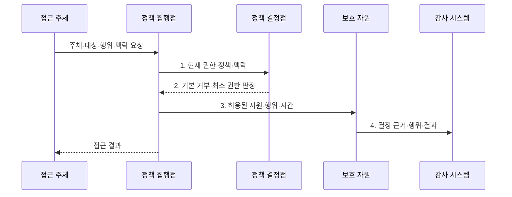

---
sidebar:
  order: 137
  label: "137. 보안 설계 원칙 — 페일 세이프·최소 노출 (Security Design Principles)"
  badge:
    text: "미출제 · 50%"
    variant: note
title: 보안 설계 원칙 — 페일 세이프·최소 노출 (Security Design Principles)
date: "2026-07-31T11:24:58+09:00"
tags:
  - notes-security
weight: 137
extra:
  question_no: "137"
  source_status: "미출제"
  source_history: ""
  priority: 50
  priority_note: "최소권한·안전실패·완전중재를 묶는 설계 우산임"
---

## 미리 알고가기

- **안전한 기본값(Fail-Safe Defaults)**: 명시적 허용 근거가 없거나 설정이 빠지면 접근을 거부하는 원칙이다.
- **최소 권한(Least Privilege)**: 주체에 업무상 필요한 최소 권한만 필요한 시간 동안 부여하는 원칙이다.
- **완전 중재(Complete Mediation)**: 모든 자원 접근을 현재 정책과 권한으로 매번 검사하는 원칙이다.
- **메커니즘 경제성(Economy of Mechanism)**: 보안 메커니즘을 작고 단순하게 설계해 검증 가능성을 높이는 원칙이다.
- **공개 설계(Open Design)**: 알고리즘 은닉이 아니라 키·자격증명 같은 제한된 비밀에만 보안을 의존하는 원칙이다.
- **권한 분리(Separation of Privilege)**: 민감 작업에 둘 이상의 독립 조건·승인을 요구하는 원칙이다.
- **최소 공통 메커니즘(Least Common Mechanism)**: 주체 간 공유 상태·기능을 줄여 비인가 흐름을 제한하는 원칙이다.
- **심층 방어(Defense in Depth)**: 독립 통제를 여러 계층에 적용해 단일 실패의 전체 확산을 막는 원칙이다.
- **안전 실패(Fail Secure)**: 보안 기능 장애 때도 무단 접근을 허용하지 않는 상태로 전환하는 원칙이다.
- **장애 전환(Failover)**: 주 시스템 장애 시 대체 시스템으로 서비스를 이어가는 가용성 방식이다.
- **NIST SP 800-160 Vol.1 Rev.1**: 신뢰 가능한 보안 시스템의 수명주기 공학 원칙·활동·과업 지침이다.
- **NIST SP 800-53 Release 5.2.0**: 시스템·조직의 보안·프라이버시 통제 카탈로그이다.

> **키워드:** 보안 설계 원칙 — 페일 세이프·최소 노출 (Security Design Principles)

## Ⅰ. 개요

- 정의/개념: 시스템 구조와 기본 동작에 보안을 내재화하는 **설계 원칙**
- 배경/필요성: 사후 통제만으로는 **예외·공유 권한·우회 경로 제거 불가**

### 쉽게 이해하기 (학습용)

- 기능 뒤에 자물쇠를 붙이기보다 처음부터 문 수와 열쇠 범위를 줄이는 접근임

## Ⅱ. 특징

- 기본 거부·안전 실패의 **예외 없는 초기 상태**
- 최소 권한·공유·기능의 **침해 범위 제한**
- 완전 중재·감사의 **지속적 정책 집행**

### 쉽게 이해하기 (학습용)

- 한 번 로그인했다고 이후 요청을 믿지 않고 대상·행위·현재 권한을 계속 확인함

## Ⅲ. 구조 및 구성요소

| 구성요소 | 책임 |
|:---|:---|
| 기본 거부·안전 실패 | 허용 근거·검사 실패 시 **거부** |
| 최소 권한·최소 기능 | **자원·행위·시간 범위** 제한 |
| 완전 중재·감사 | 모든 접근의 **현재 정책 검사** |
| 단순·공개 메커니즘 | **이해·독립 검토** 가능한 구조 |
| 권한 분리·공유 최소화 | **단일 주체·공통 상태** 의존 축소 |

### 쉽게 이해하기 (학습용)

- 보호 자산을 기준으로 기본 동작·권한·검사 지점을 정하고 우회 경로가 없는지 검증함

## Ⅳ. 흐름도

**동작 원리**

- **1. 현재 권한·정책·맥락**: 캐시 변경 여부까지 포함한 중재 입력
- **2. 기본 거부·최소 권한 판정**: 명시적으로 허용된 범위
- **3. 허용된 자원·행위·시간**: 보호 자원에 전달할 제한 권한
- **4. 결정 근거·행위·결과**: 권한 회수와 추적에 쓰는 감사 증적

### 쉽게 이해하기 (학습용)

- 정상 사용뿐 아니라 설정 누락·인증기 장애·권한 변경 때 결과를 먼저 정해야 함

## Ⅴ. 종류 및 비교

| 실패·가용성 원칙 | 기본 거부 | 안전 실패 | 장애 전환 |
|:---|:---|:---|:---|
| 적용 기준 | **접근 정책 초기 상태** | **보안 통제 오류 상태** | **서비스 장애 대체 경로** |
| 핵심 특징 | 허용 근거 없으면 **거부** | **무단 접근 없는 상태** 전환 | 대체 시스템으로 **지속** |
| 한계 | **필수 업무 과도 차단** | 의료·OT **물리 안전 영향** | 약한 대체 경로로 **주 통제 우회** |

> 요약: 정책 누락, 보안 오류, 서비스 장애를 구분함

### 쉽게 이해하기 (학습용)

- 기본 거부·안전 실패·장애 전환은 이름이 비슷해도 적용할 실패 상황이 다름

## Ⅵ. 실무 고려사항 및 대책

| 고려사항 | 대책 | 효과 |
|:---|:---|:---|
| 운영 단계에만 통제하면 구조적 우회가 남음 | **NIST SP 800-160 Vol.1 Rev.1 적용** | 설계·검증·운영 일관성 |
| 상시 과권한은 계정 침해 범위를 확대함 | **NIST SP 800-53 5.2.0 AC-6 적용** | 권한·기능·시간 축소 |
| 접근 근거가 기록되지 않으면 회수·추적이 어려움 | **AC-3·AU 통제 연계** | 완전 중재·감사 확보 |

### 쉽게 이해하기 (학습용)

- 중요 API는 기본 거부하고 시간·기기·업무 조건을 매 요청 검사하며 권한 변경 시 캐시를 즉시 무효화한다.

## Ⅶ. 결론

- 명시적 허용만 **매 요청 중재**, 실패 시 거부하되 안전 영향은 별도 전환

### 쉽게 이해하기 (학습용)

- 좋은 구조는 모든 실수를 막는 구조가 아니라 실수와 단일 실패의 영향을 제한하는 구조임
