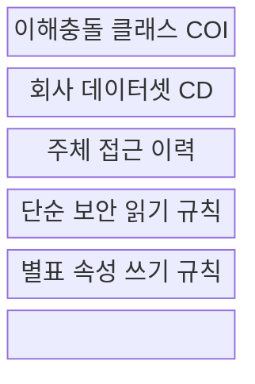
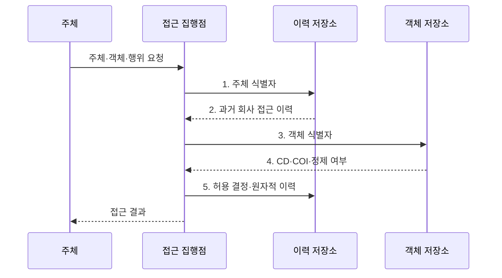

---
sidebar:
  order: 138
  label: "138. 만리장성 보안 모델 (Brewer-Nash Model)"
  badge:
    text: "기출 · 50%"
    variant: note
title: 만리장성 보안 모델 (Brewer-Nash Model)
date: "2026-07-31T02:22:46+09:00"
tags:
  - notes-security
weight: 138
extra:
  question_no: "138"
  source_status: "기출"
  source_history: "132회"
  priority: 50
  priority_note: "132회 기출이며 동적 이해충돌 모델의 차별성이 분명함"
---

## 미리 알고가기

- **브루어-내시 모델(Brewer-Nash Model)**: 과거 접근 이력에 따라 경쟁 고객 데이터 접근을 동적으로 제한하는 기밀성 모델이다.
- **만리장성 정책(Chinese Wall Policy)**: 한 경쟁사 정보를 본 주체와 다른 경쟁사 사이에 논리적 장벽을 세우는 정책이다.
- **Brewer·Nash, IEEE S&P 1989**: 브루어-내시 모델을 제시한 논문 `The Chinese Wall Security Policy`의 발표 정보이다.
- **이해충돌 클래스(Conflict of Interest Class, COI Class)**: 서로 경쟁해 정보 공유 시 이해충돌이 생기는 회사 데이터셋 집합이다.
- **회사 데이터셋(Company Dataset, CD)**: 동일 회사·고객에 속해 함께 접근을 통제해야 하는 정보 객체 집합이다.
- **주체(Subject)**: 객체 접근을 요청하고 과거 회사 데이터 접근 이력이 기록되는 사용자·프로세스이다.
- **정제 정보(Sanitized Information)**: 특정 회사 기밀·재식별 단서를 제거해 공유 가능하다고 검증한 정보이다.
- **벨-라파둘라 모델(Bell-LaPadula Model, BLP)**: 보안 등급에 따라 기밀 정보의 읽기·쓰기 방향을 제한하는 모델이다.
- **역할 기반 접근제어(Role-Based Access Control, RBAC)**: 권한을 역할에 묶어 사용자에게 배정하는 모델이다.
- **원자적 처리(Atomic Processing)**: 접근 결정과 이력 기록을 끼어들기 없이 하나의 작업으로 완료하는 처리이다.
- **NIST SP 800-53 AC-4**: 승인된 정보 흐름 정책을 시스템 안팎에서 집행하는 통제이다.

## Ⅰ. 개요

- 정의/개념: 접근 이력으로 경쟁사 정보흐름을 제한하는 **동적 기밀성 모델**
- 배경/필요성: 고정 역할만으로는 이전 고객 접근에 따른 **이해충돌 판정 불가**

### 쉽게 이해하기 (학습용)

- 같은 산업의 A사 자료를 본 담당자는 경쟁 B사 자료를 볼 수 없지만 다른 산업 자료는 볼 수 있음

## Ⅱ. 특징

- 최초 접근 이력의 **동적 장벽 형성**
- COI별 독립 회사 선택의 **업무 유연성**
- 읽기·쓰기 규칙의 **양방향 흐름 통제**

### 쉽게 이해하기 (학습용)

- 벽의 위치가 사용자별 과거 접근에 따라 달라 고정 역할만으로 구현하기 어려움

## Ⅲ. 구조 및 구성요소

| 구성요소 | 책임 |
|:---|:---|
| 이해충돌 클래스 COI | **경쟁 회사 데이터셋** 묶음 |
| 회사 데이터셋 CD | 한 회사의 **민감 정보 경계** |
| 주체 접근 이력 | **접근 회사·정제 정보** 기록 |
| 단순 보안 읽기 규칙 | **동일 회사·비충돌 객체** 허용 |
| 별표 속성 쓰기 규칙 | 경쟁 회사로 **정보 이동 제한** |

### 쉽게 이해하기 (학습용)

- 읽을 수 있는지와 그 정보를 어디에 쓸 수 있는지를 따로 검사해야 유출을 막음

## Ⅳ. 흐름도

**동작 원리**

- **1. 주체 식별자**: 접근 이력을 찾기 위한 사용자·프로세스 키
- **2. 과거 회사 접근 이력**: COI별 이미 선택한 회사 목록
- **3. 객체 식별자**: 읽기·쓰기 대상의 분류 조회 키
- **4. CD·COI·정제 여부**: 경쟁 관계와 공유 예외의 분류값
- **5. 허용 결정·원자적 이력**: 동시 요청 우회를 막는 판정 기록

### 쉽게 이해하기 (학습용)

- 동시에 들어온 요청이 장벽을 우회하지 못하도록 결정과 이력 기록을 한 작업으로 처리함

## Ⅴ. 종류 및 비교

| 기밀성 접근 모델 | Brewer-Nash | BLP | RBAC |
|:---|:---|:---|:---|
| 적용 기준 | 경쟁 고객 **이해충돌** | 군사·기밀 **등급 흐름** | 직무별 **권한 관리** |
| 핵심 특징 | **접근 이력·COI** 동적 권한 | 보안 등급의 **읽기·쓰기** | 역할에 **권한 배정** |
| 한계 | **이력 동시성·정제 우회** | **협업·등급 정책** 제약 | **역할 폭증·과도 권한** |

> 요약: 이력, 등급, 역할 중 정책 결정 축이 다름

### 쉽게 이해하기 (학습용)

- Brewer-Nash는 지금 역할보다 과거에 본 고객 정보가 다음 접근을 바꾼다는 점이 핵심임

## Ⅵ. 실무 고려사항 및 대책

| 고려사항 | 대책 | 효과 |
|:---|:---|:---|
| 정보흐름 규칙이 분산되면 우회 경로가 생김 | **NIST SP 800-53 AC-4 연계** | 흐름 정책·집행점 명확화 |
| COI·CD 분류가 없으면 충돌 회사를 판정할 수 없음 | **Brewer·Nash IEEE 1989 적용** | 이력 기반 규칙 정립 |
| 동시 결정과 정제 정보로 장벽을 우회할 수 있음 | **원자 갱신·재식별 검증** | 경합·예외 유출 방지 |

### 쉽게 이해하기 (학습용)

- 컨설턴트가 한 은행 자료를 보면 같은 COI의 경쟁 은행 접근을 차단하고 이력을 원자적으로 남긴다.

## Ⅶ. 결론

- 같은 COI에서는 **기존 선택 회사만 허용**, 정제 정보는 재식별 검증

### 쉽게 이해하기 (학습용)

- 현재 역할보다 과거 고객 정보가 다음 고객 업무와 충돌하는지 판단하는 것이 핵심임
