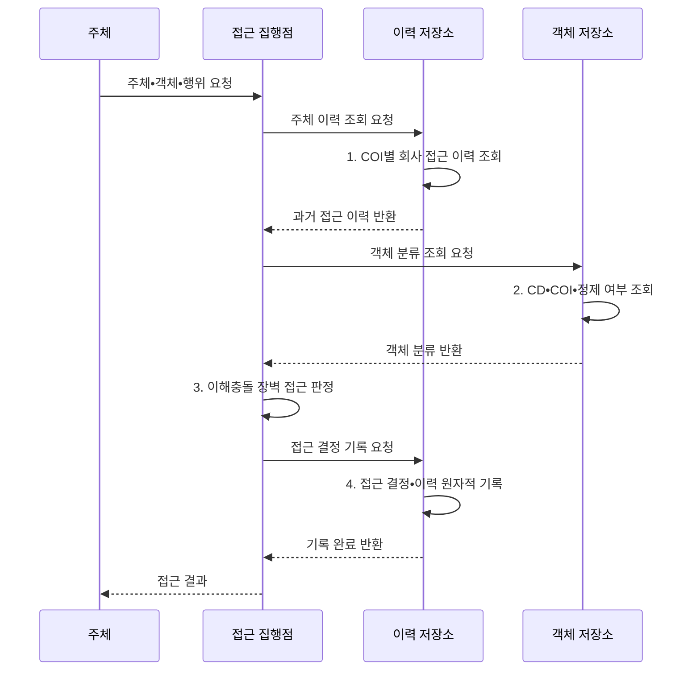

---
sidebar:
  order: 138
  label: "138. 만리장성 보안 모델 (Brewer-Nash Model)"
  badge:
    text: "기출 • 50%"
    variant: note
title: 만리장성 보안 모델 (Brewer-Nash Model)
date: "2026-08-05T00:00:00+09:00"
tags:
  - notes-security
weight: 138
extra:
  question_no: "138"
  source_status: "기출"
  source_history: "132회"
  priority: 50
  priority_note: "132회 기출이며 동적 이해충돌 모델의 차별성이 분명함"
---

## Ⅰ. 개요

<details>
<summary>핵심 용어</summary>

- **Brewer-Nash 모델**: 과거 접근 이력에 따라 경쟁 고객 데이터 접근을 동적으로 제한하는 기밀성 모델이다.

</details>

- 정의/개념: 과거 접근 이력에 따라 경쟁 회사 데이터 접근을 동적으로 제한하는 **Brewer-Nash 기밀성 보안 모델**
- 배경/필요성: 고정 역할만으로는 이전 고객 접근에 따른 **이해충돌 판정 불가**

#### 한줄 요약

- 같은 산업의 A사 자료를 본 담당자는 경쟁 B사 자료를 볼 수 없지만 다른 산업 자료는 볼 수 있음

## Ⅱ. 특징

<details>
<summary>핵심 용어</summary>

- **만리장성 정책**: 한 경쟁사 정보를 본 주체와 다른 경쟁사 사이에 논리적 장벽을 세우는 정책이다.
- **COI(Conflict of Interest)**: 교차 접근을 제한해야 하는 경쟁 회사 집합이다.

</details>

- 최초 접근 이력의 **동적 장벽 형성**
- COI별 독립 회사 선택의 **업무 유연성**
- 읽기•쓰기 규칙의 **양방향 흐름 통제**

#### 한줄 요약

- 벽의 위치가 사용자별 과거 접근에 따라 달라 고정 역할만으로 구현하기 어려움

## Ⅲ. 구조 및 구성요소

<details>
<summary>핵심 용어</summary>

- **COI 클래스**: 서로 경쟁하는 회사들의 집합이다.
- **CD(Company Dataset)**: 한 회사에 속해 함께 통제할 정보 객체 집합이다.
- **정제 정보**: 특정 회사 기밀•재식별 단서를 제거해 공유 가능하다고 검증한 정보이다.

</details>

```text
[이해충돌 클래스 COI] ----- [회사 데이터셋 CD]
                                      |
                              [주체 접근 이력]
                                 /         \
                  [단순 보안 읽기 규칙]   [별표 속성 쓰기 규칙]
```

선의 의미: 이해충돌 클래스는 경쟁 회사 데이터셋을 묶고, 회사 데이터셋에 대한 주체 접근 이력 아래에는 읽기 허용과 쓰기 정보 흐름을 각각 제한하는 두 규칙이 놓이는 정적 Brewer-Nash 정책 구조를 뜻한다.

| 구성요소 | 책임 |
|:---|:---|
| 이해충돌 클래스 COI | **경쟁 회사 데이터셋** 묶음 |
| 회사 데이터셋 CD | 한 회사의 **민감 정보 경계** |
| 주체 접근 이력 | **접근 회사•정제 정보** 기록 |
| 단순 보안 읽기 규칙 | **동일 회사•비충돌 객체** 허용 |
| 별표 속성 쓰기 규칙 | 경쟁 회사로 **정보 이동 제한** |

#### 한줄 요약

- 읽을 수 있는지와 그 정보를 어디에 쓸 수 있는지를 따로 검사해야 유출을 막음

## Ⅳ. 흐름도

<details>
<summary>핵심 용어</summary>

- **원자적 처리**: 접근 결정과 이력 기록을 끼어들기 없이 하나의 작업으로 완료하는 처리이다.
- **객체•이력 분류**: CD와 COI를 객체•이력에 연결한 판단 정보이다.

</details>



**동작 원리**

- **1. COI별 회사 접근 이력 조회**: 주체가 이미 선택한 회사 목록 조회
- **2. CD•COI•정제 여부 조회**: 경쟁 관계와 공유 예외 분류 확인
- **3. 이해충돌 장벽 접근 판정**: 이력•분류를 대조해 허용 여부 결정
- **4. 접근 결정•이력 원자적 기록**: 동시 요청의 이력 검사 우회 차단

#### 한줄 요약

- 동시에 들어온 요청이 장벽을 우회하지 못하도록 결정과 이력 기록을 한 작업으로 처리함

## Ⅴ. 종류 및 비교

<details>
<summary>핵심 용어</summary>

- **BLP(Bell-LaPadula Model)**: 보안 등급의 정보 흐름을 제한하는 모델이다.
- **RBAC(Role-Based Access Control)**: 역할에 권한을 묶어 배정하는 모델이다.

</details>

| 기밀성 접근 모델 | Brewer-Nash | BLP | RBAC |
|:---|:---|:---|:---|
| 적용 기준 | 경쟁 고객 **이해충돌** | 군사•기밀 **등급 흐름** | 직무별 **권한 관리** |
| 핵심 특징 | **접근 이력•COI** 동적 권한 | 보안 등급의 **읽기•쓰기** | 역할에 **권한 배정** |
| 한계 | 경합•정제 정보로 **장벽 우회** | **협업•등급 정책** 제약 | **역할 폭증•과도 권한** |

> 요약: 이력, 등급, 역할 중 정책 결정 축이 다름

#### 한줄 요약

- Brewer-Nash는 지금 역할보다 과거에 본 고객 정보가 다음 접근을 바꾼다는 점이 핵심임

## Ⅵ. 실무 고려사항 및 대책

<details>
<summary>핵심 용어</summary>

- **NIST(National Institute of Standards and Technology)**: 미국 국립표준기술연구소이다.
- **SP(Special Publication)**: NIST가 발행하는 특별간행물이다.
- **AC(Access Control)**: 접근통제 통제군이다.
- **NIST SP 800-53 AC-4**: 승인된 정보 흐름을 집행하는 통제이다.
- **IEEE(Institute of Electrical and Electronics Engineers)**: 전기전자 기술 논문•표준 기관이다.
- **Brewer•Nash 1989**: 만리장성 정책을 제시한 IEEE 원 논문이다.
- **충돌 회사 분류**: COI와 CD를 연결해 충돌 회사를 판정하는 기준이다.

</details>

| 문제 | 대책 | 효과 |
|:---|:---|:---|
| 정보흐름 규칙이 분산되면 집행점 사이로 통제 우회 | **NIST SP 800-53 AC-4 연계** | 흐름 정책•집행점 명확화 |
| COI•CD 분류가 없으면 충돌 회사를 판정할 수 없음 | **Brewer•Nash IEEE 1989 적용** | 이력 기반 규칙 정립 |
| 동시 결정과 정제 정보로 장벽을 우회할 수 있음 | **원자 갱신•재식별 검증** | 경합•예외 유출 방지 |

#### 한줄 요약

- 컨설턴트가 한 은행 자료를 보면 같은 COI의 경쟁 은행 접근을 차단하고 이력을 원자적으로 남긴다.

## Ⅶ. 결론

<details>
<summary>핵심 용어</summary>

- **이력 기반 동적 권한**: 현재 역할이 아니라 과거에 접근한 고객 정보에 따라 다음 접근을 제한하는 방식이다.
- **COI 선택**: 같은 경쟁 집단에서 기존 선택 회사만 허용하는 규칙이다.

</details>

- 같은 COI에서는 **기존 선택 회사만 허용**, 정제 정보는 재식별 검증

#### 한줄 요약

- 현재 역할보다 과거 고객 정보가 다음 고객 업무와 충돌하는지 판단하는 것이 핵심임
