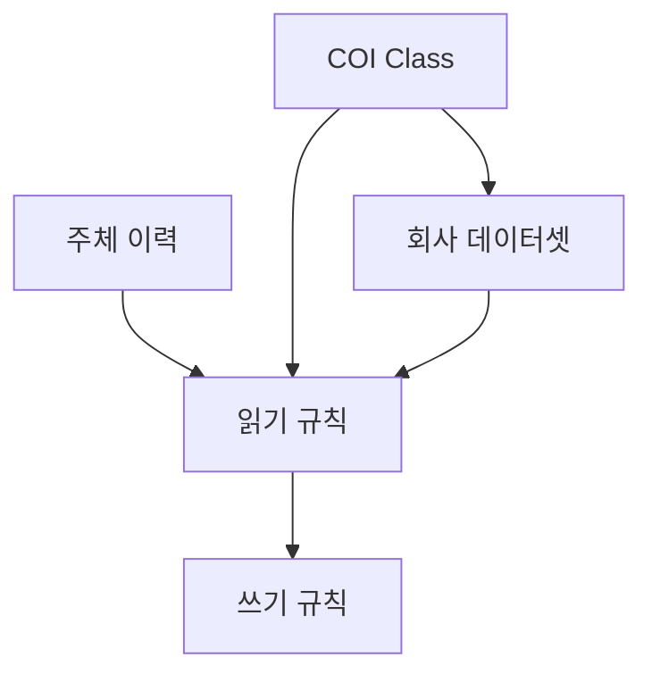
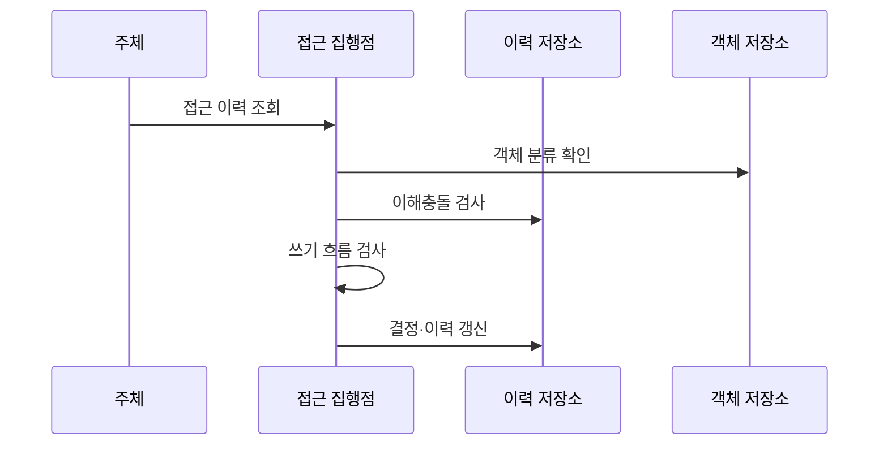

---
sidebar:
  order: 138
  label: "138. 만리장성 보안 모델 (Brewer-Nash Model)"
  badge:
    text: "기출 · 50%"
    variant: note
title: 만리장성 보안 모델 (Brewer-Nash Model)
date: "2026-07-27T23:59:59+09:00"
tags:
  - notes-security
weight: 138
extra:
  question_no: "138"
  source_status: "기출"
  source_history: "132회"
  priority: 50
  priority_note: "132회 기출이며 동적 이해충돌 모델의 차별성이 분명함"
---

## 미리 알고가기

- **브루어-내시 모델(Brewer-Nash Model, 브루어 내시 모델)**: 두 설계자의 이름을 붙였으며, 접근 이력에 따라 경쟁 고객 데이터 접근을 동적으로 제한
- **만리장성(Chinese Wall)**: “차이니즈 월”로도 불리는 역사적 모델명이며, 한 경쟁사 정보를 본 주체와 다른 경쟁사 사이에 논리적 장벽을 세운다는 뜻
- **이해충돌 클래스(Conflict of Interest Class, COI Class)**: 서로 경쟁하여 정보 공유 시 이해충돌이 발생하는 회사 데이터셋을 묶은 집합이다.
- **회사 데이터셋(Company Dataset, CD)**: 동일한 회사나 고객에 속해 함께 접근을 통제해야 하는 정보 객체의 집합이다.
- **객체(Object)**: 문서·레코드처럼 읽기·쓰기 통제를 받는 회사 데이터셋 안의 정보 단위
- **주체(Subject)**: 객체 접근을 요청하고 과거 회사 데이터 접근 이력이 기록되는 사용자나 프로세스
- **정제 정보(Sanitized Information)**: 특정 회사 기밀과 재식별 단서를 제거해 여러 회사에 공유할 수 있도록 검증한 정보
- **벨-라파둘라 모델(Bell-LaPadula Model, BLP)**: 보안 등급에 따라 기밀 정보의 읽기와 쓰기 방향을 제한하는 기밀성 접근 통제 모델이다.
- **역할 기반 접근 제어(Role-Based Access Control, RBAC)**: 권한을 역할에 묶어 사용자에게 배정하는 접근 제어 모델이다.
- **인공지능(Artificial Intelligence, AI)**: 경쟁 고객의 데이터가 학습·검색·생성 과정에서 서로 섞이지 않도록 정보 흐름을 통제해야 하는 기술이다.
- **원자적 처리**: 접근 결정과 이력 기록을 중간 끼어들기 없이 하나의 작업으로 완료하는 처리

## Ⅰ. 개요

- 정의/개념: 접근 이력으로 경쟁 기업 간 정보 흐름 제한
- 기존 한계: 고정 역할·등급은 접근 후 이해충돌 반영 곤란
- **배경/필요성**: 고정 역할만으로는 사용자의 과거 접근 이력에 따라 달라지는 경쟁 고객 간 이해충돌을 통제하기 어려움

### 쉽게 이해하기 (학습용)

- 같은 산업의 A사 자료를 본 담당자는 경쟁 B사 자료를 볼 수 없지만 다른 산업 자료는 볼 수 있음

## Ⅱ. 특징

- 첫 접근 이력이 같은 COI 내 허용 회사 데이터셋을 결정한다.
- 다른 COI의 회사 데이터셋은 별도로 선택할 수 있다.
- 읽기·쓰기 제약으로 경쟁 회사 간 정보 흐름을 차단한다.

### 쉽게 이해하기 (학습용)

- 벽의 위치가 사용자마다 접근 이력에 따라 달라지므로 고정 역할만으로 구현하기 어려움

## Ⅲ. 아키텍처 및 구성요소

| 설계 요소 | 설명 |
|:---|:---|
| COI Class | 경쟁 관계의 회사 데이터셋 집합 |
| 회사 데이터셋 | 한 회사의 민감 정보 경계 |
| 주체 이력 | 접근한 회사·정제 정보 기록 |
| 읽기 규칙 | 동일 회사·충돌 없는 객체 허용 |
| 쓰기 규칙 | 경쟁 회사로의 정보 이동 제한 |

### 쉽게 이해하기 (학습용)

- 읽을 수 있는지와 그 정보를 어디에 쓸 수 있는지를 따로 검사해야 경쟁사 유출을 막을 수 있음

## Ⅳ. 원리 및 절차 흐름도

| 절차 | 설명 |
|:---|:---|
| 접근 이력 조회 | 주체가 접근한 회사·정제 정보 조회 |
| 객체 분류 확인 | 데이터셋·COI·정제 여부 판정 |
| 이해충돌 검사 | 동일 COI의 다른 회사 이력 검사 |
| 쓰기 흐름 검사 | 경쟁 회사로의 민감 정보 이동 검사 |
| 결정·이력 갱신 | 허용 결정과 회사 이력을 원자적 기록 |

### 쉽게 이해하기 (학습용)

- 동시에 들어온 요청이 서로 벽을 우회하지 않도록 접근 결정과 이력 기록을 한 작업으로 처리해야 함

## Ⅴ. 종류 및 비교

| 판단 기준 | Brewer-Nash | BLP | RBAC |
|:---|:---|:---|:---|
| 적용 기준 | 경쟁 고객 간 이해충돌을 막을 때 | 군사·기밀 등급 간 유출을 막을 때 | 직무별 권한을 일관되게 관리할 때 |
| 핵심 특징 | 접근 이력·COI로 권한 동적 변경 | 보안 등급으로 정보 흐름 제한 | 역할에 권한을 묶어 배정 |
| 한계 | 이력 동시성·정제 정보 우회 | 등급 정책의 협업 제한 | 역할 폭증·과도한 권한 |

> 요약: 접근 이력으로 경쟁 고객 권한을 동적 제한

### 쉽게 이해하기 (학습용)

- Brewer-Nash는 사용자가 무엇을 봤는지가 다음 접근 권한을 바꾼다는 점이 핵심임

## Ⅵ. 실무 사례

1. 컨설팅사의 **경쟁 고객 간 접근 이력 기반 차단**

### 쉽게 이해하기 (학습용)

- 컨설턴트가 한 은행의 기밀자료에 접근하면 동일 이해충돌 집단의 경쟁 은행 자료 접근을 이후 업무에서도 동적으로 차단한다.

## Ⅶ. 결론

- 경쟁 고객 간 기밀정보 흐름을 막기 위해 이해충돌 집단·회사 데이터셋·과거 접근 이력·정제 정보의 안전성을 검토하여, 동적 격리가 필요한 업무에 Brewer-Nash 모델을 적용해야 한다.

### 쉽게 이해하기 (학습용)

- 핵심은 현재 역할보다 과거에 본 고객 정보가 다음 고객 업무와 충돌하는지 판단하는 데 있음
