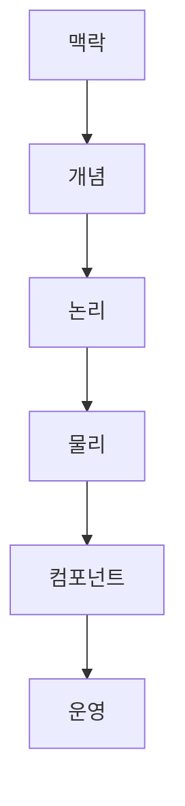
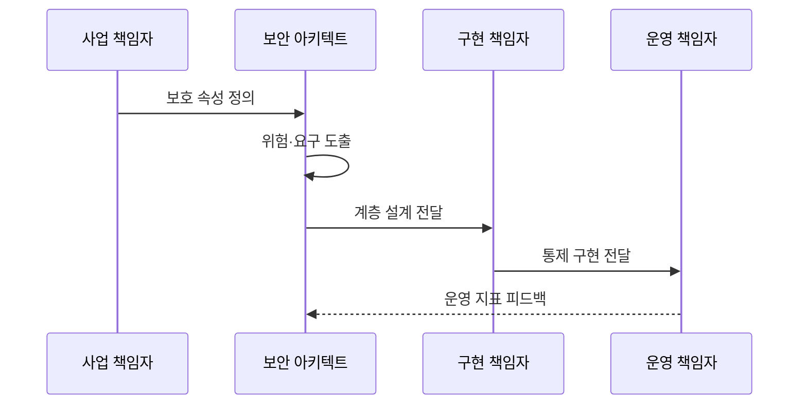

---
sidebar:
  order: 139
  label: "139. 보안 아키텍처 평가 — SABSA (SABSA Security Architecture)"
  badge:
    text: "미출제 · 50%"
    variant: note
title: 보안 아키텍처 평가 — SABSA (SABSA Security Architecture)
date: "2026-07-25T01:00:00+09:00"
tags:
  - notes-security
weight: 139
extra:
  question_no: "139"
  source_status: "미출제"
  source_history: ""
  priority: 50
  priority_note: "비즈니스 위험을 보안구현으로 추적하는 독립 방법론임"
---

## 미리 알고가기

- **셰어우드 응용 비즈니스 보안 아키텍처(Sherwood Applied Business Security Architecture, SABSA)**: 영문 머리글자를 딴 공식 표기라 “샙사”로 읽으며, 비즈니스 위험을 보안 구현·운영으로 추적하는 방법론
- **비즈니스 속성(Business Attribute)**: “비즈니스 애트리뷰트”로 읽으며, 기밀성·가용성 같은 보호 목표를 사업 언어와 측정 기준으로 표현한다
- **SABSA 매트릭스(SABSA Matrix)**: “샙사 매트릭스”로 읽으며, 여섯 계층과 무엇·왜·어떻게·누가·어디서·언제 질문으로 산출물 누락을 점검한다
- **맥락 계층(Contextual Layer)**: “컨텍스추얼 레이어”로 읽으며, 사업 목표·자산·위험과 보안 범위를 정의한다
- **개념 계층(Conceptual Layer)**: “컨셉추얼 레이어”로 읽으며, 사업 위험을 다룰 보안 원칙과 서비스 모델을 정의한다
- **논리 계층(Logical Layer)**: “로지컬 레이어”로 읽으며, 제품과 무관한 보안 기능·정보 흐름·책임을 설계한다
- **추적성(Traceability)**: “트레이서빌리티”로 읽으며, 사업 요구·위험·통제·구성·운영 지표를 양방향으로 연결한다
- **물리 계층(Physical Layer)**: “피지컬 레이어”로 읽으며, 논리 보안 기능을 제품·표준·기술 구조로 구체화한다
- **컴포넌트 계층(Component Layer)**: “컴포넌트 레이어”로 읽으며, 실제 제품·구성·사양과 배치 상세를 정한다
- **운영 계층(Operational Layer)**: “오퍼레이셔널 레이어”로 읽으며, 운영 절차·책임·지표·개선 활동을 정한다
- **오픈 그룹 아키텍처 프레임워크(The Open Group Architecture Framework, TOGAF)**: 영문 머리글자를 딴 공식 표기라 “토가프”로 읽으며, 전사 아키텍처를 개발·전환·관리하는 비교 방법론
- **아키텍처 개발 방법(Architecture Development Method, ADM)**: 영문 머리글자를 딴 공식 표기라 “에이디엠”으로 읽으며, TOGAF에서 아키텍처를 반복 개발·거버넌스하는 절차
- **Zachman Framework**: 무엇·왜·어떻게·누가·어디서·언제와 관점으로 아키텍처 산출물을 분류하는 틀

## Ⅰ. 개요

- **정의/개념**: 비즈니스 목표·위험에서 보안을 도출하는 방법론
- **배경/필요성**: 기술 통제만 선택 시 사업 가치 단절 발생

### 쉽게 이해하기 (학습용)

- 방화벽을 먼저 고르는 대신 어떤 사업 속성을 지켜야 하는지부터 묻고 기술까지 내려가는 방식임

## Ⅱ. 특징

- 비즈니스 속성으로 보호 목표·성공 기준 측정한다.
- 여섯 계층으로 사업 요구를 구현까지 구체화한다.
- 육하원칙 질문으로 계층별 누락·정합성 점검한다.
- 요구·통제·지표의 양방향 추적성 유지한다.

### 쉽게 이해하기 (학습용)

- 위에서 정한 사업 이유가 아래의 제품 설정과 운영 지표까지 이어지고 다시 설명될 수 있어야 함

## Ⅲ. 아키텍처 및 구성요소

| 설계 요소 | 설명 |
|:---|:---|
| 맥락 | 사업 목표·자산·위험 정의 |
| 개념 | 보안 원칙·서비스 모델 |
| 논리 | 기술 독립적 보안 기능 |
| 물리 | 제품·표준·기술 구조 |
| 컴포넌트 | 실제 제품·구성·사양 |
| 운영 | 절차·책임·측정·개선 |

### 쉽게 이해하기 (학습용)

- 사업 언어를 바로 제품명으로 바꾸지 않고 원칙과 논리 기능을 거쳐 구현·운영으로 구체화함

## Ⅳ. 원리 및 절차 흐름도

| 절차 | 설명 |
|:---|:---|
| 보호 속성 정의 | 사업 목표·임계값·책임 지정 |
| 위험·요구 도출 | 위협·영향에서 보안 요구 산출 |
| 계층 설계 전달 | 맥락부터 컴포넌트까지 추적 |
| 통제 구현 전달 | 논리 서비스를 제품 설정에 연결 |
| 운영 지표 피드백 | 잔여 위험으로 요구·설계 갱신 |

### 쉽게 이해하기 (학습용)

- 운영 지표가 나빠지면 어떤 사업 속성과 위험이 영향을 받는지 연결해 개선 우선순위를 정함

## Ⅴ. 종류 및 비교

| 비교축 | SABSA | TOGAF | Zachman |
|:---|:---|:---|:---|
| 핵심 특징 | 위험·보안 속성의 계층별 추적 | ADM으로 기업 아키텍처 전환 | 관점·질문으로 산출물 분류 |
| 적용 기준 | 사업 위험을 보안 구현까지 연결할 때 | 전사 업무·데이터·기술을 통합 전환할 때 | 관점별 산출물 누락을 점검할 때 |
| 주요 위험 | 모든 매트릭스 칸을 채워 문서 과잉 | 보안 위험의 깊이가 부족해질 수 있음 | 개발 절차로 오해해 실행 연결이 약함 |

> 요약: 사업 위험을 보안 구현·운영까지 추적

### 쉽게 이해하기 (학습용)

- SABSA는 보안과 위험에 깊게 초점을 두고 TOGAF·Zachman은 더 넓은 기업 아키텍처 관점을 제공함

## Ⅵ. 실무 사례

1. 비즈니스 속성에 목표·임계값·책임 지정
2. 의사결정에 필요한 매트릭스 산출물만 선택
3. 계층 간 용어·책임·데이터 흐름 연결
4. 변경 영향의 통제·구성·지표를 역추적

### 쉽게 이해하기 (학습용)

- Business Attribute는 목표·임계값·측정 책임까지 구체화함
- Matrix는 모든 칸을 채우지 않고 현재 결정에 필요한 산출물만 선택함
- 계층 간 용어·책임·데이터 흐름을 맞춰 구현이 상위 요구를 바꾸지 않게 함
- 변경이 생기면 양방향 추적으로 영향받는 통제·구성·지표를 다시 평가함

## Ⅶ. 결론

- 사업 위험을 보안 서비스·구현·지표로 추적

### 쉽게 이해하기 (학습용)

- 보안 투자가 어떤 사업 가치를 지키는지 구현과 운영 결과로 계속 증명하게 하는 틀임
