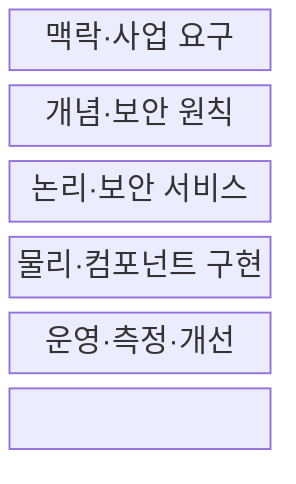
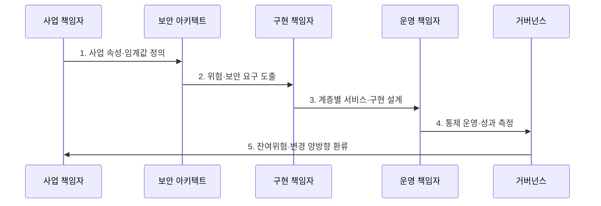

---
sidebar:
  order: 139
  label: "139. 보안 아키텍처 평가 — SABSA (SABSA Security Architecture)"
  badge:
    text: "미출제 · 50%"
    variant: note
title: 보안 아키텍처 평가 — SABSA (SABSA Security Architecture)
date: "2026-07-30T19:00:00+09:00"
tags:
  - notes-security
weight: 139
extra:
  question_no: "139"
  source_status: "미출제"
  source_history: ""
  priority: 50
  priority_note: "비즈니스 위험을 보안구현으로 추적하는 독립 방법론임"
---

## 미리 알고가기

- **셰어우드 응용 비즈니스 보안 아키텍처(Sherwood Applied Business Security Architecture, SABSA)**: 사업 목표·위험을 보안 구현·운영 지표까지 추적하는 방법론이다.
- **비즈니스 속성(Business Attribute)**: 보호 목표를 사업 언어와 측정 가능한 성공 기준으로 표현한 속성이다.
- **SABSA 매트릭스(SABSA Matrix)**: 여섯 계층과 무엇·왜·어떻게·누가·어디서·언제를 조합해 산출물을 점검하는 틀이다.
- **맥락 계층(Contextual Layer)**: 사업 목표·자산·위험·이해관계자와 범위를 정의하는 계층이다.
- **개념 계층(Conceptual Layer)**: 사업 위험을 다룰 보안 원칙·서비스 모델을 정의하는 계층이다.
- **논리 계층(Logical Layer)**: 제품과 무관하게 보안 기능·정보 흐름·책임을 설계하는 계층이다.
- **물리 계층(Physical Layer)**: 논리 기능을 제품·표준·기술 구조로 구체화하는 계층이다.
- **컴포넌트 계층(Component Layer)**: 실제 제품·구성·사양과 배치 상세를 결정하는 계층이다.
- **운영 계층(Operational Layer)**: 운영 절차·책임·지표·개선 활동을 정의하는 계층이다.
- **추적성(Traceability)**: 사업 요구·위험·통제·구성·지표를 양방향 연결하는 성질이다.
- **TOGAF Standard, 10th Edition**: The Open Group의 전사 아키텍처 개발·거버넌스 표준이다.
- **ISO/IEC/IEEE 42010:2022**: 아키텍처 설명·관점·뷰·모델 종류의 표현 요구사항이다.

## Ⅰ. 개요

- 정의/개념: 사업 목표·위험에서 **보안 아키텍처를 도출**
- 배경/필요성: 기술 통제와 **사업 가치·위험의 단절 방지**

### 쉽게 이해하기 (학습용)

- 방화벽부터 고르지 않고 어떤 사업 속성을 지켜야 하는지 묻고 구현까지 내려감

## Ⅱ. 특징

- 비즈니스 속성의 **측정 가능한 보호 목표**
- 여섯 계층·육하원칙의 **누락·정합성 점검**
- 요구·통제·지표의 **양방향 추적성**

### 쉽게 이해하기 (학습용)

- 상위 사업 이유가 제품 설정·운영 지표까지 이어지고 아래 결과로 다시 설명돼야 함

## Ⅲ. 구조 및 구성요소

| 구성요소 | 책임 |
|:---|:---|
| 맥락·사업 요구 | 목표·자산·위험·이해관계자 |
| 개념·보안 원칙 | 속성·정책·서비스 모델 |
| 논리·보안 서비스 | 기술 독립 기능·정보 흐름 |
| 물리·컴포넌트 구현 | 표준·제품·구성·배치 |
| 운영·측정·개선 | 절차·책임·지표·환류 |

### 쉽게 이해하기 (학습용)

- 사업 언어를 바로 제품명으로 바꾸지 않고 원칙·논리 기능을 거쳐 구현·운영으로 구체화함

## Ⅳ. 흐름도

**동작 원리**

- **1. 사업 속성·임계값 정의**: 목표·측정값·책임 지정
- **2. 위험·보안 요구 도출**: 위협·영향에서 요구 산출
- **3. 계층별 서비스·구현 설계**: 논리·물리·제품 연결
- **4. 통제 운영·성과 측정**: 절차·지표·증거 수집
- **5. 잔여위험·변경 양방향 환류**: 영향받는 요구·구성 갱신

### 쉽게 이해하기 (학습용)

- 운영 지표가 나빠지면 어떤 사업 속성과 위험이 영향을 받는지 연결해 개선함

## Ⅴ. 종류 및 비교

| 아키텍처 프레임워크 | SABSA | TOGAF | Zachman |
|:---|:---|:---|:---|
| 적용 기준 | 사업 위험과 보안 구현 연결 | 전사 업무·기술 전환 | 관점별 산출물 분류 |
| 핵심 특징 | 속성·위험의 계층별 추적 | ADM 기반 변화 거버넌스 | 관점·질문 매트릭스 |
| 한계 | 전 칸 작성 시 문서 과잉 | 보안 위험 깊이 부족 | 실행 절차 연결 약함 |

> 요약: 보안 위험, 전사 전환, 산출물 분류의 초점이 다름

### 쉽게 이해하기 (학습용)

- SABSA는 보안·위험에 깊고 TOGAF와 Zachman은 더 넓은 전사 구조를 다룸

## Ⅵ. 실무 고려사항 및 대책

| 고려사항 | 대책 | 효과 |
|:---|:---|:---|
| 사업 위험·보안 추적 | **SABSA Matrix 선택 적용** | 속성·통제·지표 정렬 |
| 전사 변화 거버넌스 | **TOGAF 10th Edition 연계** | ADM·전환 계획 통합 |
| 아키텍처 설명 품질 | **ISO/IEC/IEEE 42010:2022 적용** | 관점·뷰·관심사 명확화 |

### 쉽게 이해하기 (학습용)

- 금융 서비스 가용성 목표를 비즈니스 속성으로 정하고 보안 서비스·제품 구성·운영 지표까지 연결한다.

## Ⅶ. 결론

- **사업 속성·위험·책임·측정성**으로 아키텍처를 결정한다.

### 쉽게 이해하기 (학습용)

- 보안 투자가 어떤 사업 가치를 지키는지 구현과 운영 결과로 계속 증명해야 함
