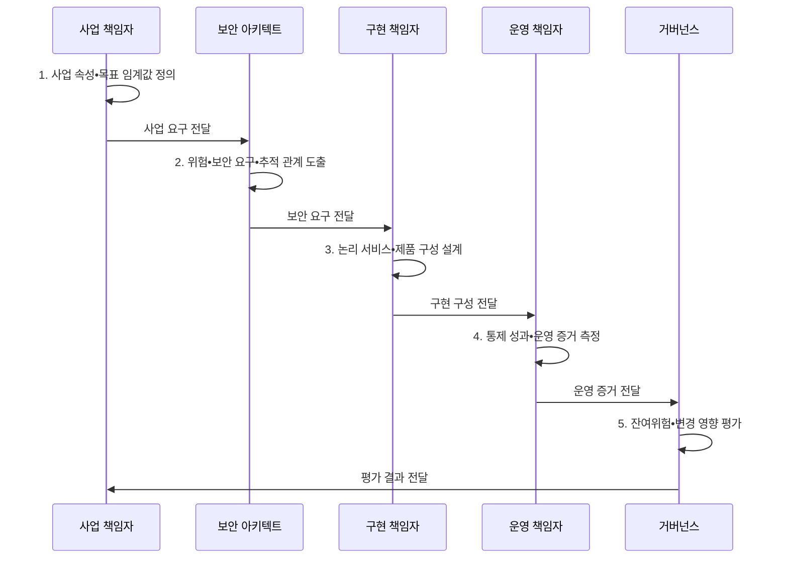

---
sidebar:
  order: 139
  label: "139. 보안 아키텍처 평가 — SABSA (SABSA Security Architecture)"
  badge:
    text: "미출제 • 50%"
    variant: note
title: 보안 아키텍처 평가 — SABSA (SABSA Security Architecture)
date: "2026-08-05T00:00:00+09:00"
tags:
  - notes-security
weight: 139
extra:
  question_no: "139"
  source_status: "미출제"
  source_history: ""
  priority: 50
  priority_note: "비즈니스 위험을 보안구현으로 추적하는 독립 방법론임"
---

## Ⅰ. 개요

<details>
<summary>핵심 용어</summary>

- **SABSA(Sherwood Applied Business Security Architecture)**: 사업 위험을 보안 구현•지표까지 추적하는 방법론이다.

</details>

- 정의/개념: 사업 목표와 위험을 보안 속성•서비스•구현•운영 지표까지 연결하는 **SABSA 위험 기반 보안 아키텍처 방법론**
- 배경/필요성: 제품 중심 설계로는 통제와 **사업 가치•위험 연결 불가**

#### 한줄 요약

- 방화벽부터 고르지 않고 어떤 사업 속성을 지켜야 하는지 묻고 구현까지 내려감

## Ⅱ. 특징

<details>
<summary>핵심 용어</summary>

- **비즈니스 속성**: 보호 목표를 사업 언어와 측정 가능한 성공 기준으로 표현한 속성이다.
- **추적성**: 사업 요구•위험•통제•구성•지표를 양방향으로 연결하는 성질이다.

</details>

- 비즈니스 속성의 **측정 가능한 보호 목표**
- 여섯 계층•육하원칙의 **누락•정합성 점검**
- 요구•통제•지표의 **양방향 추적성**

#### 한줄 요약

- 상위 사업 이유가 제품 설정•운영 지표까지 이어지고 아래 결과로 다시 설명돼야 함

## Ⅲ. 구조 및 구성요소

<details>
<summary>핵심 용어</summary>

- **SABSA 계층**: 요구를 맥락•개념•논리•물리•운영으로 구체화한다.

</details>

```text
[맥락•사업 요구]
        |
[개념•보안 원칙]
        |
[논리•보안 서비스]
        |
[물리•컴포넌트 구현]
        |
[운영•측정•개선]
```

선의 의미: 세로선은 사업 목표와 위험을 보안 원칙, 기술 독립 서비스, 물리 구현 및 운영 측정으로 구체화하는 SABSA의 정적 아키텍처 계층을 뜻한다.

| 구성요소 | 책임 |
|:---|:---|
| 맥락•사업 요구 | **목표•자산•위험•이해관계자** |
| 개념•보안 원칙 | **속성•정책•서비스 모델** |
| 논리•보안 서비스 | **기술 독립 기능•정보 흐름** |
| 물리•컴포넌트 구현 | **표준•제품•구성•배치** |
| 운영•측정•개선 | **절차•책임•지표•환류** |

#### 한줄 요약

- 사업 언어를 바로 제품명으로 바꾸지 않고 원칙•논리 기능을 거쳐 구현•운영으로 구체화함

## Ⅳ. 흐름도

<details>
<summary>핵심 용어</summary>

- **양방향 추적**: 상위 사업 요구를 구현•지표로 내려 연결하고 운영 결과를 다시 사업 위험으로 올려 설명하는 방식이다.

</details>



**동작 원리**

- **1. 사업 속성•목표 임계값 정의**: 보호 가치•측정값•책임 정의
- **2. 위험•보안 요구•추적 관계 도출**: 위협•영향에서 보안 요구 도출
- **3. 논리 서비스•제품 구성 설계**: 기술 독립 기능과 구현 연결
- **4. 통제 성과•운영 증거 측정**: 절차•지표로 실효성 자료 수집
- **5. 잔여위험•변경 영향 평가**: 갱신할 사업 요구•통제•구성 판정

#### 한줄 요약

- 운영 지표가 나빠지면 어떤 사업 속성과 위험이 영향을 받는지 연결해 개선함

## Ⅴ. 종류 및 비교

<details>
<summary>핵심 용어</summary>

- **TOGAF(The Open Group Architecture Framework)**: 전사 아키텍처 전환 프레임워크이다.
- **Zachman 프레임워크**: 관점별 아키텍처 산출물 분류 체계이다.
- **ADM(Architecture Development Method)**: TOGAF의 아키텍처 개발 방법이다.

</details>

| 아키텍처 프레임워크 | SABSA | TOGAF | Zachman |
|:---|:---|:---|:---|
| 적용 기준 | 사업 위험과 **보안 구현 연결** | 전사 **업무•기술 전환** | 관점별 **산출물 분류** |
| 핵심 특징 | **속성•위험의 계층별 추적** | **ADM 기반 변화 거버넌스** | **관점•질문 매트릭스** |
| 한계 | 전 칸 작성 시 **문서 과잉** | **보안 위험 깊이** 부족 | **실행 절차 연결** 약함 |

> 요약: 보안 위험, 전사 전환, 산출물 분류의 초점이 다름

#### 한줄 요약

- SABSA는 보안•위험에 깊고 TOGAF와 Zachman은 더 넓은 전사 구조를 다룸

## Ⅵ. 실무 고려사항 및 대책

<details>
<summary>핵심 용어</summary>

- **SABSA 매트릭스**: 여섯 계층과 육하원칙으로 산출물을 점검하는 틀이다.
- **ISO(International Organization for Standardization)**: 국제표준화기구이다.
- **IEC(International Electrotechnical Commission)**: 국제전기기술위원회이다.
- **IEEE(Institute of Electrical and Electronics Engineers)**: 전기전자 기술표준을 개발하는 학회이다.
- **ISO/IEC/IEEE 42010**: 아키텍처 관점•뷰•모델 표현 표준이다.
- **전사 전환 연계**: TOGAF ADM으로 보안 설계와 전환 일정을 연결한다.

</details>

| 문제 | 대책 | 효과 |
|:---|:---|:---|
| 모든 매트릭스 칸을 채우면 문서만 증가할 수 있음 | **SABSA Matrix 선택 적용** | 속성•통제•지표 정렬 |
| 보안 설계만으로 전사 전환 일정을 통제하기 어려움 | **TOGAF 10th Edition 연계** | ADM•전환 계획 통합 |
| 이해관계자별 관심사가 섞이면 설명이 모호해짐 | **ISO/IEC/IEEE 42010:2022 적용** | 관점•뷰•관심사 명확화 |

#### 한줄 요약

- 금융 서비스 가용성 목표를 비즈니스 속성으로 정하고 보안 서비스•제품 구성•운영 지표까지 연결한다.

## Ⅶ. 결론

<details>
<summary>핵심 용어</summary>

- **사업 가치 입증**: 보안 구현과 운영 성과가 어떤 사업 목표•위험에 기여하는지 연결해 설명하는 활동이다.
- **위험 추적•전사 전환 결합**: SABSA 위험 추적과 TOGAF 전환을 결합하는 방식이다.

</details>

- 사업 위험 추적은 **SABSA**, 전사 전환은 **TOGAF 결합** 적용

#### 한줄 요약

- 보안 투자가 어떤 사업 가치를 지키는지 구현과 운영 결과로 계속 증명해야 함
