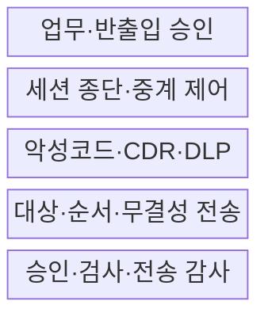
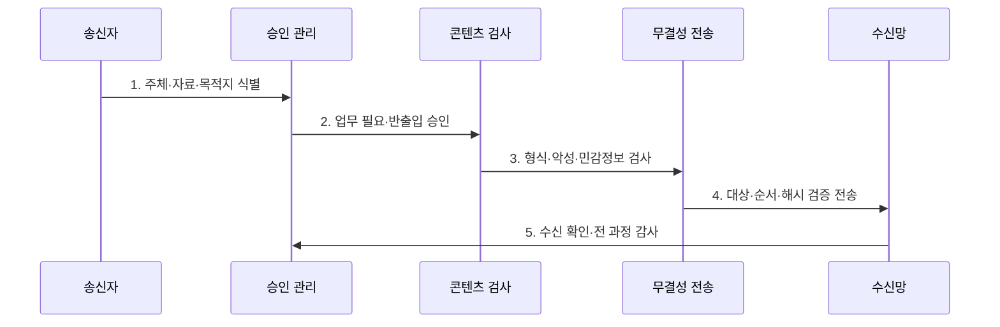

---
sidebar:
  order: 140
  label: "140. 망분리·망연계 솔루션 (Network Separation Bridging)"
  badge:
    text: "기출 · 50%"
    variant: note
title: 망분리·망연계 솔루션 (Network Separation Bridging)
date: "2026-07-27T23:59:59+09:00"
tags:
  - notes-security
weight: 140
extra:
  question_no: "140"
  source_status: "기출"
  source_history: "125회"
  priority: 50
  priority_note: "125회 기출이며 망분리 예외흐름 설계에 유용함"
---

## 미리 알고가기

- **망분리(Network Separation)**: 보안 수준·업무가 다른 영역의 직접 통신을 물리·논리적으로 차단하는 통제이다.
- **망연계(Network Bridging)**: 분리된 망 사이에서 승인된 정보만 검사·중계·감사하는 통제 체계이다.
- **자료 전송(File Transfer)**: 파일을 저장한 뒤 승인·내용 검사를 마치고 다른 망으로 전달하는 방식이다.
- **스트림 연계(Stream Bridging)**: 프록시가 양쪽 세션을 각각 맺어 응용 데이터 흐름을 실시간 중계하는 방식이다.
- **단방향 전송(One-way Transfer)**: 역방향 통신을 물리·논리적으로 제한해 한 방향 정보 흐름만 허용하는 방식이다.
- **콘텐츠 무해화(Content Disarm and Reconstruction, CDR)**: 실행 요소를 제거하고 안전한 내용으로 파일을 재구성하는 기술이다.
- **정보유출 방지(Data Loss Prevention, DLP)**: 민감정보의 비인가 저장·사용·전송을 탐지·차단하는 통제이다.
- **은닉 채널(Covert Channel)**: 허용 데이터·신호에 비밀 정보를 실어 정책을 우회하는 비인가 통신 경로이다.
- **NIST SP 800-53 AC-4**: 승인된 정보 흐름 정책을 시스템 안팎에서 집행하는 통제이다.
- **NIST SP 800-53 SC-7**: 외부·내부 경계의 통신을 감시·통제하는 경계 보호 통제이다.
- **전자금융감독규정 제15조**: 금융회사의 해킹 방지와 내부 업무용 시스템 망분리 등을 규정한다.

## Ⅰ. 개요

- 정의: 분리 영역 간 **승인 정보의 검사·중계·감사**
- 목적: 완전 단절의 업무 제약과 **비인가 우회 전송 방지**

### 쉽게 이해하기 (학습)

- 두 망 사이에 필요한 물건만 검사하고 기록해 통과시키는 검문소를 둠

## Ⅱ. 특징

- 데이터·방향·시간의 **업무별 최소 허용**
- 양쪽 세션 종단의 **직접 연결 차단**
- 악성코드·민감정보·이력의 **통합 검사**

### 쉽게 이해하기 (학습)

- 파일 확장자만 보지 않고 내부 매크로·객체·민감정보와 실제 목적지까지 검사함

## Ⅲ. 구조 및 구성요소

| 설계 요소 | 설명 |
|:---|:---|
| 업무·반출입 승인 | 주체·자료·목적·목적지 판정 |
| 세션 종단·중계 제어 | 에이전트·프록시로 연결 분리 |
| 악성코드·CDR·DLP | 능동 콘텐츠·민감정보 검사 |
| 대상·순서·무결성 전송 | 해시·재전송·중복 검증 |
| 승인·검사·전송 감사 | 결정·결과·관리 행위 보관 |

### 쉽게 이해하기 (학습)

- 송수신망이 직접 대화하지 않고 중계 구간이 내용을 검사한 뒤 별도 연결로 전달함

## Ⅳ. 흐름도

| 절차 | 설명 |
|:---|:---|
| 1. 주체·자료·목적지 식별 | 소유자·등급·방향 확인 |
| 2. 업무 필요·반출입 승인 | 정책·결재·예외 유효성 판정 |
| 3. 형식·악성·민감정보 검사 | 압축·암호화·능동 객체 처리 |
| 4. 대상·순서·해시 검증 전송 | 오배송·변조·중복 방지 |
| 5. 수신 확인·전 과정 감사 | 승인·검사·결과 증거 보관 |

### 쉽게 이해하기 (학습)

- 누가 어디로 무엇을 왜 보냈는지와 검사·수신 결과를 남겨 사고 흐름을 재구성함

## Ⅴ. 종류 및 비교

| 망연계 방식 | 자료 전송 | 스트림 연계 | 단방향 전송 |
|:---|:---|:---|:---|
| 적용 기준 | 문서·배치 전송 | API·동기 업무 | 로그 수집·정책 배포 |
| 핵심 특징 | 저장·검사 후 전달 | 세션 종단·실시간 중계 | 한 방향 정보만 전달 |
| 한계 | 암호·복합 파일 우회 | 취약점의 양쪽 망 확산 | 은닉·역방향 신호 |

> 요약: 데이터 형태·실시간성·방향에 따라 방식을 선택함

### 쉽게 이해하기 (학습)

- 파일·실시간 서비스·한 방향 데이터는 위험이 달라 같은 연계 방식으로 처리하기 어려움

## Ⅵ. 실무 고려사항 및 대책

| 고려사항 | 대책 | 효과 |
|:---|:---|:---|
| 허용 정보흐름 | **NIST SP 800-53 AC-4 적용** | 방향·유형·정책 집행 |
| 망 경계 보호 | **NIST SP 800-53 SC-7 적용** | 세션 종단·경로 통제 |
| 금융권 망분리·예외 | **전자금융감독규정 제15조 준수** | 법적 예외·대체통제 확보 |

### 쉽게 이해하기 (학습)

- 외부 파일은 승인·악성코드 검사·CDR을 통과한 경우만 전용 중계가 내부망에 전달하고 이력을 남긴다.

## Ⅶ. 결론

- **업무 필요·검사 가능성·방향·추적성**으로 연계를 결정한다.

### 쉽게 이해하기 (학습)

- 많이 전달하는 것보다 필요한 데이터만 안전하고 추적 가능하게 전달하는 것이 성공 기준임
