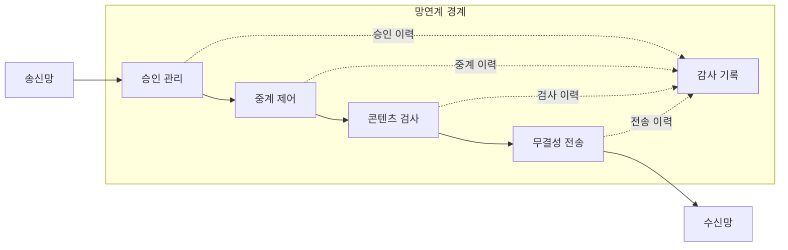
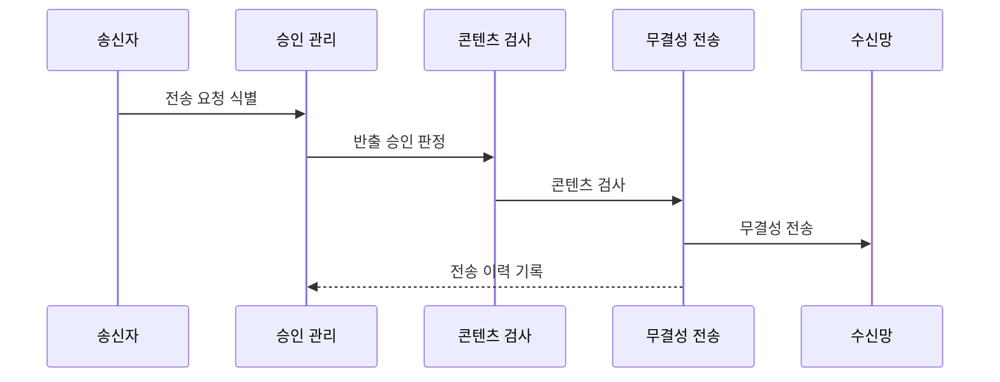

---
sidebar:
  order: 140
  label: "140. 망분리·망연계 솔루션 (Network Separation Bridging)"
  badge:
    text: "기출 · 50%"
    variant: note
title: 망분리·망연계 솔루션 (Network Separation Bridging)
date: "2026-07-27T23:59:59+09:00"
tags:
  - notes-security
weight: 140
extra:
  question_no: "140"
  source_status: "기출"
  source_history: "125회"
  priority: 50
  priority_note: "125회 기출이며 망분리 예외흐름 설계에 유용함"
---

## 미리 알고가기

- **망분리·망연계(Network Separation Bridging, 네트워크 세퍼레이션 브리징)**: 분리된 망 사이에 통제된 다리를 둔다는 뜻으로, 직접 통신 없이 승인 정보만 전달
- **자료 전송**: 파일을 중계 구간에 저장해 승인과 내용 검사를 마친 뒤 다른 망으로 전달하는 비실시간 연계 방식입니다.
- **스트림 연계**: 프록시가 양쪽 세션을 각각 맺어 응용 데이터 흐름을 실시간으로 중계하는 연계 방식입니다.
- **단방향 전송**: 역방향 통신을 물리적 또는 논리적으로 제한해 한 방향의 정보 흐름만 허용하는 연계 방식입니다.
- **콘텐츠 무해화(Content Disarm and Reconstruction, CDR)**: 문서의 실행 요소와 알려지지 않은 객체를 제거하고 안전한 내용만으로 새 파일을 구성하는 기술이다.
- **정보 유출 방지(Data Loss Prevention, DLP)**: 민감정보를 식별하여 승인되지 않은 저장·사용·전송을 탐지하고 차단하는 통제이다.
- **프록시(Proxy)**: 송신망의 연결을 종료한 뒤 수신망에 별도 연결을 만들어 요청과 응답을 중계하는 구성요소이다.
- **에이전트(Agent)**: 송수신 장치에서 연계 요청·파일 전달·상태 보고를 수행하는 프로그램이다.
- **해시(Hash)**: 입력 데이터에서 고정 길이 값을 생성하여 전송 전후 데이터의 동일성과 무결성을 확인하는 함수이다.
- **응용 프로그램 인터페이스(Application Programming Interface, API)**: 정해진 요청·응답 형식으로 분리된 시스템의 실시간 업무 기능을 연계하는 접점이다.
- **은닉 채널(Covert Channel)**: 허용된 데이터나 신호에 비밀 정보를 실어 보안 정책을 우회하는 비인가 통신 경로이다.

## Ⅰ. 개요

- 정의/개념: 분리된 영역 간 정보를 검사·승인·전달함
- 기존 한계: 완전 단절은 업무 불편과 비인가 우회 전송 유발
- **배경/필요성**: 망을 물리적으로 분리해도 업무 연계 구간의 파일·API·관리 경로가 악성코드 유입과 정보 유출의 우회 통로가 될 수 있음

### 쉽게 이해하기 (학습용)

- 두 망 사이 문을 없애는 대신 필요한 물건만 검사하고 기록해 통과시키는 검문소를 둠

## Ⅱ. 특징

- 업무별 데이터·방향·시간을 정책으로 최소 허용한다.
- 중계 구간이 양쪽 세션을 분리해 직접 연결을 차단한다.
- 악성코드·민감정보 검사와 전송 이력을 함께 관리한다.

### 쉽게 이해하기 (학습용)

- 허용 파일 형식만 정해도 문서 안 매크로나 민감정보가 남을 수 있어 내용 검사가 필요함

## Ⅲ. 아키텍처 및 구성요소

| 설계 요소 | 설명 |
|:---|:---|
| 승인 관리 | 업무·데이터·목적지 허용 판정 |
| 중계 제어 | 에이전트·프록시로 연결 분리 |
| 콘텐츠 검사 | 악성코드·CDR·DLP 적용 |
| 무결성 전송 | 대상·순서·해시를 검증 |
| 감사 기록 | 승인·검사·전송 이력을 보관 |

### 쉽게 이해하기 (학습용)

- 송신망과 수신망이 직접 대화하지 않고 중계가 내용을 검사한 뒤 새 연결로 전달함

## Ⅳ. 원리 및 절차 흐름도

| 절차 | 설명 |
|:---|:---|
| 전송 요청 식별 | 송신자·파일·목적지 확인 |
| 반출 승인 판정 | 업무 정책으로 허용 여부 결정 |
| 콘텐츠 검사 | 형식·악성코드·민감정보 확인 |
| 무결성 전송 | 대상·순서·해시 검증 후 전달 |
| 전송 이력 기록 | 승인·검사·전달 증거 보관 |

### 쉽게 이해하기 (학습용)

- 누가 어디로 무엇을 왜 보냈는지와 검사 결과를 남겨 사고 때 흐름을 재구성할 수 있어야 함

## Ⅴ. 종류 및 비교

| 판단 기준 | 자료 전송 | 스트림 연계 | 단방향 전송 |
|:---|:---|:---|:---|
| 적용 기준 | 문서·배치 전송 | API·동기화 업무 | 로그 수집·배포 |
| 핵심 특징 | 저장·검사 후 파일 전달 | 프록시로 세션 실시간 중계 | 한 방향의 정보만 전달 |
| 한계 | 암호화·복합 파일 검사 우회 | 취약점의 양쪽 망 확산 | 은닉 채널·역방향 신호 |

> 요약: 최소 허용·집중 통제로 망분리 경계를 유지함

### 쉽게 이해하기 (학습용)

- 파일, 실시간 서비스, 한 방향 데이터는 업무와 위험이 달라 같은 연계 방식으로 처리하기 어려움

## Ⅵ. 실무 사례

1. 외부망 파일의 **검사·무해화 후 내부망 반입**

### 쉽게 이해하기 (학습용)

- 외부망 파일은 승인·악성코드 검사·콘텐츠 무해화를 통과한 경우에만 전용 연계 서버가 내부망으로 전달하고 모든 반입 이력을 기록한다.

## Ⅶ. 결론

- 망분리 환경의 업무 연계가 우회 통로가 되는 것을 막기 위해 데이터 필요성·검사 가능성·관리 경로·실시간 요구·비상 절차를 검토하여, 최소 흐름만 중계·검사·감사해야 한다.

### 쉽게 이해하기 (학습용)

- 연계 성공 기준은 많이 전달하는 것이 아니라 필요한 데이터만 안전하고 추적 가능하게 전달하는 것임
