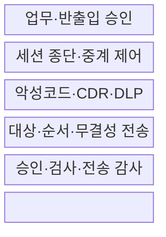
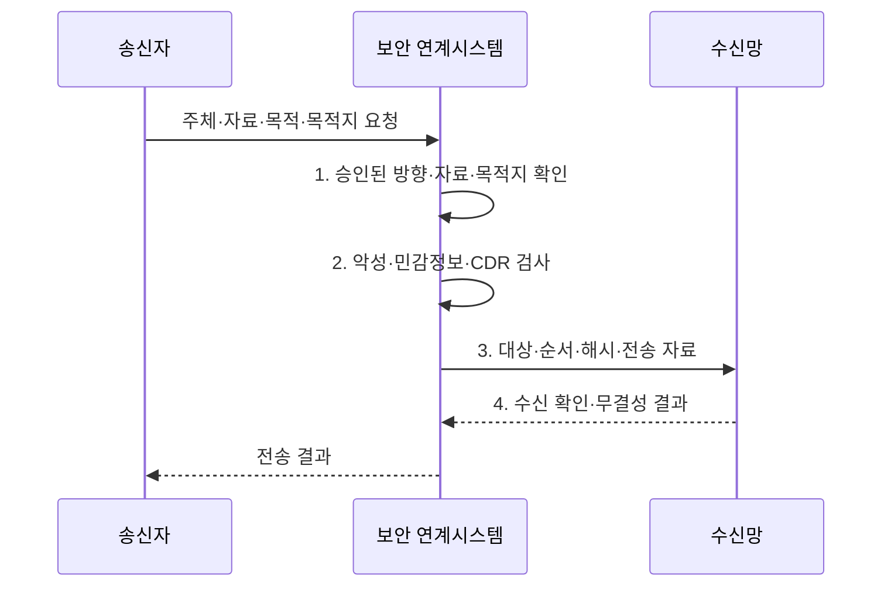

---
sidebar:
  order: 140
  label: "140. 망분리·망연계 솔루션 (Network Separation Bridging)"
  badge:
    text: "기출 · 50%"
    variant: note
title: 망분리·망연계 솔루션 (Network Separation Bridging)
date: "2026-07-31T11:25:35+09:00"
tags:
  - notes-security
weight: 140
extra:
  question_no: "140"
  source_status: "기출"
  source_history: "125회"
  priority: 50
  priority_note: "125회 기출이며 망분리 예외흐름 설계에 유용함"
---

## Ⅰ. 개요

핵심 용어

- **망분리·망연계**: 보안영역의 직접 통신을 차단하고 승인된 정보만 검사·중계·감사하는 통제이다.

- 정의/개념: 보안영역의 직접 통신을 차단하고 승인된 정보만 검사·중계·감사하는 **망분리·망연계 통제 체계**
- 배경/필요성: 완전 단절만으로는 필요한 **망 간 업무 데이터 교환 불가**

#### 한줄 요약

- 두 망 사이에 필요한 물건만 검사하고 기록해 통과시키는 검문소를 둠

## Ⅱ. 특징

핵심 용어

- **세션 종단**: 중계 장치가 양쪽 연결을 각각 끝내 분리된 망의 직접 통신을 막는 방식이다.
- **콘텐츠 무해화(Content Disarm and Reconstruction, CDR)·데이터 유출방지(Data Loss Prevention, DLP)**: 실행 요소를 제거해 파일을 재구성하는 기술과 민감정보 유출을 탐지·차단하는 통제이다.

- 데이터·방향·시간의 **업무별 최소 허용**
- 양쪽 세션 종단의 **직접 연결 차단**
- 악성코드·민감정보·이력의 **통합 검사**

#### 한줄 요약

- 파일 확장자만 보지 않고 내부 매크로·객체·민감정보와 실제 목적지까지 검사함

## Ⅲ. 구조 및 구성요소

핵심 용어

- **무결성 전송**: 대상·순서·해시·재전송 정보를 검사해 오배송·변조·중복을 막는 기능이다.
- **능동 콘텐츠·민감정보 검사**: 콘텐츠 무해화(Content Disarm and Reconstruction, CDR)와 데이터 유출방지(Data Loss Prevention, DLP)를 결합해 위험 내용을 검사한다.

| 구성요소 | 책임 |
|:---|:---|
| 업무·반출입 승인 | **주체·자료·목적·목적지** 판정 |
| 세션 종단·중계 제어 | **에이전트·프록시**로 연결 분리 |
| 악성코드·CDR·DLP | **능동 콘텐츠·민감정보** 검사 |
| 대상·순서·무결성 전송 | **해시·재전송·중복** 검증 |
| 승인·검사·전송 감사 | **결정·결과·관리 행위** 보관 |

#### 한줄 요약

- 송수신망이 직접 대화하지 않고 중계 구간이 내용을 검사한 뒤 별도 연결로 전달함

## Ⅳ. 흐름도

핵심 용어

- **감사 증적**: 승인부터 검사·전송·수신 결과까지 흐름을 재구성할 수 있게 남긴 기록이다.
- **콘텐츠 무해화(Content Disarm and Reconstruction, CDR)**: 압축·문서의 능동 객체를 제거하고 안전한 내용만 재구성하는 검사이다.

**동작 원리**

- **1. 승인된 방향·자료·목적지 확인**: 정책·결재·예외를 통과한 범위 판정
- **2. 악성·민감정보·CDR 검사**: 압축·능동 객체까지 확인해 차단·무해화 여부 판정
- **3. 대상·순서·해시·전송 자료**: 오배송·변조·중복 방지 정보
- **4. 수신 확인·무결성 결과**: 승인부터 수신까지 남기는 감사 증적

#### 한줄 요약

- 누가 어디로 무엇을 왜 보냈는지와 검사·수신 결과를 남겨 사고 흐름을 재구성함

## Ⅴ. 종류 및 비교

핵심 용어

- **자료·스트림·단방향 전송**: 저장 후 파일 전달, 실시간 세션 중계, 한 방향 정보 흐름만 허용하는 방식이다.
- **은닉 채널**: 허용 데이터·신호에 비밀 정보를 실어 정책을 우회하는 비인가 통신 경로이다.
- **응용 프로그래밍 인터페이스(Application Programming Interface, API) 연계**: 실시간 업무 요청을 프록시에서 종단·검사한 뒤 별도 세션으로 전달하는 방식이다.

| 망연계 방식 | 자료 전송 | 스트림 연계 | 단방향 전송 |
|:---|:---|:---|:---|
| 적용 기준 | **문서·배치 전송** | **API·동기 업무** | **로그 수집·정책 배포** |
| 핵심 특징 | **저장·검사 후 전달** | **세션 종단·실시간 중계** | **한 방향 정보만 전달** |
| 한계 | 암호·복합 파일로 **콘텐츠 검사 우회** | 취약점의 **양쪽 망 확산** | **은닉·역방향 신호** |

> 요약: 데이터 형태·실시간성·방향에 따라 방식을 선택함

#### 한줄 요약

- 파일·실시간 서비스·한 방향 데이터는 위험이 달라 같은 연계 방식으로 처리하기 어려움

## Ⅵ. 실무 고려사항 및 대책

핵심 용어

- **미국 국립표준기술연구소 특별간행물 접근통제 4·시스템통신보호 7(NIST Special Publication 800-53 Access Control 4/System and Communications Protection 7, NIST SP 800-53 AC-4·SC-7)**: 정보 흐름 집행과 통신 경계 보호를 다루는 통제이다.
- **서비스형 소프트웨어(Software as a Service, SaaS) 예외**: 금융 업무망이 외부 클라우드 서비스를 이용할 때 위험평가·승인·대체통제를 요구하는 예외 경로이다.
- **콘텐츠 무해화(Content Disarm and Reconstruction, CDR)**: 외부 파일에서 실행 가능한 요소를 제거해 내부망 반입 위험을 낮추는 통제이다.
- **전자금융감독규정 제15조**: 금융회사의 해킹 방지와 내부 업무용 시스템 망분리 등을 규정한다.

| 문제 | 대책 | 효과 |
|:---|:---|:---|
| 흐름 기준이 없으면 승인 자료가 다른 경로로 확산됨 | **NIST SP 800-53 AC-4 적용** | 방향·유형·정책 집행 |
| 양쪽 망 세션이 직접 연결되면 취약점이 전파됨 | **NIST SP 800-53 SC-7 적용** | 세션 종단·경로 통제 |
| 금융 업무망의 외부 연결은 규정 위반 위험이 있음 | **전자금융감독규정 제15조·SaaS 예외 준수** | 위험평가·대체통제 확보 |

#### 한줄 요약

- 외부 파일은 승인·악성코드 검사·CDR을 통과한 경우만 전용 중계가 내부망에 전달하고 이력을 남긴다.

## Ⅶ. 결론

핵심 용어

- **최소 정보 흐름**: 업무에 필요한 데이터·방향·시간·목적지만 허용하는 경계 통제 원칙이다.
- **응용 프로그래밍 인터페이스(Application Programming Interface, API) 프록시**: 실시간 요청을 경계에서 종단하고 승인된 기능만 중계하는 방식이다.

- 문서는 **자료 전송**, 실시간 연계는 **API 프록시**, 일방 흐름은 **단방향 전송** 적용

#### 한줄 요약

- 많이 전달하는 것보다 필요한 데이터만 안전하고 추적 가능하게 전달하는 것이 성공 기준임
