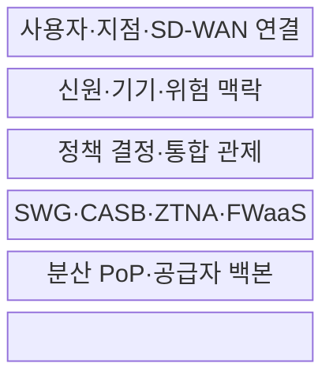
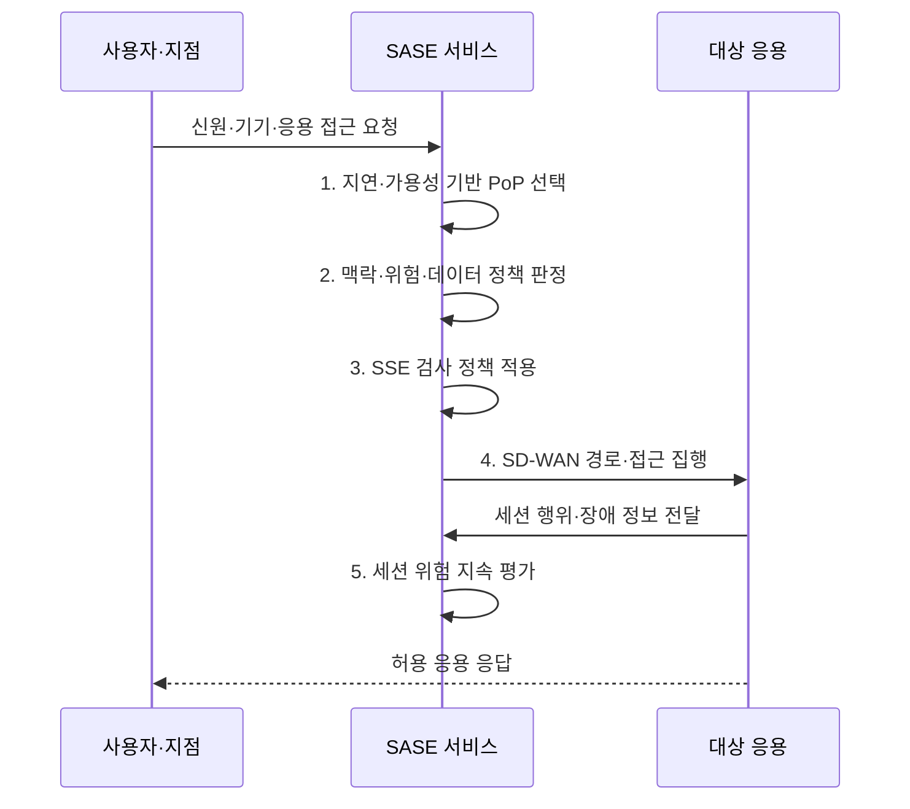

---
sidebar:
  order: 141
  label: "141. 보안 접근 서비스 경계(Secure Access Service Edge, SASE) 아키텍처"
  badge:
    text: "기출 · 70%"
    variant: note
title: 보안 접근 서비스 경계(Secure Access Service Edge, SASE) 아키텍처
date: "2026-07-31T11:24:14+09:00"
tags:
  - notes-security
weight: 141
extra:
  question_no: "141"
  source_status: "기출"
  source_history: "135회"
  priority: 70
  priority_note: "135회 기출이며 광역망·보안 통합 설계성이 큼"
---

## Ⅰ. 개요

핵심 용어

- **보안 접근 서비스 경계(Secure Access Service Edge, SASE)**: 광역망 연결과 보안을 가까운 접속 거점(Point of Presence, PoP)에서 공통 정책으로 제공하는 구조이다.
- **소프트웨어 정의 광역망(Software-Defined Wide Area Network, SD-WAN)·보안 서비스 경계(Security Service Edge, SSE)**: 응용별 경로 선택과 클라우드 접근 보안을 SASE에서 결합하는 두 기능축이다.

- 정의/개념: 분산 PoP에서 **SD-WAN 연결·SSE 보안** 을 통합 제공하는 구조
- 배경/필요성: 중앙 백홀로 인한 **지연·병목과 분산 환경의 정책 불일치를 완화할 필요**

#### 한줄 요약

- 사용자 가까운 거점에서 신원·기기를 검증하고 허용 응용으로 바로 연결함

## Ⅱ. 특징

핵심 용어

- **소프트웨어 정의 광역망(Software-Defined Wide Area Network, SD-WAN)·보안 서비스 경계(Security Service Edge, SSE)**: 응용 정책으로 광역망 경로를 선택하는 기술과 접근 보안을 클라우드에서 통합하는 구조이다.
- **접속 거점(Point of Presence, PoP)**: 사용자 가까이에서 연결·보안 검사를 처리하는 공급자 거점이다.

- SD-WAN·SSE의 **클라우드 통합 제공**
- 신원·기기·응용·데이터의 **맥락 정책**
- 분산 PoP·백본의 **저지연·고가용 접속**

#### 한줄 요약

- 위치가 달라도 같은 신원·기기·데이터 기준으로 경로 선택과 보안 검사를 수행함

## Ⅲ. 구조 및 구성요소

핵심 용어

- **보안 웹 게이트웨이(Secure Web Gateway, SWG)·클라우드 접근 보안 중개(Cloud Access Security Broker, CASB)·제로 트러스트 네트워크 접근(Zero Trust Network Access, ZTNA)·서비스형 방화벽(Firewall as a Service, FWaaS)**: 웹·클라우드·응용 접근·네트워크 방화벽 보안을 제공하는 보안 서비스 경계(Security Service Edge, SSE) 기능이다.
- **경로·거점·신원 판단**: 소프트웨어 정의 광역망(Software-Defined Wide Area Network, SD-WAN), 접속 거점(Point of Presence, PoP), 신원 제공자(Identity Provider, IdP)를 연결해 판단한다.

| 구성요소 | 책임 |
|:---|:---|
| **사용자·지점·SD-WAN 연결** | 에이전트·터널·**경로 선택** |
| **신원·기기·위험 맥락** | IdP·상태·행위·**데이터 입력** |
| **정책 결정·통합 관제** | 공통 정책·로그·**위험 판정** |
| **SWG·CASB·ZTNA·FWaaS** | 웹·클라우드·앱·망 **검사** |
| **분산 PoP·공급자 백본** | 근접 처리·**거점 간 전송** |

#### 한줄 요약

- 가까운 거점에서 경로와 보안을 동시에 적용하고 정책·로그는 일관되게 관리함

## Ⅳ. 흐름도

핵심 용어

- **지속 위험 평가**: 세션 중 행위·기기 상태·장애 정보를 반영해 접근 결정을 계속 갱신하는 활동이다.
- **접근·검사·경로 흐름**: 보안 접근 서비스 경계(Secure Access Service Edge, SASE)가 접속 거점(Point of Presence, PoP)을 선택하고 보안 서비스 경계(Security Service Edge, SSE) 검사와 소프트웨어 정의 광역망(SD-WAN) 경로를 집행하는 흐름이다.

**동작 원리**

- **1. 지연·가용성 기반 PoP 선택**: PoP 상태·부하를 반영한 대체 경로 계산
- **2. 맥락·위험·데이터 정책 판정**: 최소 응용·행위 허용
- **3. SSE 검사 정책 적용**: 웹·클라우드·응용·데이터 통제
- **4. SD-WAN 경로·접근 집행**: 정책 기반 경로와 세션 연결
- **5. 세션 위험 지속 평가**: 행위·장애·로그를 정책에 환류

#### 한줄 요약

- 가까운 거점을 고른 뒤 맥락에 맞는 응용만 연결하고 세션 중 위험도 계속 평가함

## Ⅴ. 종류 및 비교

핵심 용어

- **보안 접근 서비스 경계(Secure Access Service Edge, SASE)·보안 서비스 경계(Security Service Edge, SSE)**: 광역망 연결까지 통합한 구조와 기존 연결망 위에서 보안 기능만 통합한 구조이다.
- **연결·보안 통합 범위**: 소프트웨어 정의 광역망(SD-WAN), 보안 웹 게이트웨이(SWG), 클라우드 접근 보안 중개(CASB), 제로 트러스트 네트워크 접근(ZTNA), 접속 거점(PoP)으로 통합 범위를 판단한다.

| 접근 보안 구조 | SASE | SSE | 전통 경계형 |
|:---|:---|:---|:---|
| **적용 기준** | 분산 망·보안 **동시 통합** | 연결망 유지·**보안 통합** | 사용자·응용 **중앙 집중** |
| **핵심 특징** | **SD-WAN 경로·SSE 통합** | **SWG·CASB·ZTNA 통합** | **데이터센터 경계 검사** |
| **한계** | **PoP 장애·공급자 종속** | **회선·경로 제어 공백** | **백홀 지연·정책 불일치** |

> 요약: 연결과 보안의 통합 범위가 서로 다름

#### 한줄 요약

- SSE는 보안 기능, SASE는 광역망 경로까지 함께 통합한 구조임

## Ⅵ. 실무 고려사항 및 대책

핵심 용어

- **메트로 이더넷 포럼(Metro Ethernet Forum, MEF) 117·118.1**: 보안 접근 서비스 경계(SASE) 속성과 신원·정책 기반 제로 트러스트 서비스 프레임워크를 정의한다.
- **미국 국립표준기술연구소 특별간행물(National Institute of Standards and Technology Special Publication, NIST SP) 800-207**: 자원 중심 제로 트러스트 아키텍처의 논리 구성·배치 지침이다.
- **서비스 수준 협약(Service Level Agreement, SLA)**: 기능·정책·연결의 가용성·성능·책임 수준을 명시한 계약 기준이다.

| 문제 | 대책 | 효과 |
|:---|:---|:---|
| **SASE 서비스 속성** | **MEF 117 적용** | 기능·정책·연결 **SLA 명확화** |
| **제로 트러스트 서비스** | **MEF 118.1 적용** | 신원·**정책 집행점 정렬** |
| **자원 중심 접근** | **NIST SP 800-207 연계** | 위치 기반 **암묵 신뢰 제거** |

#### 한줄 요약

- 재택 사용자는 가까운 PoP로 연결되고 신원·기기 상태·앱 정책을 통과한 트래픽만 업무 자원에 전달된다.

## Ⅶ. 결론

핵심 용어

- **대체 접속 거점(Alternative Point of Presence, Alternative PoP)**: 선택한 거점 장애 시 세션을 이어가기 위해 전환하는 다른 공급자 거점이다.
- **망·보안 선택 기준**: 보안 접근 서비스 경계(Secure Access Service Edge, SASE), 광역망(Wide Area Network, WAN), 보안 서비스 경계(Security Service Edge, SSE)의 통합 범위를 비교한다.

- 분산 응용·저지연 필요 시 **SASE**, 기존 WAN 유지 시 **SSE** 선택

#### 한줄 요약

- 사용 위치가 달라도 같은 맥락 기준으로 허용 응용에만 연결하고 장애 시 대체 PoP로 전환해야 함
